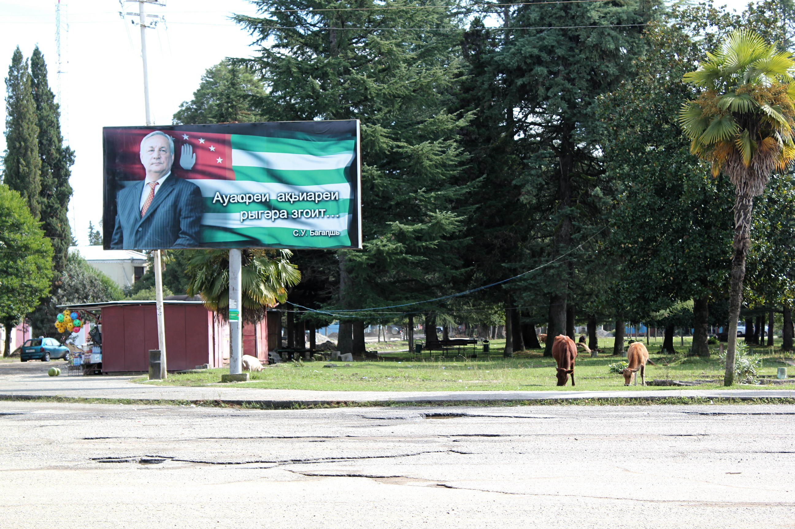

**Originally published on [Osservatorio Balcani e Caucaso](https://www.balcanicaucaso.org/eng/Areas/Abkhazia/In-Abkhazia-worried-about-the-language-law-124824)**

*The law “On the state language”, approved by the authorities in Sukhumi in 2007, risks exacerbating inter-ethnic relations in Abkhazia, a territory that remains largely multi-ethnic, even after the ethnic cleansing that happened during the war. Our correspondent went to Abkhazia to find out more about it. A feature story*

"Do not try to gather too much information in order to demonstrate that non-Abkhaz are treated badly in Abkhazia.", Indira Vardania told me last year. At the time, she was Sukhumi's minister of Education. She is now deputy prime minister and one of the few women with a prominent role in Abkhazia's politics. "And concerning the language law that you're so worried about, for what concerns the part stating that everybody has the right to study in his or her own language, you can be assured that it is fully implemented."

Vardania was suspicious that I was there to discredit Abkhazia, as she felt many international observers visiting the region were intent on doing. Obviously, this was not the aim of my visit. But she was right in stating that I was worried about the law "On the state language of Abkhazia." After a long debate, it was approved by authorities in Sukhumi in 2007. The law states that Abkhaz is the only state language in Abkhazia, that "all citizens of the Republic of Abkhazia must command the state language" (i.e. Abkhaz), and makes clear that members of parliament and heads of local administrations must know and use it.

Given the negligible number of non-ethnic Abkhaz who speak the language, if literally understood and thoroughly implemented, the law would totally exclude non-Abkhaz from political life, be a cause of discrimination, and increase inter-ethnic tensions. The issue is not purely theoretical: even after the war in 1992-1993 that forced more than 200,000 Georgians (out of a total population of about 550,000) to leave the territories now controlled by authorities in Sukhumi (and contested by Tbilisi), contemporary Abkhazia still has a largely multi-ethnic population. Local demographics are highly disputed, but by most accounts, Armenians, Georgians and Russians taken together make up more than 50% of the local population, while ethnic Abkhaz are a plurality, but not a majority, in the territory.

As of today, with the exception of the Gali district inhabited by Georgian returnees, inter-ethnic relations in Abkhazia are broadly non-confrontational, in part due to the fact that Russian is by and large used for daily business by Abkhaz and non-Abkhaz residents alike. Most observers agree on the fact that the language law is not being applied in full, nor will it be after all of its provisions enter into force by 2015.

In practice
-----------

"The language law cannot possibly be implemented in the near future", Dalila Pilia, head of "World Without Violence", a local NGO, told me in the organization's offices in Sukhumi. "Nobody has the right today to demand that everybody in Abkhazia know the language," she said. "Adequate conditions for its implementation should be offered first."

In theory, the law provides for dedicated programmes and adequate state support for the implementation of all its parts. For example, a provision dedicated to printed and broadcast media states that at least half of the printed text area of all magazines and newspapers printed in Abkhazia must be in the Abkhaz language, and that the state will support those who publish in Abkhaz.

This, however, seems to be more theory than practice, or at least this was the case when I met Izida Chania, director of Sukhumi-based, Russian and Abkhaz-language independent newspaper *Nuzhnaya Gazeta,* last year."In principle, I am in favour of the law as it relates to the media", she told me as phones kept ringing in the newspapers' small office. The office is not far from the huge, half burned 12-storey building that housed the local government during Soviet times. "And if the authorities did support publishing in Abkhaz, we'd be glad to comply. But for the time being, we comply with the law only in part because, by ourselves, we don't have enough resources."

Izida Chania argues this is the problem with how the law was approved and implemented as a whole. The final goal of supporting the Abkhaz language is clear, she argues, but little is being done to support it in practice and the timeframe is unrealistic. "If the Abkhaz language were thoroughly taught from kindergartens to university and dedicated language programmes were properly implemented, it would be possible to implement the law in twenty years," she told me.

Kindergartens and schools
-------------------------

The Abkhaz language must now be taught in all schools of this territory on the shore of the Black Sea whose *de facto* independence has received little international recognition except that of Russia (in August 2008.) But a number of issues make education a complex affair in the territory.

Only about 30 of the 300 kindergartens that existed before the war in the early 1990s are now active. Many schools were destroyed, others were badly damaged. Repairing and reconstructing has been taking place in the last few years, but much is yet to be done. Low salaries for teachers are among reasons cited for the lack of qualified teachers in the republic, a problem further complicated by the needs of multilingual education. Out of the 169 schools currently active in Abkhazia, 62 of them are Abkhaz language schools, 16 mixed Russian-Abkhaz, 48 Russian, 32 Armenian and 11 Georgian (all of them in the Gali district) .

In recent years, authorities have taken measures to support the teaching of the Abkhaz language, but obstacles remain. There are few teachers or textbooks that could be used to teach Abkhaz as a foreign language. There was Abkhaz language education also in Soviet times, but after fourth grade all subjects were taught in Russian.

"It is fair to say there have been problems in the past with the teaching of Abkhaz in Russian and Armenian schools because of the lack of textbooks and educational materials, but this has not been a problem for at least five years", Indira Vardania told me confidently in October 2011. To prove her point -- and her ministry's commitment to the support of the Abkhaz language -- she showed me colourful textbooks and other didactic materials for the teaching of the Abkhaz language. "In order to have regular Abkhaz classes also in the [mostly Georgian inhabited] Gali district, we increased the salary of Abkhaz language teachers willing to go there by about 50%", she added.

Shools in Gali
--------------

As the topic shifted to the schools in Gali, the tone of the conversation became more tense. Vardania warned me not to trust reports like one published by Kurt Vollebaek, OSCE High Commissioner on National Minorities. According to the report, Georgians living in Abkhazia are under pressure from Sukhumi's authorities, their right to education is threatened, and Georgian language schools are being closed. "For what concerns the part of the language law that grants education in one's mother tongue we have no problems, the law is already being implemented in full," Vardania, head of education in Abkhazia, said confidently.

But a report published by *Human Rights Watch* in July 2011 ("[Living in Limbo](http://www.hrw.org/reports/2011/07/15/living-limbo-0%29) "), which focuses on the situation in the Gali district, explains at length how "in practice, access to Georgian-language education for ethnic Georgians living in the Gali district is restricted," pointing out how Georgian language schools have been phased out. According to the report, Russian language instruction makes things difficult for children who at home speak mostly Mingrelian (a language belonging to the same linguistic family as literary Georgian) or Georgian, and teachers, who might not have a sufficient command of the language.

Gali
----

I wanted to go by bus to Gali, but busses from Sukhumi towards the Georgian-inhabited district are infrequent. I took a car with a few other men I met at the bus station. One is an Ossetian who used to work in the Tkvarcheli mines in Soviet times and came to Abkhazia for a few days to visit a sick relative. The driver is an Abkhazian from Sukhumi. On the road, he picks up his wife, who, knowing we're headed to Gali, decides to take the chance and meet an old friend there. During the journey, the two men start speaking half jokingly in Georgian. Both know the language well. The driver's wife whispers to me "My husband's mother was Georgian. Sometimes he misses speaking the language."

Gali is still in dire straits. Many houses are abandoned. Cows graze in the park next to the local administration's offices. Roads are in extremely poor condition. A fresh poster of Sergey Bagapsh, the former president of Abkhazia who died a few months earlier, makes clear that the place is under the control of Sukhumi.

When I asked her about the situation with schooling, Nino, a young activist in a local NGO, confirmed that the lack of Georgian-language education is definitely a big problem. The situation is further complicated by the fact that many local residents are forced to choose on which side of the *de facto* border to stay. For example, if one goes to study in Zugdidi or Tbilisi, her diploma won't be recognized in Abkhazia. Only a few local Georgians are willing to attend university in Sukhumi, thus receiving a diploma that might be of little elsewhere.

In spite of all the problems of local Georgians, Nino is not against the efforts of Sukhumi's authorities to promote Abkhaz. "As we live here, I'm in favour of the fact that pupils in the schools of Gali study Abkhaz. We live together, we should know the language. It certainly won't do any harm," she told me over a cup of tea.

When, [a few days earlier, I met Suren Kerselyan](http://www.balcanicaucaso.org/eng/Regions-and-countries/Abkhazia/Abkhazia-s-Armenians-multilingualism-is-the-future-106982), a representative of the Armenian community in Sukhumi, I got a similar response. "We want our children to study Abkhaz and in Armenian schools they do, but not enough."

Abkhaz, a language under threat
-------------------------------

In fact, while the "Law on the state language" strongly discriminates in favour of Abkhaz, everybody agrees that Abkhaz, as a language spoken by a tiny group, is under threat by the overwhelming predominance of Russian in all spheres, from business to culture, from pop music to cinema.

Kurt Vollebaek, that same OSCE High Commissioner on National Minorities that criticized authorities in Sukhumi for their approach to the Georgian community, [stated](http://www.osce.org/hcnm/78915) that "as the Abkhaz language also seems to be under threat, I have offered to support the de facto authorities in Sukhumi in efforts to maintain and further strengthen the knowledge and development of the Abkhaz language."

Vollebaek has a point. If one looks back at the roots of the conflict, it is clear that fear of losing cultural and linguistic rights -- and ultimately disappearing as an ethnic group -- was among the driving factors that exacerbated conflict in the early 1990s. Nowadays, the Abkhaz fear of being physically under threat as a group has largely vanished thanks to economic and especially military support from Moscow. On the contrary, fear of cultural assimilation by Russia is possibly stronger than ever. This is probably what led Sukhumi's authorities to approve the highly discriminatory law "On state language" in the first place.

Crossing the bridge
-------------------



As I cross the bridge on the Inguri that marks Abkhazia's *de facto* border with Georgia, I am still worried about that law. I understand that common sense will probably prevail in the end, and that the law will be applied only in part or selectively ignored. For example, I don't really expect that, at the next parliamentary elections, all non-Abkhaz will be really banned from running for office. [Some analysts](http://www.tandfonline.com/doi/abs/10.1080/01419870.2012.675079) already tend to point out the elements of "ethnic democracy" that characterize the Abkhazian political system, even without taking into consideration the structural exclusion of Georgians that had to leave the territory during the war and the ones that returned but did not obtain an Abkhazian passport. Enacting the language law in full without exacerbating inter-ethnic relations, if at all possible, would seriously put into questions the democratic developments that have taken place in the region since it gained *de facto* independence.

Still, language issues do not end on this side of the Inguri.

In Abkhazia, Russian is the common language and knowledge of Georgian among non-Georgians is completely disappearing. Just across the Inguri, in the uncontested Georgian territories, it is primarily English that is taught in schools as a foreign language (not Russian) and Russian language instruction is becoming rare. As I leave Abkhazia and cross into Georgia, I cannot help but thinking that people living on both sides of the Inguri might soon find themselves without a language in common.