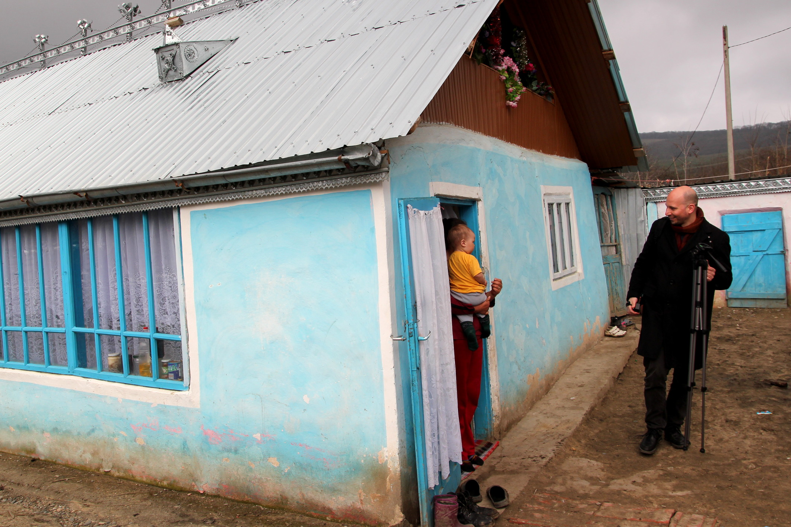

**Originally published on [Osservatorio Balcani e Caucaso](https://www.balcanicaucaso.org/eng/Areas/Romania/Romania-the-importance-of-the-after-school-programs-142142)**

*Despite the declarations of Prime Minister Victor Ponta, the after-school service in Romania still lacks adequate support from the State.*

Last spring, Romanian [Prime Minister](http://adevarul.ro/educatie/scoala/premierul-victor-ponta-anuntat-renunta-programul-cornul-laptele-muta-banii-programe-after-school-1_5148919300f5182b852a9304/index.html) [Victor Ponta declared](http://romaeducationfund.ro/en/projects/school-after-school/) he was willing to end the "*cornul şi laptele*" ("roll and milk") program to channel any resources that would be saved into more useful initiatives, such as after-school. The statement caused an uproar in the media but, as shown with the beginning of the new school year, there has been no actual consequence.

### **Roll and milk**

The "roll and milk" program, inaugurated in 2002, provides all students in the country's kindergartens and schools with a free roll and a glass of milk. The idea was that of combating drop out rates and contributing to the children's diet, especially of those coming from poor families. "Roll and milk", though, is a universal program: it reaches all children in the country, irrespective of their income and the place the live in.

The anecdotal evidence first and then a [survey commissioned by the government](http://www.publicinfo.gov.ro/library/lapte_si_corn_expert.pdf) have highlighted how most of the snacks offered by the state are simply thrown away. The monotony of milk and rolls -- the same every single day -- and the poor quality of the products provided by the sub-contracted companies are among the reasons quoted by the report to underline the size of the waste.

Despite the wastes, it is politically difficult to cancel a program that offers food and milk to children; that is also because the initiative has inevitably gone to support the agricultural and food sector, and that of milk production in particular. Indeed, the first protest against the possibility of interrupting the program was raised by the Agricultural Minister, Daniel Constantin who, however, conceded that the program might be rethought and provided only to those who truly needed it.**After-school**

Last September 16^th^ students went back to school and found rolls and milk for everyone. The debate started by the PM in March in order to find important alternative measures has died off, and not even the beginning of the new school year was able to float the media's attention back to the issue.

It is a shame, as experts say the measure proposed last spring by Ponta -- an after-school service -- could bring highly important benefits to the children and their families as well. Indeed, the after-school program is now only offered as a payment service in private schools or, in some cases, as a project financed by NGOs. The[Roma Education Fund](http://romaeducationfund.ro/en/projects/school-after-school/), for instance, has organized an after-school service especially for Roma communities. [World Vision România](http://www.worldvision.ro/) has supported the implementation of an after-school program in various public schools, located both in cities or in rural areas, to verify its usefulness and understand the problems to consider when making the program even more far-reaching.

The program endorsed by World Vision provides for a free hot meal and educators who in the afternoon can help the children with their homework, their daily lessons, help them rest, play or socialize. The projects realized provide for a psychologist to be involved and contribute to improve the interaction between schools and families and to tackle children's issues with their parents.



### **Bucharest**

The story of a mother whose daughter is enrolled in one of the after-school projects carried out with the help of World Vision at school number 126, sector 5 in Bucharest, helps to immediately understand the importance of these initiatives, for the children and their parents alike.

"When it was time to send our daughter to school, we wondered how we would manage. I thought I would have to give up my job to follow her properly, but it would have been hard to get by without my salary".

The after-school service allowed her to avoid having to make a very difficult choice.

A teacher actively working for the program underlines the importance of helping children with their homework: "Many parents do not have the necessary competence, the time or the capability to help their children study". The school director cannot hide her enthusiasm for the program and adds that the spreading of the programs on a national level should be perceived as a need rather than a possibility.

Bucharest's school 126 is in good conditions, the rooms for the after-school are adequately equipped, the children are well dressed. Of course, the area is not exceptionally poor and the children do not come from disadvantaged families. However, in the cities often both parents work away from home and it is not always possible to rely on the grand-parents: it is here that an after-school service avoids children being left alone and allows them to play and study in a peaceful environment.

The after-school program can also help the children whose parent/s has/have emigrated abroad in search of a job. It can practically be a measure of contributing to the welfare vacuums created, for instance, by mothers who have emigrated to work as caregivers in Italy or other European countries.

### **In the country**

In Drăxeni, a small town 300 kilometers North-East of Bucharest in the district of Vaslui and one of the poorest areas of Romania, the situation is very much different. Here, a hot meal is a determining incentive to send children to school, while doing their homework and playing with their friends in the after-school avoids them having to start working at an early age.

The building for the after-school program has been restored and the room where the children carry out their activities has been recently refurnished. There is no running water in the school, however, as in the other houses in the area. The bathroom is a trench a few feet away from the school. The water is carried in tanks from a fountain on the town's main street. The heaters are wood stoves. The teachers have trouble getting to school, especially during winter. There is no work -- besides working the land -- and most families survive on the meager subsidies they receive from the Romanian government.

"My parents work in the fields around the house and we are six brothers and sisters", tells a student. "My older brother helps my father, my sister works in the garden with my mother, I take care of my younger brothers and sisters and that's how we manage".

In a place where school children are perceived as a resource for the family, many parents are reluctant about the after-school programs.

"When the program started last fall, I said I was not convinced and that I would probably have drop out starting from the spring", tells a mother from Drăxeni. "I didn't know whom to leave my baby daughter with and I was counting on her to do it. But then I noticed she really enjoyed her after-school... And I couldn't but let her continue".

It is the same parents who openly admit they cannot help their own children with their homework. Seeing them come home happy and half-way with their homework done is an important incentive for those parents who believe their children's education is important.

### **A matter of resources**

Experts in the field and the parents who have benefited firsthand from the after-school programs widely recognize their importance. It is very likely that this same consensus has persuaded Prime Minister Victor Ponta to state that the after-school could be introduced in the "roll and milk" stead.

Last spring's debate seems to have concluded with the obvious statement that an after-school program that includes a hot meal and overtime for the teachers is more expensive than the bread and milk given to the children mid-morning. It is, however, misleading to think that "roll and milk" and after-school are measures alternative to each other.

The political statement underlining the importance of the after-school program and expanding it starting from the places where it is most needed, in collaboration with the local authorities and international NGOs, could have laid the foundations for a longer distance to run. The public-private co-financing also, with lower rates according to income, would allow to expand the programs to the cities. This would be vital in the reintegration of the mothers in the working world, along with helping the children in their education.

Students have gone back to school. It would be about time for the government to do its homework as well and seriously evaluate the best ways to expand a program that meets the needs of all people in society. A reflection that needs to be done also outside Romanian borders.