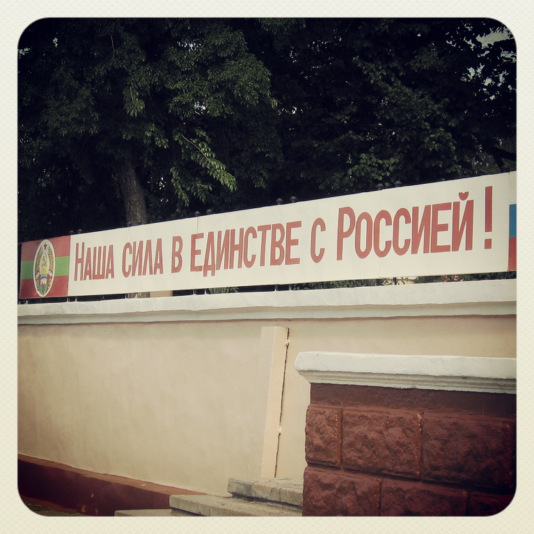

**Questo articolo è stato originariamente pubblicato su [Osservatorio Balcani e Caucaso](https://www.balcanicaucaso.org/aree/Ucraina/Amore-in-Crimea-152470). Tutte le foto sono scattate dall'autore.**

*I timori per quanto sta accadendo in Ucraina erano stati anticipati da vari studiosi. Ma cosa ha fatto l’Unione europea per limitare la crisi? E che cosa potrebbero fare le istituzioni europee per evitare che i cittadini ucraini perdano la fiducia nell’Europa? Un’analisi*

"Amore in Crimea" ("Miłość na Krymie") è, come recita il sottotitolo, una "commedia tragica in tre atti" scritta nel 1993 da Sławomir Mrożek, uno dei più noti drammaturghi polacchi del ventesimo secolo. È un testo teatrale ricco di riferimenti čechoviani nel quale ogni atto è ambientato in Crimea in un diverso momento storico; il primo nella Russia pre-rivoluzionaria del 1910, il secondo a fine anni '20 in piena sovietizzazione, mentre il terzo si svolge a inizio anni '90. Anche in questo terzo atto, come nei precedenti, dominano conversazioni assurde. I dialoghi trasudano pessimismo e decadenza morale. A un certo punto, due attori issano una bandiera americana.

A vent'anni di distanza dalla prima di questo spettacolo, tutto il mondo si è ritrovato a seguire un inaspettato quarto atto. Questa volta la Crimea è sia sfondo che protagonista di una nuova fase della storia russa. Come pubblico a teatro durante una rappresentazione di "Amore in Crimea", abbiamo assistito attoniti a dichiarazioni senza apparente legame con la realtà e dialoghi disfunzionali, mentre sullo sfondo si issavano bandiere. Questa volta, russe. 

* * *

La straordinaria attualità di alcuni aspetti di quest'opera mi ha fatto riprendere dallo scaffale questo testo teatrale che avevo letto una decina di anni fa e del quale quasi non avevo memoria. L'avevo comprato quando per me, come per la maggior parte dei russi, la Crimea era prima di tutto un posto di vacanza. Ci ero andato nel 2006, con un treno diretto Mosca-Simferopol' e da lì in filobus fino a Jalta, per stare qualche giorno al mare. Affittacamere accoglievano a frotte i nuovi arrivati alla stazione degli autobus, mentre durante il giorno le spiagge artificiali vicine al centro cittadino erano affollate dai turisti. Strisce di cemento e recinzioni limitavano le spiagge private, in alcuni casi riservate ai clienti di sanatori sovietici non ristrutturati di recente.

Il russo era sostanzialmente l'unica lingua che si sentiva per strada o in spiaggia, ma l'uso della *grivnya* come moneta per gli acquisti e l'occasionale scritta in ucraino all'ingresso degli uffici pubblici serviva da costante pro-memoria del fatto che quella era Ucraina. Un fatto che all'epoca non sembrava più in questione.

L'attenzione di studiosi e giornalisti in quel periodo era tutta dedicata alla "rivoluzione arancione", alle dinamiche che l'avevano resa possibile e alle lotte interne che da subito avevano caratterizzato il nuovo gruppo al potere, mentre la Crimea era passata in secondo piano.

Negli anni successivi, però, in particolare dopo il conflitto dell'agosto 2008 in Caucaso meridionale e il riconoscimento da parte russa dell'indipendenza di Abkhazia e Ossezia del Sud, i moniti non erano mancati. Nel 2009 era infatti uscito un *Policy Brief* intitolato "[Crimea: il prossimo punto caldo nel vicinato europeo?](http://www.fride.org/descarga/pb14_crimea-flash_point_eng_jul09.pdf)", a firma Natalia Shapovalova e Balazs Jarabik. Lo studio faceva notare, ad esempio, come il governo di Mosca avesse più influenza di Kiev in Crimea e che questo stato delle cose avrebbe potuto dare spazio a contese sulla sovranità del territorio. Gli autori sottolineavano l'assenza di una coerente politica per la Crimea sia da parte delle autorità di Kiev, sia da parte dell'Unione europea e degli stati membri. Registrando l'assenza di programmi di aiuto e cooperazione da parte di Stati Uniti e UE dedicati alla Crimea, il report esortava l'Unione a sviluppare una strategia di prevenzione del conflitto basata su dialogo, aiuti, investimenti e una prospettiva di integrazione ucraina nell'UE. Tra le iniziative proposte, scambi universitari, gemellaggi, facilitazione alla mobilità e all'incontro di giornalisti, cooperazione a livello di società civile sia bilaterale (Crimea-UE) che trilaterale (Ucraina-Crimea-UE) e lo stabilimento di consolati o uffici di rappresentanza delle istituzioni europee.

Uno studio del noto esperto di questioni ucraine Taras Kuzio pubblicato nel 2010 ("[Crimea: il prossimo punto caldo europeo?](http://www.peacepalacelibrary.nl/ebooks/files/372451918.pdf)") riportava, seppure con argomentazioni in parte diverse, la medesima preoccupazione per la Crimea.

Quando ad inizio 2014, approfittando della debolezza di Kiev, il governo di Mosca è intervenuto per annettere la Crimea alla Federazione russa, osservatori e giornalisti sono rimasti unanimemente stupiti dalla rapidità con cui l'operazione di annessione della regione sia stata messa in pratica.

C'è stato appena il tempo di rendersi conto che l'UE non aveva legami diretti sostanziali con la regione che potessero, se non influenzare il corso degli eventi, almeno contribuire a fornire informazioni affidabili su ciò che stava avvenendo. Un legame che forse avrebbe potuto esistere se si fosse stabilita una tradizione di cooperazione diretta tra istituzioni europee (o di paesi UE) e le autorità locali o scambi a livello di studenti, società civile e giornalisti.

* * *

Le raccomandazioni ampiamente inascoltate di quel report del 2009 sulla Crimea sono in buona parte valide anche per altri territori contesi nello spazio post-sovietico, quali Transnistria, Abkhazia, Ossezia del Sud e Nagorno Karabakh, a prescindere dal loro attuale status.

Nel contesto attuale, il caso della Transnistria merita particolare attenzione. La ratifica dell'Accordo di associazione tra Moldavia e UE prevista per giugno desta grosse preoccupazioni in Transnistria, territorio de facto indipendente che beneficia ampiamente del sostegno di Mosca.

Nelle quasi mille pagine che compongono il testo completo degli [Accordi di associazione firmati tra UE e Moldavia](http://eeas.europa.eu/moldova/assoagreement/assoagreement-2013_en.htm), l'unico riferimento sostanziale alla Transnistria si trova al Titolo II, art. 8, comma 2, ove si "reitera l'impegno delle parti a una soluzione sostenibile della questione transnistriana, in pieno rispetto della sovranità e dell'integrità territoriale della Repubblica Moldova", si parla di facilitare azioni di "riabilitazione post-conflitto" e più in generale si ribadisce l'importanza della questione. Pochino, se l'intenzione è non solo quella di dichiarare il proprio sostegno alle autorità di Chișinău, ma anche di stabilire un percorso di cooperazione e dialogo con Tiraspol mirato a una soluzione condivisa e sostenibile del conflitto.

Esiste un dialogo sulla questione transnistriana che vede coinvolte sia Osce che rappresentanti UE. Non si registra però un coinvolgimento più ampio che includa collaborazione diretta con le autorità de facto, cooperazione accademica e scambi tra studenti o altre iniziative volte a favorire l'interazione e l'integrazione tra chi risiede, studia e lavora in Transnistria e cittadini di paesi UE. Iniziative di questo tipo esistono invece in abbondanza tra Transnistria e Federazione russa, che in sostanza diventa quindi il principale attore che previene l'isolamento della regione e offre possibilità di mobilità, studio e carriera ai suoi residenti.

La cooperazione con stati de facto le cui autorità non sono riconosciute a livello internazionale non è priva di ostacoli, ma molti sono i settori in cui vi sarebbe spazio per averne di maggiore.

Nel febbraio 2013, è stato pubblicato [un report per le Nazioni Unite](http://www.un.md/publicdocget/41/) dedicato alla situazione dei diritti umani in Transnistria, il quale evidenziava problemi in molti settori, dalla salute ai diritti dei bambini. Le autorità de facto di Tiraspol hanno risposto nel novembre 2013, approvando un "[piano di misure per la realizzazione delle raccomandazioni del *senior expert* delle Nazioni Unite sui diritti umani in Transnistria](http://president.gospmr.ru/ru/news/prezident-pmr-evgeniy-shevchuk-podpisal-ukaz-kotorym-utverdil-plan-meropriyatiy-po-realizacii)" in cui si elenca punto per punto come il governo intenda approcciare le questioni sollevate nel report ([vedi allegato al decreto presidenziale n. 523, 2013](http://president.gospmr.ru/sites/default/files/zakon/prilozheniya_0.rar)). Per alcune di queste voci, si prevedono riforme effettuate con risorse interne e si citano le tempistiche previste. Per molte altre, si indica l'apertura a collaborare con attori internazionali o si sottolinea la necessità di finanziamenti esterni. Ad esempio, facendo riferimento a centri per l'educazione inclusiva o iniziative a favore di persone con disabilità, si auspica la collaborazione tra ministero dell'Educazione, ONG locali e internazionali e si indica che progetti in questa direzione avranno luogo "in misura del finanziamento ottenuto dall'esterno". I settori di cooperazione sono numerosi, da iniziative a sostegno dei malati di tubercolosi al processo di deistituzionalizzazione dei minori.

Programmi di cooperazione a sostegno dei diritti umani nella regione che, con il sostegno dell'Unione europea, coinvolgano organizzazioni della società civile internazionale e locale, senza precludere collaborazioni con le autorità de facto, potrebbero essere un primo importante passo per mostrare alla popolazione residente che l'UE si interessa del loro benessere, in linea con la missione UE di favorire la tutela dei diritti umani nel proprio vicinato. Scambi studenteschi potrebbero essere un altro passo importante.

Senza iniziative di questo tipo, autorità e media locali hanno gioco facile nell'indicare Mosca come unico partner su cui si possa fare affidamento. Per ora, l'Accordo di associazione tra UE e Moldavia e i nuovi accordi doganali con l'UE sono percepiti dalla Transnistria principalmente come una minaccia per la propria sostenibilità economica. In questo contesto, se a Mosca si aprisse uno spiraglio, le autorità di Tiraspol potrebbero cogliere l'occasione per cercare maggiore integrazione con la Federazione russa. D'altra parte, sono prontissimi: hanno già tenuto un referendum in tal senso nel 2006 e con una modifica costituzionale introdotta a dicembre 2013 la legislazione russa è direttamente applicabile sul territorio della Transnistria.

* * *

Nel 2009-2010, mentre venivano pubblicati report che indicavano come la Crimea potesse diventare un punto di tensione cruciale nel vicinato europeo, io mi interessavo in particolare di politiche giovanili ed educazione patriottica in Russia. Oltre a partecipare a [campi "patriottici" organizzati dal governo russo](http://scholarworks.iu.edu/journals/index.php/aeer/article/view/1997), in quel periodo seguivo costantemente materiali propagandistici diffusi dal Cremlino o da organizzazioni filo-governative.

Tra questi, [un video animato](http://youtu.be/Kvb6jYHMhrw?t=5m24s) realizzato per promuovere l'"anno dei giovani" nel 2009 mi sembra riassuma in modo esemplare la visione della storia recente che è alla base del consenso di cui gode oggi Vladimir Putin in Russia. Negli anni Novanta, oligarchi e banditi controllavano il paese. La gente normale pativa la fame e la Russia doveva farsi approvare il budget dal Fondo Monetario Internazionale. Poi è arrivato Vladimir Putin (nell'animazione, vestito da supereroe): in meno di dieci anni, la Russia non è più debitrice verso l'Occidente, le pensioni e gli stipendi vengono pagati regolarmente, il mondo degli affari paga le tasse, i ladri stanno in prigione, c'è pace in Cecenia e si è fatto vedere a Saakashvili chi comanda.

Come ogni buon materiale di propaganda, questo filmato include numerosi riferimenti in cui il pubblico si può riconoscere direttamente. Gli anni Novanta sono stati effettivamente un periodo straordinariamente duro per buona parte della popolazione russa. Quegli anni però non sono stati solo gli anni degli oligarchi, del banditismo, del crac economico e il periodo in cui la povertà diffusa ha raggiunto il suo apice. Sono anche gli anni in cui al potere c'erano i "democratici", i "filo-occidentali". Il fallimento della classe politica degli anni Novanta ha screditato in ampi settori della popolazione i "democratici" e i "filo-occidentali" come coloro che hanno portato il paese alla rovina... "democratici" e "filo-occidentali" sono oggi quindi in ampi segmenti della popolazione quasi sinonimi di ladri e traditori della patria.

Per fortuna -- questa la logica conclusione di questa rappresentazione della storia -- è arrivato Vladimir Putin a rimettere le cose a posto e dare nuova speranza al paese.

* * *

Mentre seguo gli eventi di questi mesi in Ucraina, temo che "europeista" tra qualche anno possa suonare come "democratico" e "filo-occidentale" in Russia oggi. Il neo presidente dell'Ucraina, Petro Poroshenko, [ha recentemente ribadito](http://www.nytimes.com/2014/05/19/world/europe/frontrunner-in-ukraine-election-may-be-shifting-putins-stance.html) che per l'Ucraina "la principale direzione di sviluppo deve essere l'integrazione europea." Per ora però, il governo di Kiev non ha il completo controllo su tutto il paese. L'Ucraina ha dovuto ricorrere all'intervento di FMI e Unione europea per sostenere il proprio debito estero. Il prezzo attuale del gas stabilito da Gazprom per l'Ucraina sta facendo lievitare rapidamente il debito ucraino in questo settore (ad oggi, [circa 2,5 miliardi di euro](http://www.bbc.com/news/business-27374070)); l'insostenibilità degli attuali livelli di approvvigionamento energetico a questi prezzi potrebbe mettere in difficoltà interi settori dell'economia ucraina, nonché impoverire ulteriormente i meno abbienti (durante i negoziati con il FMI, [il governo di Kiev ha accettato](http://www.bbc.com/news/business-26758788) di introdurre un aumento del 50 per cento del costo del gas per le utenze domestiche, con ulteriori aumenti previsti per gli anni successivi). Più in generale, il pacchetto del FMI è legato alla promessa da parte del governo ucraino di [tagliare le spese, aumentare le tasse, bloccare nuove assunzioni nel pubblico](http://www.theguardian.com/world/2014/may/01/ukraine-bailout-imf-approved-warns-risks), ed altre misure ben note ai paesi costretti a fare ricorso ai prestiti del FMI. Le condizioni potrebbero diventare ancora più stringenti se l'economia ucraina dovesse risentire della prolungata mancanza del gettito fiscale dall'est del paese, di un ulteriore rallentamento dell'economia causata dalla situazione di instabilità nel paese o da complicazioni nelle relazioni economiche con la Russia.

Vi sono molte perplessità sull'efficacia dei "piani di salvataggio" per i paesi in crisi sostenuti da FMI, Commissione europea e Banca centrale europea (la cosiddetta "troika"). Non sembrano esservi dubbi però sul fatto che il ruolo di affiancamento delle istituzioni europee al FMI in questa fase abbia ridotto notevolmente la fiducia dell'opinione pubblica dei paesi coinvolti nei confronti dell'UE. Paesi in cui tradizionalmente si era registrato un alto livello di fiducia nei confronti dell'Unione europea hanno visto un tracollo di questo dato: nella primavera del 2013, l'eurobarometro ha registrato che solo il 13 per cento dei ciprioti, il 19 per cento dei greci e il 25 per cento dei portoghesi dichiarava di essere propenso ad avere fiducia nell'UE (un valore che nel 2007 era rispettivamente al 61, 63 e 65 per cento). Un calo netto di fiducia molto significativo evidenziato in [un recente report dell'*European Council on Foreign Relations*](http://ecfr.eu/page/-/ECFR98_EUROSCEPTIC_BRIEF_AW_%284%29.pdf).

La propensione filo-europea di ampia parte dell'elettorato ucraino sopravviverà al piano di "salvataggio" di [FMI](http://www.imf.org/external/np/sec/pr/2014/pr14189.htm) e [Unione europea](http://europa.eu/rapid/press-release_MEMO-14-279_en.htm)? A giudicare dalle esperienze recenti, ci sono pochi motivi per essere ottimisti. Se i prossimi anni porteranno un calo di fiducia nell'UE comparabile a quello registrato nei paesi europei dove è intervenuta la "troika"nel quinquennio scorso, verrà a mancare anche il sostegno necessario per portare avanti il percorso di integrazione europea e riforme che in molti oggi auspicano.

È quindi cruciale oggi che l'Unione europea faccia tutto il possibile per fare in modo che la fase degli "europeisti" al governo in Ucraina non venga associata ad un'ulteriore riduzione del benessere, dell'occupazione e dello stato sociale o ricordata come il periodo dei "democratici" al potere in Russia negli anni Novanta.

[Il comunicato stampa](http://www.imf.org/external/np/sec/pr/2014/pr14189.htm) che ha accompagnato l'approvazione del piano del FMI per l'Ucraina, sottolinea, ad esempio, che "migliorare l'assistenza sociale per proteggere i più vulnerabili dagli aggiustamenti del prezzo dell'energia è un elemento cruciale delle riforme." Un'osservazione condivisibile, ma certo difficile da coniugare con le contemporanee richieste di tagli alla spesa pubblica.[ Il pacchetto dell'Unione europea](http://europa.eu/newsroom/files/pdf/ukraine_en.pdf), oltre a prestiti affiancati a quelli del FMI, include consistenti fondi a sostegno di sviluppo e riforme (1,4 miliardi di euro per i prossimi sette anni), in parte redistribuiti in forma di finanziamenti a favore di iniziative della società civile. È determinante che il sostegno UE contribuisca non solo ad attutire l'impatto dei tagli richiesti per i settori più vulnerabili della popolazione, ma anche a tutelare diritti fondamentali dei cittadini, offrendo inoltre benefici percepibili già nei prossimi anni anche in ambiti quali educazione e salute non esplicitamente inclusi nell'elenco preliminare dei settori di intervento.

Considerazioni riguardanti il formato degli aiuti all'Ucraina devono essere parte di una più ampia riflessione sulla natura stessa dell'Unione europea e un'occasione per ribadire che i valori fondanti del progetto europeo non sono e non possono essere liberalizzazione del mercato e stabilizzazione macroeconomica.

* * *

Nel primo atto di "Amore in Crimea" due personaggi hanno il seguente dialogo:

*-- Si può guardare solo verso le montagne o solo verso il mare. Non si può guardare da due parti allo stesso tempo.*

*-- E chi me lo vieta?*

*-- Le leggi della fisica, della geometria, della geografia, l'ottica...*

L'Ucraina sembra essere in una situazione simile. È netta le sensazione che non possa guardare alla Russia e all'UE allo stesso tempo, ma è difficile spiegare cosa lo renda effettivamente impossibile. Un'Ucraina democratica, rispettosa della diversità linguistica e culturale che la caratterizza, economicamente e culturalmente aperta sia verso i paesi UE che verso la Russia, con libertà di movimento per i suoi residenti in entrambe le direzioni, rimane un orizzonte a cui tutti gli attori coinvolti dovrebbero aspirare.

Nel frattempo, l'UE deve fare il possibile per evitare che per gli ucraini, tra qualche anno, "guardare all'Europa" non sollevi altro che rabbia per i difficili anni seguiti al 2014.