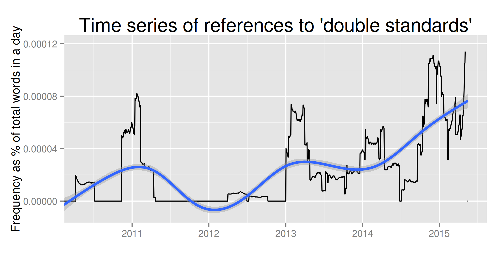
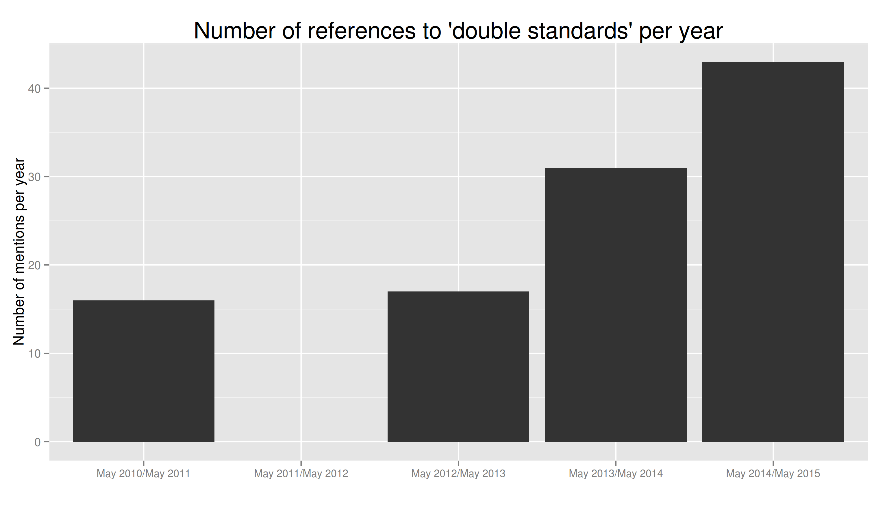

At the latest [ASN](https://twitter.com/ASN_Org) conference in New York I have been talking with [Sofie Bedford](https://twitter.com/sofiebedford) about the rhetoric of 'double standards' in Azerbaijan and elsewhere. The conversation prompted a vary basic research question: "is it true that Azerbaijan's president has been using more and more the rhetoric of 'double standards'?"

Since it is exactly the kind of straightforward question that can be easily approached with a tool I have been working on recently that simplifies quantitative content analysis of textual materials available online, I gave it a spin... and here are the results.

The current English language version of the website of the president of Azerbaijan has 4094 articles published in its [news section](http://en.president.az/news/), starting with May 2010. They are mostly reports of the official meetings of Ilham Aliyev, and include the full version of lengthy presidential speeches and official declarations. This arguably constitutes the most comprehensive collection of Aliyev's speeches since 2010 available in English.

In all of these materials, 'double standards' is mentioned 107 times in 48 separate occasions.

The graph below shows the frequency of references to 'double standards' as a percentage of total words published on the website in a given day, calculated on a rolling average of 90 days to highlight trends and enhance readability.

The same data is reported below in a bar chart that shows the absolute number of references to 'double standards' on the official website of the president of Azberbaijan on a yearly basis. Since the website currently shows only news published since May 2010, and I have included all publications until mid-May 2015, for the purpose of this post I divided the whole period in 12-months periods accordingly.[^1]

This brief analysis of official press releases and speeches published on the website of Azerbaijan's president makes clear that the answer to the question asked at the beginning of this post is 'yes'. In recent years, Azerbaijan's president has made more and more often reference to the issue of 'double standards' in official occasions.

[^1]: The same data divided by solar years would result in [this graph](barchartDoubleStandardsPresidentAzerbaijanSolar2.png). The resulting graph is slightly misleading, as the years 2010 and 2015 are not complete. However, this shows that in the first five months and a half of 2015 there were as many references to ‘double standards’ as in the whole of 2014.