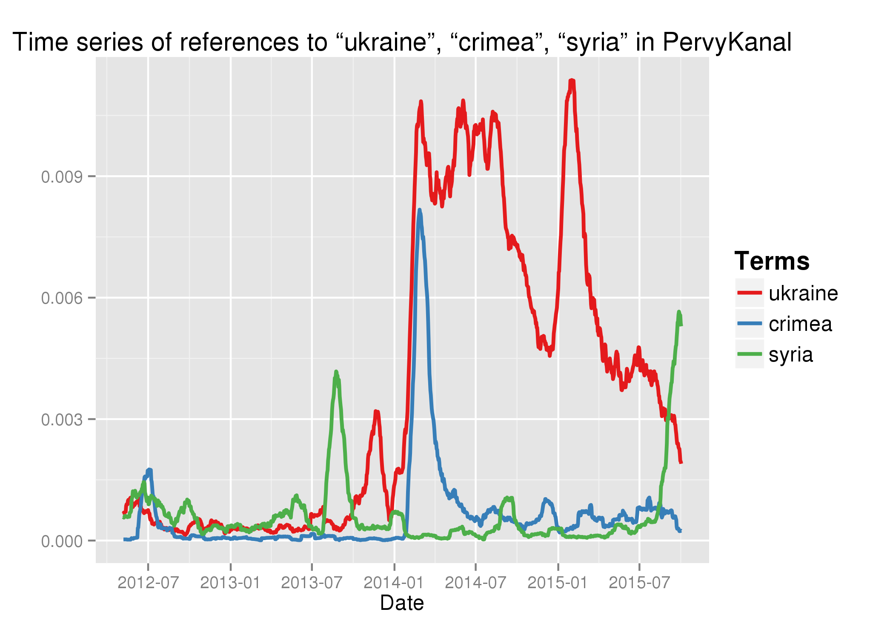
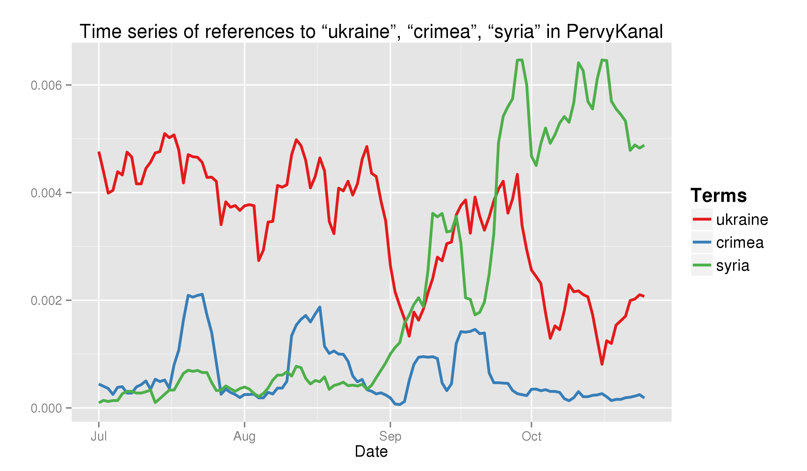
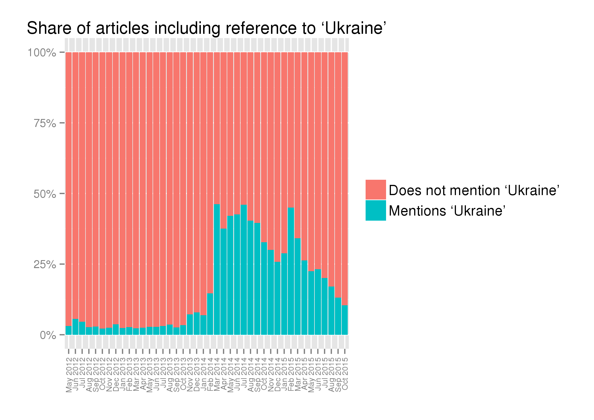
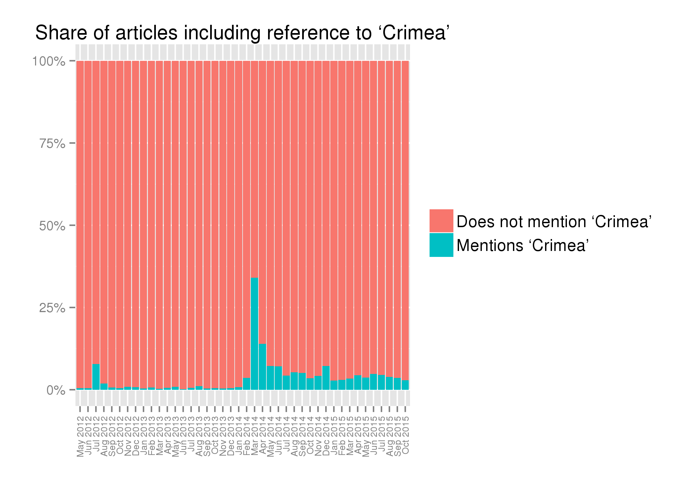
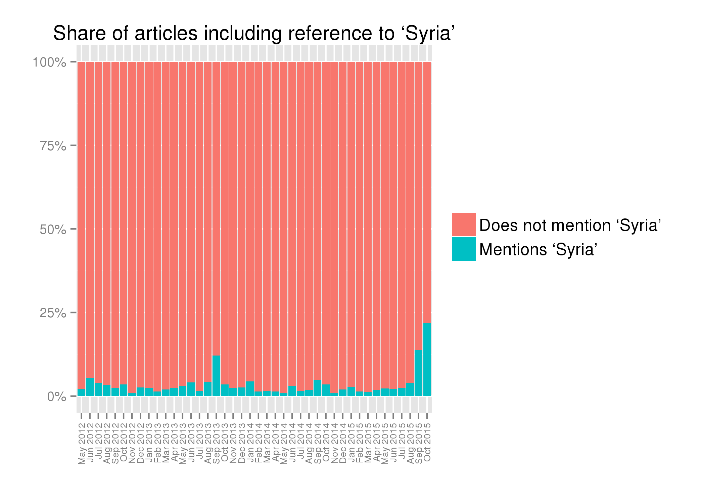

Just more than a month has passed since Russia started its military intervention in Syria. There has been a lot of talking about the motivations behind the Kremlin's decision to take an active military role in the Middle East, and a number of competing explanations have been proposed. However, one element that has been frequently quoted is the Kremlin's desire to shift attention in Russia's media from Ukraine to something else, while maintaining the focus on foreign affairs rather than domestic issues. For example, [Timothy Snyder](https://twitter.com/timothydsnyder) [claimed that](http://time.com/4054941/putin-russia-syria/) "the more important factor is domestic public opinion", that "Russia is a television culture", and that "Russian television has completely changed the subject: from Ukraine to Syria."

In spite of the frequency of such statements in analyses of Russia's intervention in Syria, I found no specific evidence of such allegations. This is why I decided to do some basic word frequency analysis of Russia's state broadcaster. Russia's (state owned) [First Channel](http://1tv.ru/) is the main source of information for many Russians, and regularly publishes transcripts of its news stories on its website.

I downloaded and extracted all news items published since the beginning of Putin's third mandate as president (7 May 2012) and until the end of October 2015, for a total of 83.191 items.[^1]

The graph below shows the frequency of references to 'Ukraine', 'Crimea', and 'Syria' as a share of total words published on the website in a given day, calculated on a rolling average of 30 days to highlight trends and enhance readability.[^2]

Even in recent weeks, Syria has not been receiving quite as much attention as Ukraine in 2014 and early 2015 (or Crimea at the time of its annexation).[^3] However, it has clearly surpassed both of them in recent weeks, as appears more clearly from the following graph that includes only data for the second half of 2015. This graph is calculated on a rolling average of 7 days, in order to provide more details.[^4]

Here is another way to look at the data. The following graphs show the share of articles published on Russia's First Channel website mentioning Ukraine, Crimea and Syria.

What really stands out from these graphs is that for months almost half of all news stories on Russia's First Channel made reference to Ukraine. While Syria never reached that level of attention, in the month of October 2015 almost one quarter of news stories mentioned at least once Syria. Such numbers would be surprising for many countries, where the news cycle is dominated by domestic news.

Overall, this brief analysis shows that:

- indeed, Syria has become a common topic in the news on Russia's First Channel, with almost one quarter of news items making reference to Syria in the month of October 2015;
- in October 2015, Syria has been mentioned much more often than either Crimea or Ukraine (up to three times as much);
- Syria has never reached the level of attention that was dedicated to Ukraine for a considerable part of the last two years;
- Ukraine has dominated the news cycle in Russia for much of 2014 and 2015, with more than one quarter of news stories published on the website of Russia's First Chanell making reference to Ukraine for each month from March 2014 until April 2015;
- in a few months, almost half of all news items made reference to Ukraine (in particular,  the months of March 2014, July 2014 and February 2015).

In brief, while Syria has been receiving a lot of attention in recent weeks, and, indeed, it has replaced Ukraine as the main focus of attention in terms of foreign affairs on Russia's First Channel, the truly astonishing data emerging from these graphs is the consistently high level of attention dedicated to events in Ukraine for a lengthy period of time, from early 2014 to September 2015.

[^1]: Due to technical reasons, a tiny fraction of articles may be missing. Given that the graphs are based on averages, this should not have a substantial impact on the overall results.
[^2]: All derivative forms, such as 'Ukrainian', 'Crimean', or 'Syrians' are counted here as 'Ukraine', 'Crimea' and 'Syria' respectively. A rolling average of 30 days means that the data point for each day is in effect the average result for the previous 30. 
[^3]:  The early spike of references to Syria in August/September 2013 is related to the Ghouta chemical attack and in particular Russia's role in negotiating a [chemical weapons disarmament deal](http://www.bbc.com/news/world-middle-east-23876085) in the following weeks.
[^4]: [Clicking here](timeseries-news-PervyKanal-ukraine-crimea-syria-rolling-30.png) you can see the same time series, calculated on a rolling average of 30 days. 