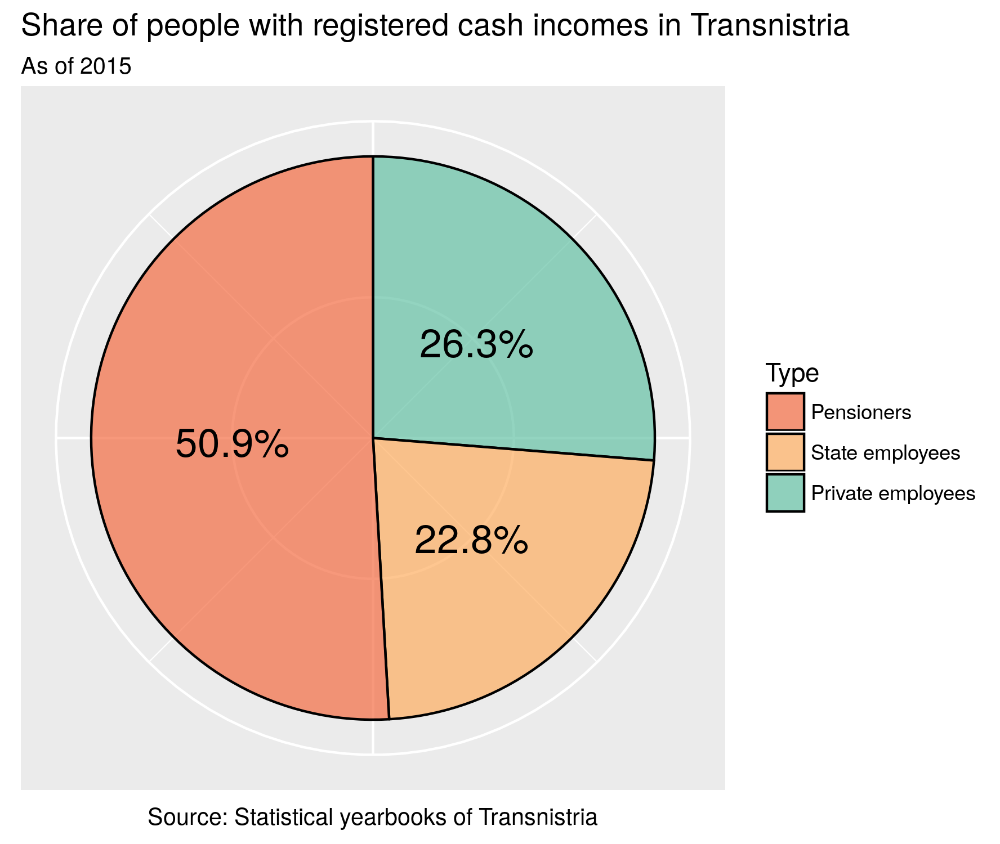
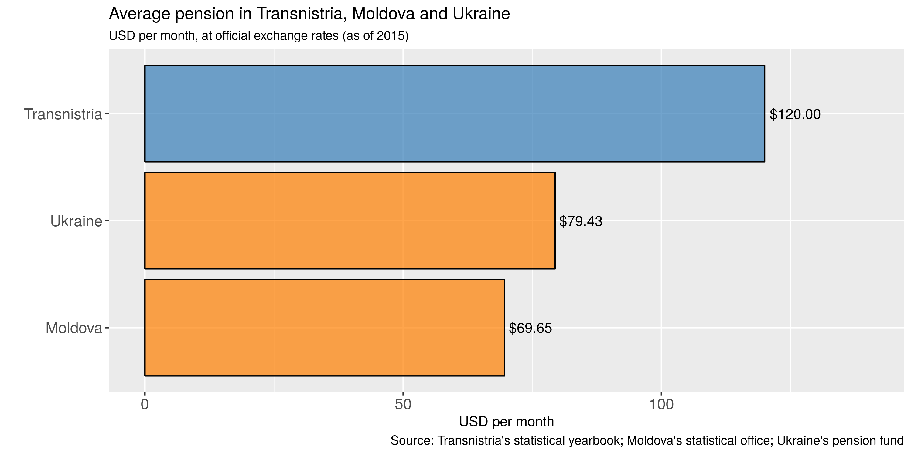
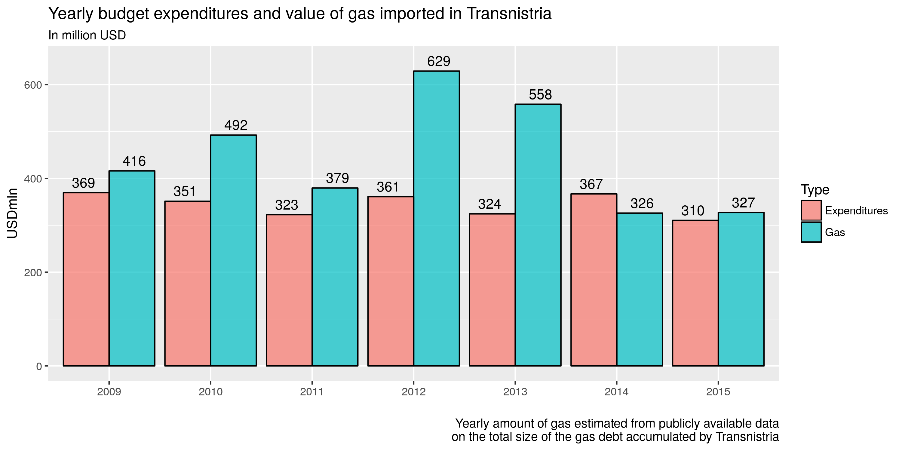
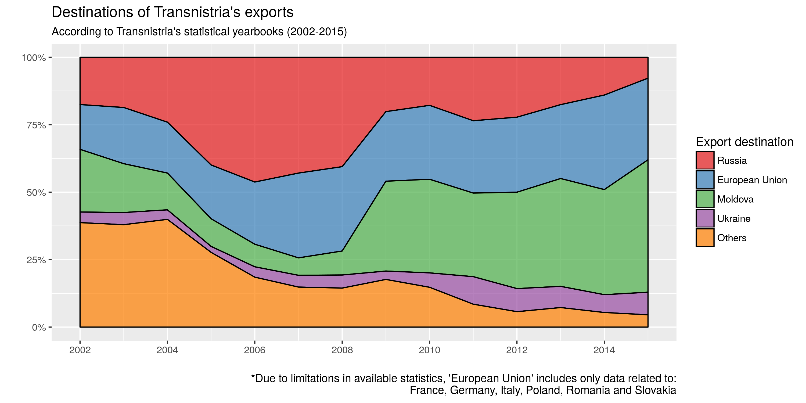
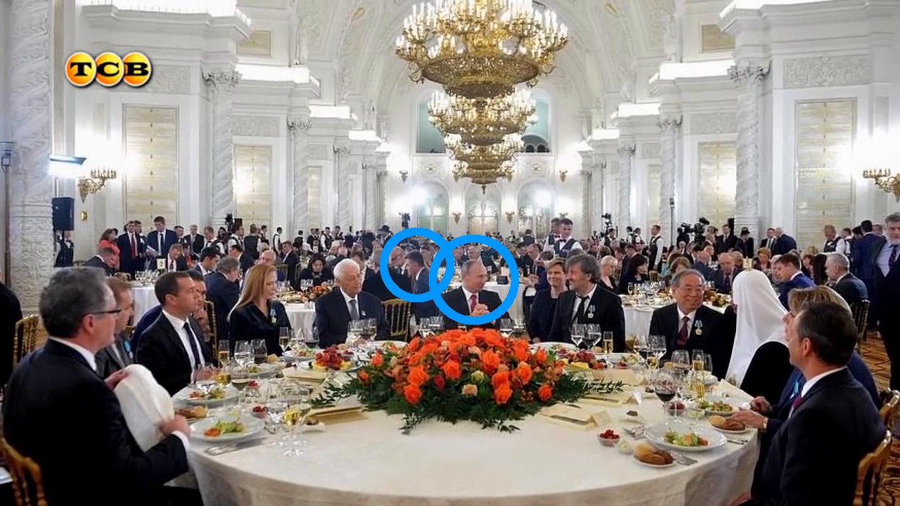
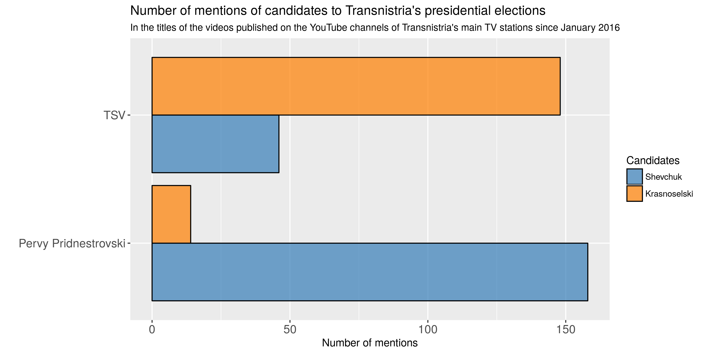

*Originally published on [Presidential Power](http://presidential-power.com/?p=5667 "Link a Presidential Power")*

Presidential elections in Transnistria, a de facto independent state within the internationally recognised borders of Moldova, are scheduled for 11 December 2016. Out of a total of seven registered candidates, the two main contenders for the position are the incumbent president, Yevgeny Shevchuk, and Vadim Krasnoselski, who currently serves as the speaker of the Transnistrian parliament (locally still known as "Supreme Soviet").

[Freedom House ranks Transnistria as "not free"](https://freedomhouse.org/report/freedom-world/2016/transnistria), yet elections take place regularly, are competitive and -- as the 2011 vote showed -- a serving president can lose at the polls. While media pluralism is limited, the work of civil society organizations is severely restricted (for example, interactions with external actors is to be agreed with the local ministry of foreign affairs), and those in power make extensive use of administrative resources to strengthen their positions, recent elections have been preceded by lively campaigns and outcomes were far from predetermined.

## Previous elections

Since its inception with the demise of the Soviet Union, Transnistria had been ruled by Igor Smirnov, known for its authoritarian style of government that prevented any substantial form of contestation. Yet, with time both Moscow (a key provider of support for the region) and Sheriff (the holding company owning key sectors of Transnistria's economy), grew dissatisfied with his leadership. When presidential elections took place in 2011, Smirnov ended only in third place. Yevgeny Shevchuk, previously speaker of the parliament and then leader of the Sheriff-supported party "Renewal", won the run-off against Moscow-backed and then parliament speaker, Anatoly Kaminski.

During his presidency, Shevchuk has distanced himself from Sheriff and tried to establish an independent power block around his administration. However, Shevchuk-backers performed poorly at the latest elections to the Supreme Soviet in November 2015; formally independent candidates close to "Renewal" and Sheriff (and now in strong opposition to Shevchuk) won a strong majority in the 43-seat parliament, and elected Vadim Krasnoselski as parliament speaker.

According to key terms of reference of Transnistrian politics, the forthcoming presidential elections can thus be briefly characterised as a contest between an incumbent president with declining popularity (Yevgeny Shevchuk) and a speaker of the parliament backed by Sheriff (Vadim Krasnoselski).

## Policies

The two key candidates do not stray from the main tenets of Transnistria's mainstream politics, and ever closer integration with Russia is not a point of debate. They may have different views in terms of fiscal policy and a few other issues, but overall their programmes largely overlap, to the extent that [in a recent talk show](https://www.youtube.com/watch?v=J6I5qtbumaQ) Krasnoselski's supporters accused Shevchuk of lifting policy proposals directly from the pre-electoral programme of his opponent.

During the campaign, both candidates insisted on their pro-Russian credentials, declared their support for pensioners (and claimed their opponent would cut pensions), accused each other of close ties with Moldova, and substantially dismissed the issue of relations with the European Union. However, keeping preferential treatment for Transnistrian exports towards the EU and ensuring that agreements on the export of electricity to right-bank Moldova remain in place will be a key challenge for Transnistria's next president.

While much of the ongoing struggle is effectively among two power blocks fighting against each other for access to political power and economic resources in the territory, there is one main question at the heart of the electorate: who among the candidates is best suited to keep Russian aid flowing, keep the economy afloat, and thus ensure that pensions and salaries of state-employees are not cut?

## Transnistria through graphs

According to official statistics released by Transnistrian authorities, of the total number of people with a registered cash income, about half are pensioners, one quarter are state-employees and one quarter are employed in the private sector.

A one-to-one workers-to-pensioners ratio is hardly sustainable, in particular considering the fact that pensions are high by regional standards (pensions in Transnistria are more than 50 per cent higher than in neighbouring Moldova and Ukraine).

Transnistria's authorities can afford this relatively high level of pensions and salaries of state employees, as well as a degree of public services comparable with that found in neighbouring countries thanks to support from Russia. [Transnistria's president himself admitted](http://novostipmr.com/ru/news/13-03-05/glava-pridnestrovya-my-hotim-rasschityvatsya-v-rossiyskih-rublyah) that Transnistria would be able to cover for only about 20-25 per cent of its budget without external support. Russia officially covers some of the expenditure for pensions, and sponsors constructions (in particular in the health and education sector) through a "humanitarian aid" programme, but the bulk of its help actually comes in the form of free gas. In brief, Gazprom delivers gas to the region, but does not demand to be paid for it. The total amount of debt accumulated by Gazprom currently stands at about 5 billion USD, or about six times Transnistria's yearly GDP. In recent years, Transnistria received every year about 300-500 million USD worth of gas (about as much as the total size of budget expenditures), without paying a penny for it.

Individuals and companies based in Transnistria mostly do pay for the gas they use, but those payments are kept as a subsidy to the budget. Accordingly, in order to transform free gas into cash for the budget, Transnistria's economy must function: hard currency does not come from Russia, but rather from the export of goods (such as metals and textiles) mostly to EU countries and Moldova. Electricity produced in Transnistrian powerplants and sold across the de facto border with Moldova is also important.

In brief, the local economy would not be able to function without Russian support, but it also needs open trade routes towards Moldova and the EU to keep itself afloat (only about 8 per cent of Transnistrian exports go towards Russia). It is ultimately those exports that provide the cash needed to pay for the pensions and salaries that are a core legitimizing element for Transnistria's leadership.

## What does this mean for the elections?

 

In order to demonstrate they can be trusted with ensuring uninterrupted Russians support, each of the main candidates boasts that they have better relations with Moscow, and have direct contacts with the Kremlin. The fact that Transnistria's parliament speaker Krasnoselski was sitting "at the next table to Putin" at a recent reception, while president Shevchuk was not even invited, [was hailed by the Sheriff-owned TV channel TSV](https://www.youtube.com/watch?v=ZtROZZWFMmk) as a clear sign that Moscow supports Krasnoselski.

In the context of limited pluralism that characterises Transnistria, the current balance of power allows for an unusually high level of contrast among candidates. Since last year's parliamentary elections, the Supreme Soviet has served as a platform for criticising the president's performance. The deadlock between the presidency and parliament stalled much needed reforms, for example, in order to deal with the ongoing currency crisis.[^1]

The year 2016 has been characterised by a constant blame-game between president and parliament that has been most noticeable on the two main local TV channels; the state-owned "Pervy Pridnestrovski" remained on Shevchuk's side, while Sheriff-owned TSV openly campaigned for Krasnoselski.

The two TV channels offered remarkably different perspectives on current events in Transnistria. TSV focused on [Krasnoselski's close ties to Moscow](https://www.youtube.com/watch?v=irdoOisyewc), on blaming president Shevchuk for the ongoing economic crisis and on highlighting the perils of a looming economic breakdown if Transnistria's leadership does not change.[^2] Shevchuk has also been accused of siphoning off large sums of money through an intermediary company involved in the export of electricity, and of conceding too much in negotiations with Moldova.[^3]

"Pervy Pridnestrovski" broadcast [multiple presidential addresses](https://www.youtube.com/results?search_query=%D0%9E%D0%B1%D1%80%D0%B0%D1%89%D0%B5%D0%BD%D0%B8%D0%B5+%D0%9F%D1%80%D0%B5%D0%B7%D0%B8%D0%B4%D0%B5%D0%BD%D1%82%D0%B0+%D0%9F%D0%9C%D0%A0+%D0%95%D0%B2%D0%B3%D0%B5%D0%BD%D0%B8%D1%8F+%D0%92%D0%B0%D1%81%D0%B8%D0%BB%D1%8C%D0%B5%D0%B2%D0%B8%D1%87%D0%B0+%D0%A8%D0%B5%D0%B2%D1%87%D1%83%D0%BA%D0%B0), and its news reports frequently blamed the parliament for inaction, reassured the public that [pensions and salaries of state-employees will be paid in full in 2017](https://www.youtube.com/watch?v=0Uq-rFbD_u8), and tried to cast Shevchuk as the man of the people [against the interests of big business](https://www.youtube.com/watch?v=ltvEtnUlyVY) (i.e. suggesting that Krasnoselski would govern in the interests of Sheriff, rather than of the common citizen).

## What to expect?

[Opinion polls](http://wciom.ru/index.php?id=236&uid=115850) published in September gave Krasnoselski a clear lead over Shevchuk and other candidates. The results of the November 2015 parliamentary elections also suggest that Shevchuk's popularity has declined. Shevchuk has on his side the power of a substantial part of the state apparatus, but Krasnoselski has influence over some key institutions through parliament, is supported by the powerful Sheriff holding and at this stage seems to have better support from Moscow. Overall public dissatisfaction with the economic situation is also likely to play in Krasnoselski's favour. Given that other candidates are also expected to gather a few percentage points of the vote (Oleg Khorzan, supported by the Communist party, got about 5 per cent at the 2011 elections), a run-off on 25 December cannot be excluded. With or without a run-off, we may be about to witness in Transnistria a new case of an incumbent president who loses at the ballot box and leaves office peacefully: a scenario that is still uncommon in the post-Soviet space, but not unseen in  Transnistria.

[^1]: While the Russian rouble as well as most other currencies in the post-Soviet space have lost half of their value against the dollar in the last couple of years, the Transnistrian rouble has kept its exchange rate unsustainably stable, with a number of consequences on the local economy, including shortages of currency.
[^2]: TSV also aired [a sweet biopic o](https://www.youtube.com/watch?v=n0QuA-XYrbY)[n](https://www.youtube.com/watch?v=n0QuA-XYrbY) [Krasnoselski](https://www.youtube.com/watch?v=n0QuA-XYrbY), portraying him as a trustworthy family man.
[^3]: [An analyst on Sheriff-owned TSV described it](https://youtu.be/plykQeOQfzE?t=2m50s) as a "purely Gorbachev-style policy of unilateral and unmotivated concessions"; in a context where the demise of the Soviet Union is largely perceived as a great tragedy, this is clearly meant as an offensive and disquieting characterisation.