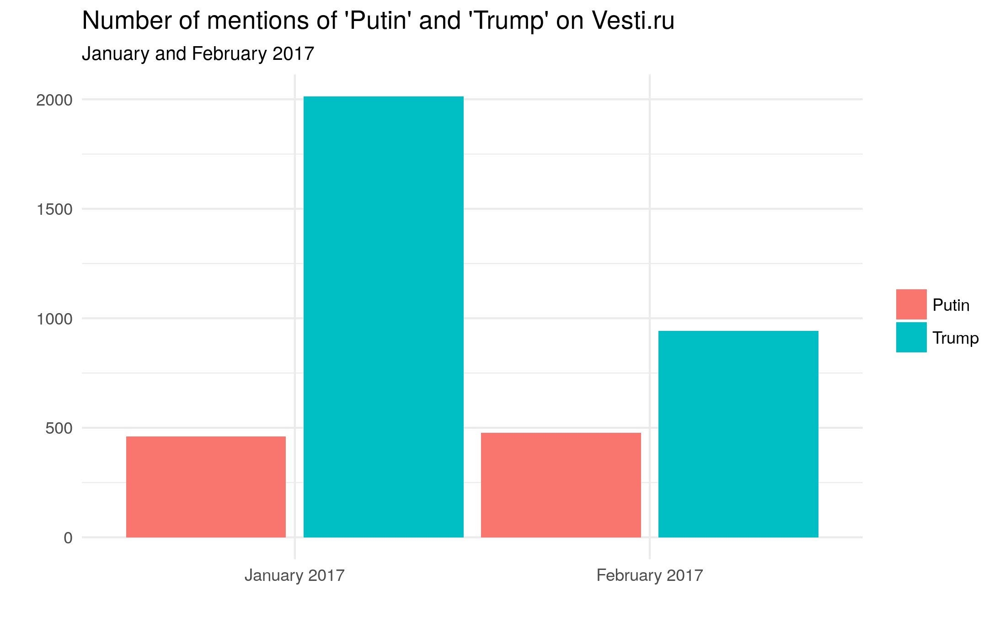
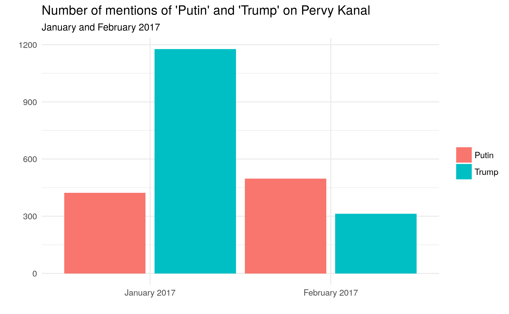
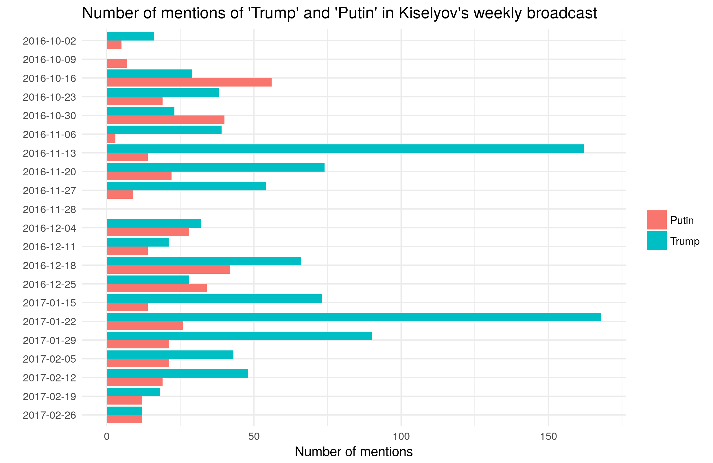
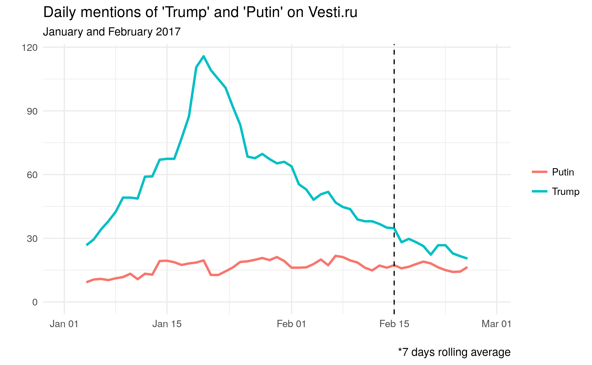
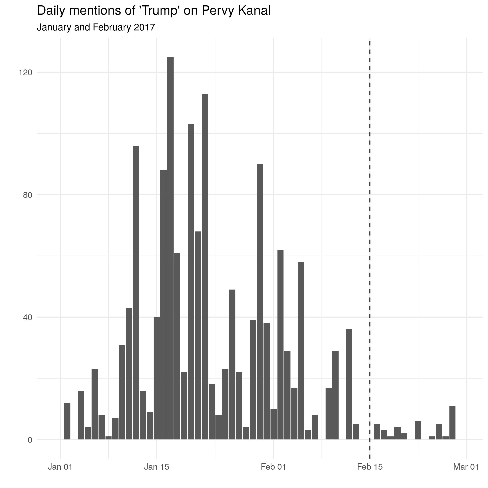
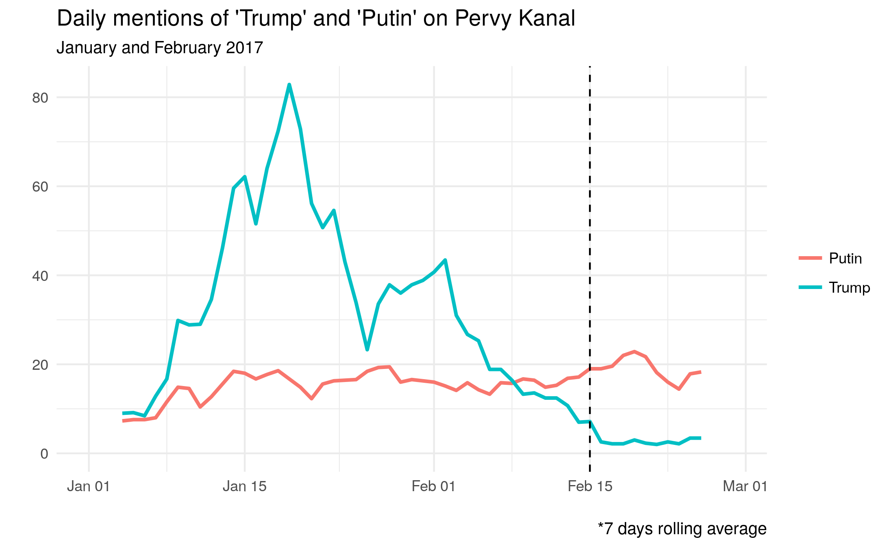
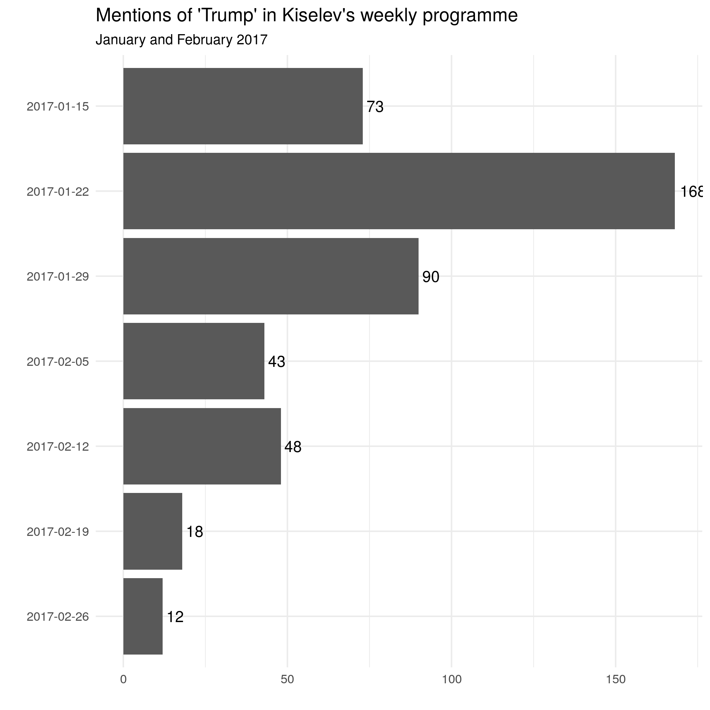
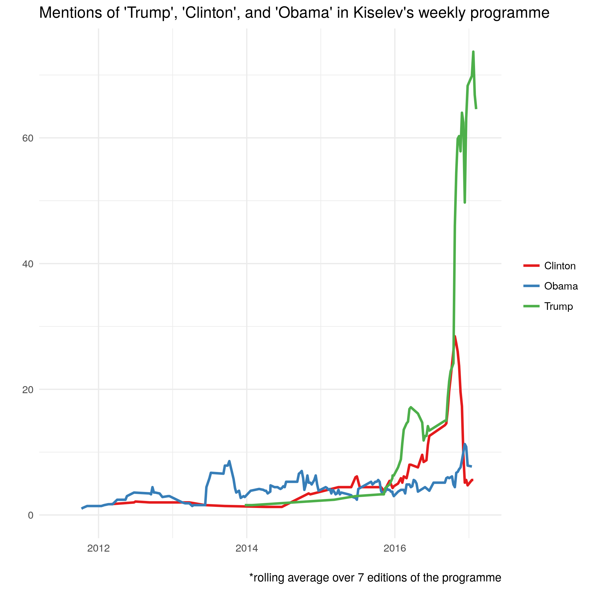
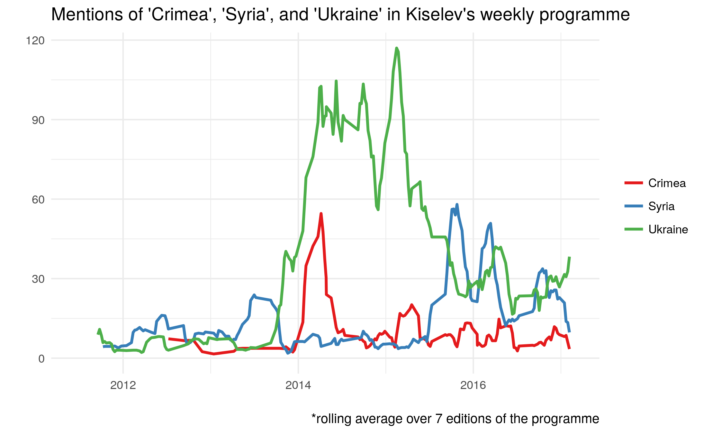

Recently, [Scan Interfax](http://www.interfax.ru/russia/547952) revealed that in the month of January 2017, for the first time since 2011, Vladimir Putin has not been the most frequently mentioned individual on Russian media: Donald Trump was. The news quickly made the rounds on American media (e.g. on [Washington Post](https://www.washingtonpost.com/news/politics/wp/2017/02/01/the-only-person-more-popular-in-russian-media-than-putin-trump/?utm_term=.8ee8415ccca8), [Newsweek](http://europe.newsweek.com/trump-putin-most-mentioned-russian-press-media-553661?rm=eu), [CNN](http://edition.cnn.com/2017/02/17/politics/russia-trump-relationship-analysis-chance/), and others).

According to an article by [Konstantin von Eggert](https://twitter.com/kvoneggert) [published by Deutsche Welle](http://www.dw.com/ru/%D0%BA%D0%BE%D0%BC%D0%BC%D0%B5%D0%BD%D1%82%D0%B0%D1%80%D0%B8%D0%B9-%D1%82%D1%80%D0%B0%D0%BC%D0%BF-%D1%82%D0%B5%D0%BF%D0%B5%D1%80%D1%8C-%D0%BD%D0%B5-%D0%BD%D0%B0%D1%88/a-37578453?maca=rus-tco-dw), on 15 February Russian state-owned media of the [VGTRK](https://en.wikipedia.org/wiki/VGTRK) group were instructed to stop talking about Trump so much. This does not sound unreasonable, as overtly positive coverage of Trump was increasingly at odds with the explicit [anti-americanism that has characterised Russian public discourse in recent years](http://carnegie.ru/commentary/?fa=60457). Yet, how do we know that such instructions have been actually given?

To test if the above statements are accurate, I downloaded all news published on Vesti.Ru (the main state owned all-news channel part of the [VGTRK](https://en.wikipedia.org/wiki/VGTRK) group) and from Russia's First Channel (state controlled) for January and February 2017. Separately, I also downloaded the transcripts of [Dmitri Kiselev](https://en.wikipedia.org/wiki/Dmitry_Kiselyov)'s weekly programme for the last 5 years. Kiselev is often characterised as the Kremlin's chief propagandist, has been included in the EU sanctions list, and has leading positions in the management of Russian state media.

This amounts to a total of 8622 news items from Vesti.ru (all news for January-February 2017, 146 publications a day on average), 3462 news items from Pervy Kanal (all news for January-February 2017, 60 publications a day on average), and all news segments available online of Kiselev's weekly programme (the archive goes back to June 2011: 3532 news segments in total, including 128 broadcast in January-February 2017)

Here are the results.

More Trump than Putin? Yes.
---------------------------

Looking at the first two months of 2017, it appears very clearly that Trump has been mentioned much more frequently than Putin in the selected media in January 2017 by a wide margin (Trump has been mentioned about four times more often than Putin on *Vesti*). In February 2017, Trump was still more frequently mentioned than Putin on *Vesti*, but not on *Pervy Kanal*.

Looking at the relevant data for Kiselev's weekly programme, it appears that Trump has been mentioned almost always more often than Putin since before the elections.

In two occasions (post-election and post-inauguration programmes) Trump was mentioned more than 150 times in a programme lasting about 2 hours 15 minutes, i.e. more than once per minute on average.

Did anybody say "no more Trump"? Maybe.
---------------------------------------

If, as suggested by [Konstantin von Eggert](https://twitter.com/kvoneggert), state media were instructed on 15 February to stop talking about Trump, we should expect a steep decrease in the number of references to Trump in the following days.

In the case of *Vesti*, there does not seem any immediate effect.

![]TrumpOnlyByDay_vesti.png)

Showing the same data based on a 7-days rolling average to highlight trends beyond daily fluctuations, and including mentions of Putin for reference, it appears more clearly that the mentions of Trump are in decline, but it does not seem that 15 February signalled an abrupt change on *Vesti.*

[A centre-aligned 7-days rolling average in practice means that the data point for each day is actually the average of the data for the given day, and the three days before and after it]

Replicating the same graph with data from  *Pervy Kanal* presents a rather different picture.

Not only did the number of 'Trump' mentions start to decrease earlier, but there is also a clearer sign that starting with (approximately) 14 February the number of mentions decreased rather abruptly, and stabilised at much smaller levels, with just very few mentions of Trump (or no mention at all) out of a news coverage composed of about 60 news items per day.

The steep decrease of mentions may well be the result of instructions from above. However, in the context of a broad trend of decreasing attention to Trump, it cannot be excluded that the decrease is "organic".

Finally, looking at Kiselev's weekly programme, it appears that the number of mentions of Trump in the two editions of the programme broadcast after 15 February 2017 is much smaller than in any of the previous programmes of 2017. Again, this is likely the result of  conscious choice, but it is not possible to rule out completely that this is simply related to decreased interest in Trump, once the post-inauguration frenzy has passed.

It should be highlighted that the high frequency of mentions of Trump over this period is highly unusual: Kiselev barely recorded Obama's re-election, and even at times of international crisis did not mention either Obama or Clinton at comparable levels.

This graph highlights the unusual amount of attention that Kiselev's programme dedicated to the American presidential election of 2016, and to Donald Trump in particular.

To sum up
---------

This brief analysis confirms that Trump has been mentioned much more frequently than Putin in January 2017 on the main state-controlled media in Russia, and to an extent that seems to be highly unusual, in particular for a foreign head of state.

The data seem to point at a new policy of talking less about Trump effective on *Pervy Kanal* starting with mid-February. However, a similar trend is not clearly noticeable on *Vesti*, which is part of the [VGTRK](https://en.wikipedia.org/wiki/VGTRK) group that allegedly instructed its employees to stop talking about Trump.

While the evidence is not conclusive, this post still presents useful inputs to the debate on the functioning of Russian media. Further analysis, perhaps including sentiment analysis, may allow to see not only how much Russia's media talk about Trump, but also how they talk about him and how media reporting on the American president (or other head of states) impacts on the public perception of a given country.

* * * * *

Bonus graph on mentions of Ukraine, Crimea and Syria
----------------------------------------------------

As a short update on my 2015 post on "[Word frequency of 'Ukraine', 'Crimea', and 'Syria' on Russia's First Channel](./2015-11-03-word-frequency-of-ukraine-crimea-and-syria-on-russias-first-channel/)", here is a bonus graph on mentions of Ukraine/Crimea/Syria by Kiselev.

