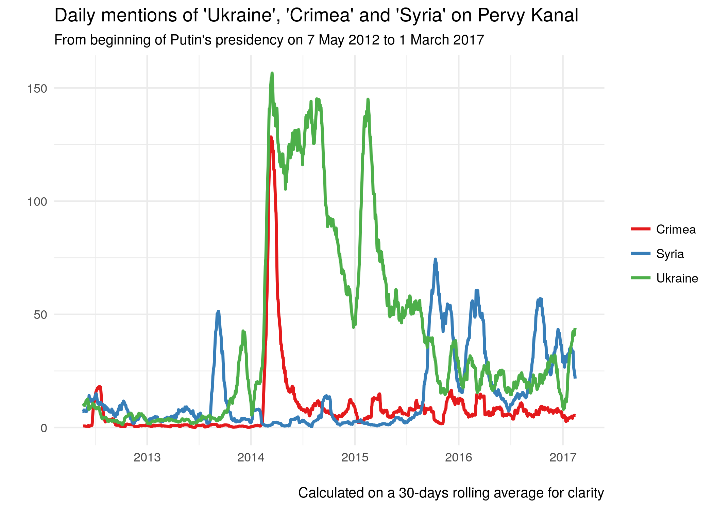
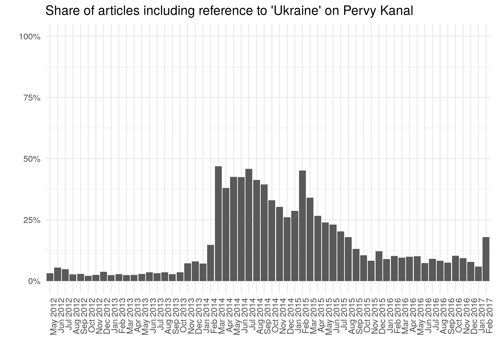
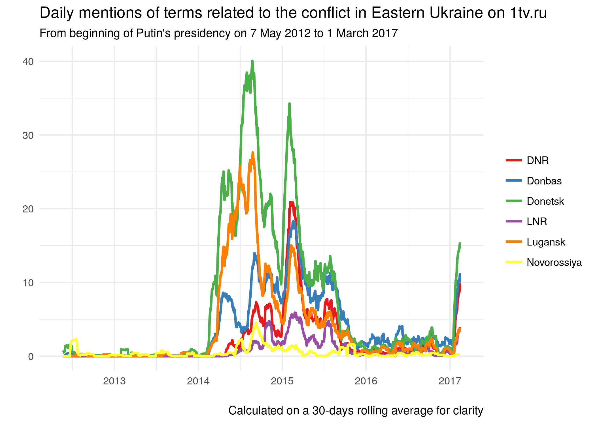
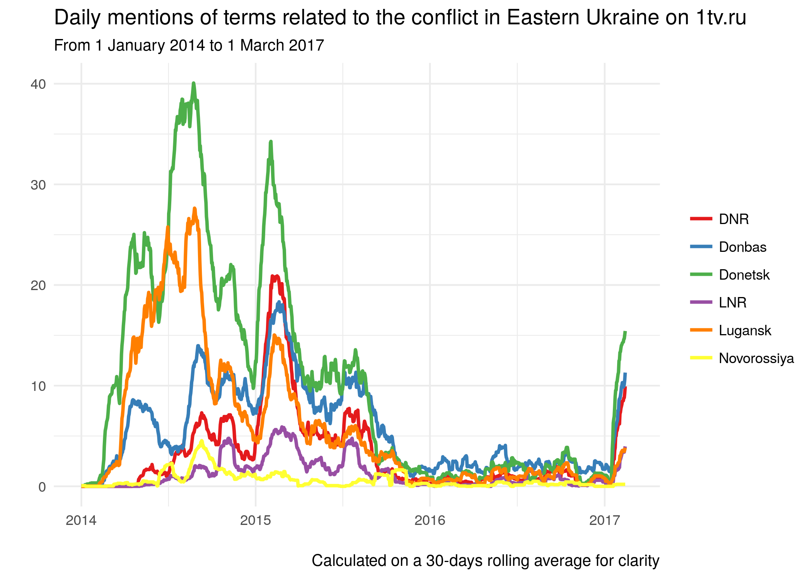
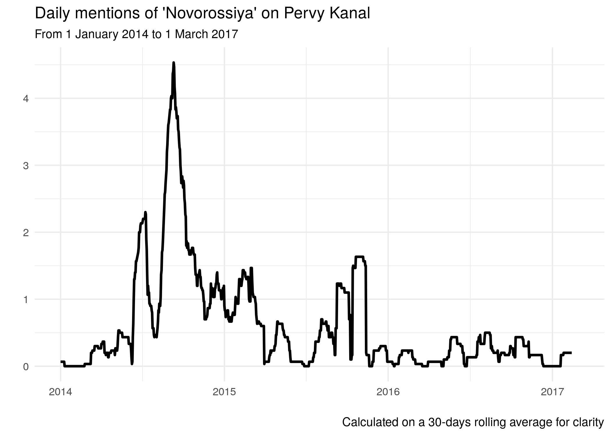

The data included in this post were prepared for publication on the online journal Ukraine-Analysen 182 (<http://www.laender-analysen.de/ukraine/pdf/UkraineAnalysen182.pdf>).

This is a quick update to the data presented in a previous post published on this blog in November 2015 on "[Word frequency of 'Ukraine', 'Crimea', and 'Syria' on Russia's First Channel](./2015-11-03-word-frequency-of-ukraine-crimea-and-syria-on-russias-first-channel/)".

The dataset has been created by extracting textual contents of each news item published on Pervy Kanal's website between the beginning of Putin's presidency on 7 May 2012 and 1 March 2017 (115.369 articles in total).

In the graphs, word frequency has been calculated on a centre-aligned rolling average of 30 days in order to highlight trends beyond daily fluctuations that would make the graph difficult to read; in practice, this means that the data point for each day effectively corresponds to the average of the 30 days around it (more specifically, the day itself, the 14 days preceding it, and the 15 days following it).

Word frequencies have been calculated including all variations of a given term. For example, the value for the frequency of "Ukraine" in practice corresponds to all mentions of *ukrain* -- in order to include all forms and declensions of Ukraine in Russian, as well as expressions such as "antiukrainian". Filters have however been checked manually in order to remove false flags, e.g. to make sure that Greek party "Syriza" is not counted as "Syria".

The graphs are presented here without further analysis.

