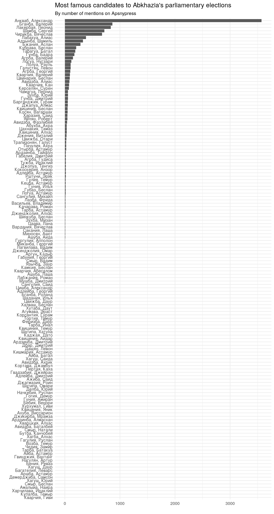
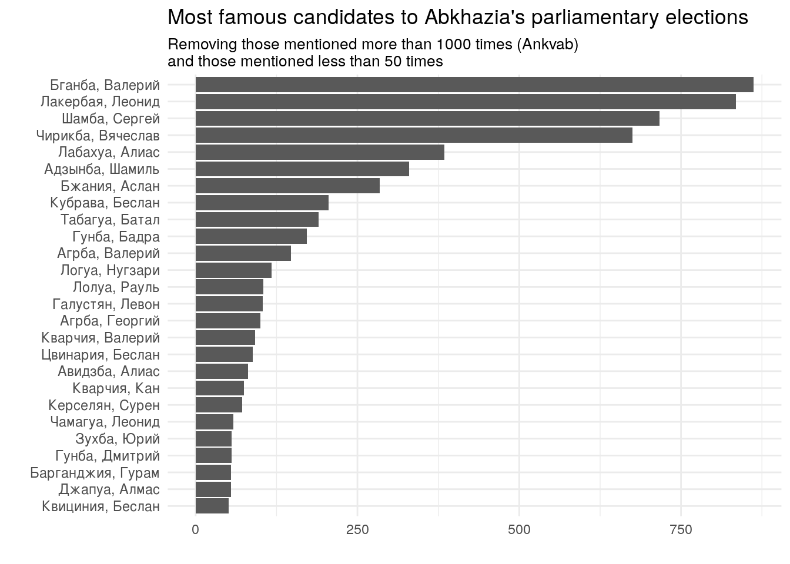
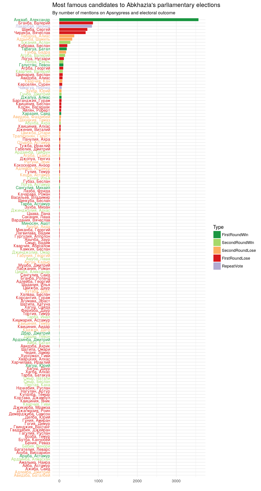
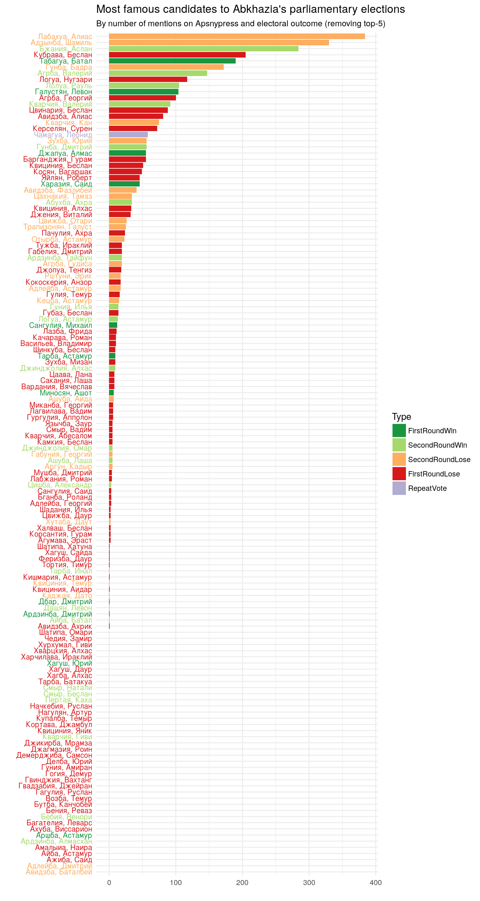
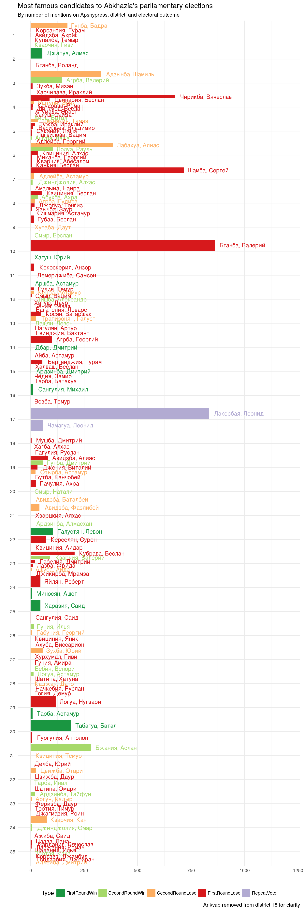
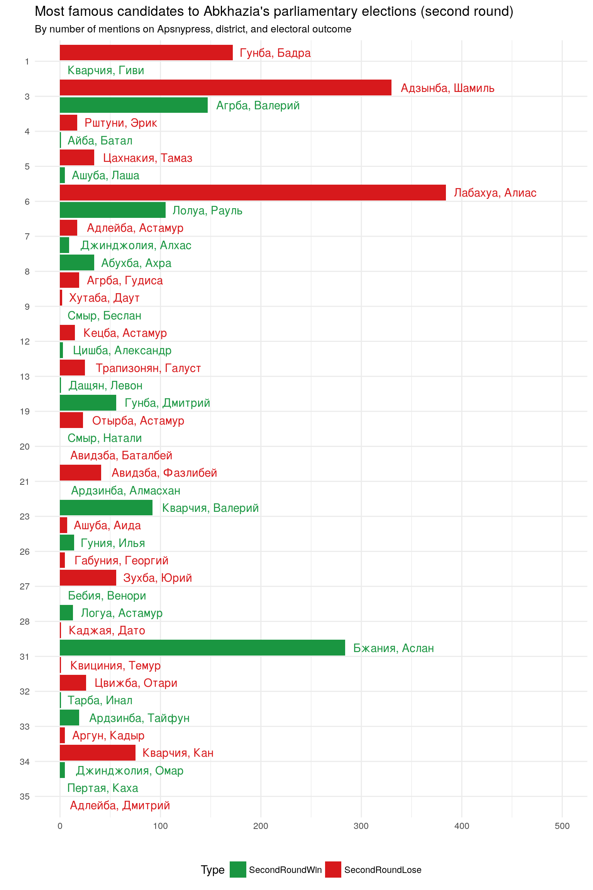

Is being famous nationally an asset or a liability for candidates competing in a single-constituency electoral system in a small polity? Judging from the recent elections in Abkhazia, certainly not a big asset, and probably a liability, in particular in the second round.

In this post, "being famous" is operationalised as "number of mentions of given candidate" in Abkhazia's main news agency. Relevant data are presented in a few graphs below. While only those familiar with political figures in Abkhazia will recognise the names, colour schemes should make this post intelligible also to readers interested in the general question, rather than to election dynamics in this specific case.

March 2017 parliamentary elections in Abkhazia
----------------------------------------------

On 12 and 26 March 2017, two rounds of parliamentary elections have been held in Abkhazia. As all political processes taking place in de facto states, they are considered illegitimate by the international community, with few exceptions. They also cannot claim to be fully democratic, as they are based on the structural exclusion of Georgian residents who were forced to leave their homes during the conflict in the early 1990s, as well as those Georgians that remained or returned to the territory. Only 603 residents were included in the electoral lists of the Gali district out of a population that, according to Abkhazia's own statistical office, amounts to 30.247 as of 1 January 2016. Even besides the structural exclusion of Georgians, the relative marginalisation of Armenians (and Russians) who live in the territory brings Abkhazia closer to the model of "ethnic democracy" (Kolstø and Blakkisrud 2013).

In spite of thes limitations, elections in Abkhazia have proven to be highly competitive. As highlighted by Ó Beacháin (2012; 2016), most incumbents decide to contest elections, but only few of them succeed in doing so. In 2007, out of 26 incumbents contesting the election, only 10 won. In 2012, out of 21, only 5 were re-relected. In 2017, this trend has been confirmed, with [8 incumbents being re-elected out of 28 contesting the election](http://www.civil.ge/eng/article.php?id=29968).

Another trend that has emerged clearly from the recent vote is that of very well known public figures failing to be re-elected. For example, Sergey Shamba (former prime-minister, long-standing minister of foreign affairs, and head of the party "United Abkhazia"),  lost in the first round to a doctor with no political experience and a sportsman. But also former foreign minister Vyacheslav Chirikba, as well as other well known public figures, lost in the first round.

Are these isolated cases, or do really well known public figures have no better chances of being (re-)elected than other candidates who are, comparatively speaking, local unknowns?

Famous candidates
-----------------

In order to test this hypothesis, I have extracted the full names of all candidates who were registered for the elections, as issued by Abkhazia's central electoral commission and published by [Apsnypress](http://www.apsnypress.info/cik/) for a total of 142 registered candidates, only a few them with formal party affiliation.

I then extracted all the news available on Abkhazia's news agency Apsnypress between January 2010 and the day before the elections, for a total of 17.509 news items.

Finally, I counted how many times the combination "name surname" of each of the candidates appeared in the news (accounting for the fact names may be declined in Russian).

This is the result:

Unsurprisingly, There is a huge difference among candidates, with former president Aleksander Ankvab being mentioned much more frequently than any other candidate. It is worth noticing that a large share of candidates has never or almost never been mentioned on Apsnypress.

In order to enhance readability, the following graph excludes Ankvab and those candidates mentioned less than 50 times.

Readers familiar with Abkhazia's politics will find, as expected, many familiar names in this graph. Indeed, while not without its shortcomings, it seems that frequency of mentions on Apsnypress may serve as useful proxy to rank how famous a public figure is in Abkhazia.

The following graphs introduce elections results: dark green is for those elected at the first round, light green for those elected at the second round, light orange for those who lost at the second round, red for those who lost at the first round. In one district, where former prime minister Lakerbaia was running, the vote will be repeated on 14 of May after a contestation.

Below, same graph as above, excluding the top-5 most famous, to allow for some more details for those mentioned less frequently.

Excluding former prime minister Lakerbaia (elections will be repeated in the district where he was a candidate), 3 out of the top 10 got elected. This is better than average, in particular if Lakerbaia will eventually be elected (on average, there were about 5 candidates for every seat), but not impressively so. It should also be highlighted that about half of newly elected members of parliament have never or only very rarely made the news (i.e. appeared in any form on ApsnyPress in the last seven years).

In the following graph, the data are shown grouped by district. Each district is given the same space in the graph, so thicker bars means less candidates in a given district. Ankvab (who won district 18) has been removed from the graph, otherwise his very high number of mentions would have effectively hidden all other results.

Finally, the next graph shows the results only for those districts that reached the second round.

Again, it does not seem that being "famous" gives a clear advantage. On the contrary, in only 7 out of the 22 districts that went to a second round the most "famous" candidate was elected.

By way of conclusion
--------------------

In a majoritarian system such as the one used for parliamentary elections in Abkhazia, national fame may not really matter, since only voters in the relevant district have a say on the outcome. In a small polity such as Abkhazia, candidates need only about 1.000 votes from their district to be elected in the first round (all those who have been elected in the first round received between 927 and 1.745 votes, and mostly just above 1.000 votes). Local or even family dynamics may be dominant.

Is this a feature common to other small polities? Does this happen in some larger countries as well? I admit I am not familiar with the relevant literature, and a quick search on Google Scholar did not prompt relevant results.

Specifically in the case of Abkhazia, other aspects that may interact with "fame", include ethnicity, being incumbent or not, having a known Abkhaz surname, being a candidate for a party, being a candidate in a rural or city district, and gender. Verifying related hypotheses, however, goes well beyond the scope of this post.

References
----------

Ó Beacháin, Donnacha. 2016. "Elections and Nation-Building in Abkhazia." In *Nation-Building and Identity in the Post-Soviet Space: New Tools and Approaches*, edited by Rico Isaacs and Abel Polese, 206--25. Milton Park, Abingdon, Oxon; New York: Routledge.

Kolstø, Pål, and Helge Blakkisrud. 2013. "Yielding to the Sons of the Soil: Abkhazian Democracy and the Marginalization of the Armenian Vote." *Ethnic and Racial Studies* 36 (12): 2075--95. <https://doi.org/10.1080/01419870.2012.675079>.

Ó Beacháin, Donnacha. 2012. "The Dynamics of Electoral Politics in Abkhazia." *Communist and Post-Communist Studies* 45 (1--2): 165--74. <https://doi.org/10.1016/j.postcomstud.2012.03.008>.