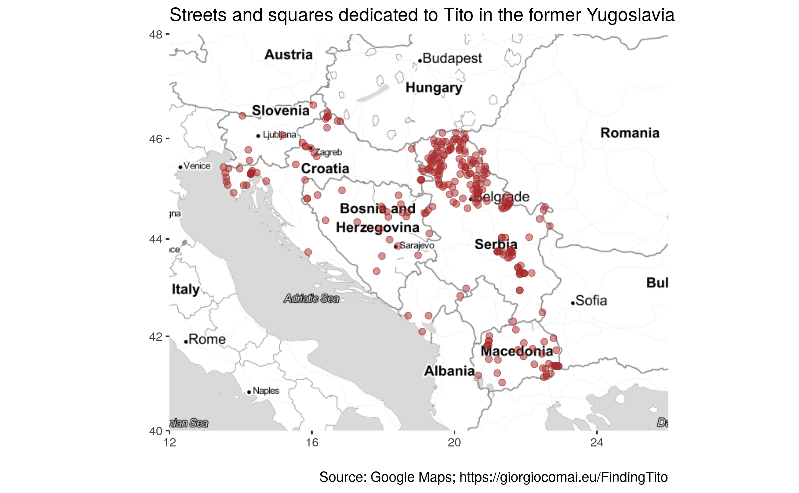
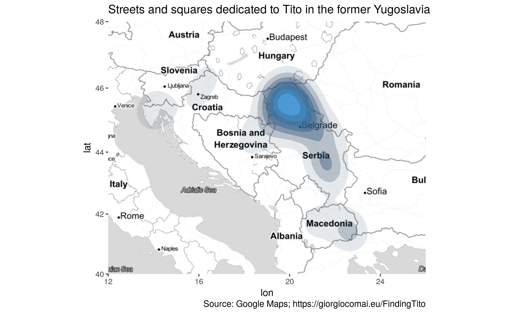
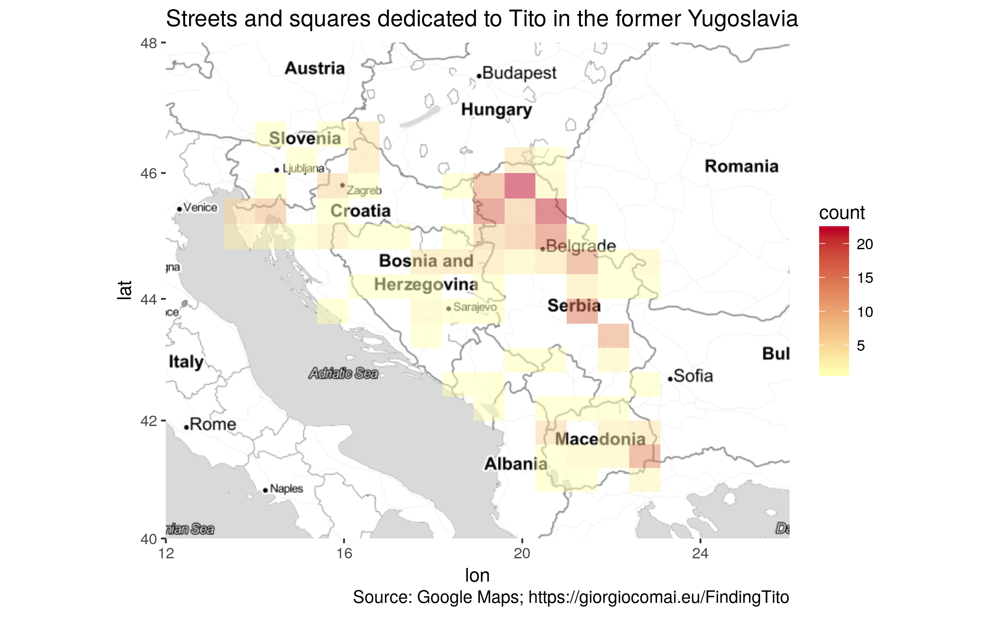
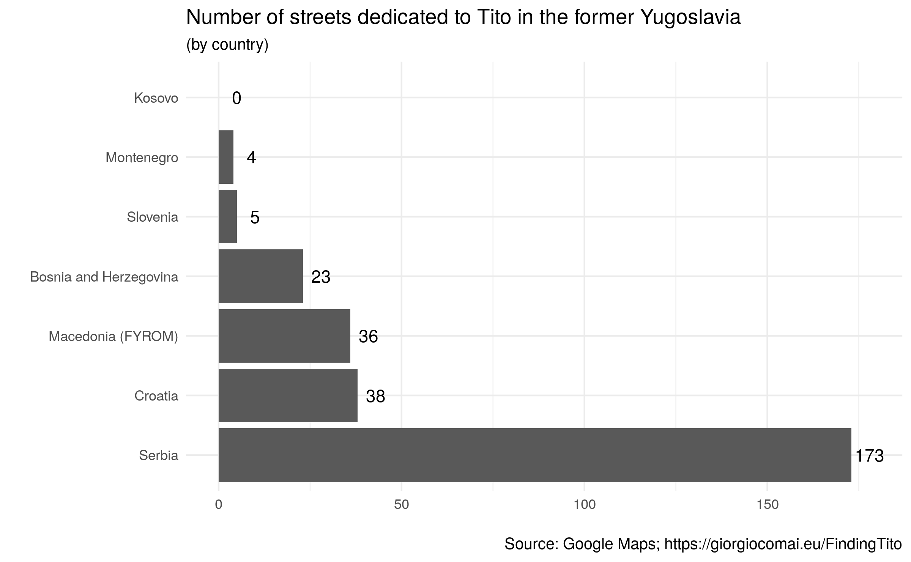

*(this post is now published also on [balcanicaucaso.org](https://www.balcanicaucaso.org/eng/Areas/Balkans/Finding-Tito-182273))*

A few weeks ago, out of curiosity, [Davide Denti](https://twitter.com/DavideDenti) asked me if I knew how to parse OpenStreetMap data in order to find all streets and squares dedicated to Tito in the former Yugoslavia. I was unfamiliar with how OpenStreetMap stores data, but after a few quick attempts I managed to extract some data and produce a map that looked meaningful. Early feedback suggested that the data were incomplete, and I did not fully polish the data, but -- aware that I would not have the time to work on this in the following weeks, and perhaps I would never pick it up again -- I decided to make public [the draft document I created](https://giocomai.github.io/TitoOnTheMap/). I included a notice highlighting that the document was in draft form, that it was only based on OpenStreetMap data, that the data have not been revised and may include substantial inaccuracies. I also made clear that I welcomed suggestions on how to improve it.

Having done this, I thought it was fine to share the result on Twitter.

The material gathered a lot of attention from the Balkan Twittersphere, and was soon picked up by local media (including Sarajevo's [TV N1](http://ba.n1info.com/a176213/Vijesti/Vijesti/Titove-ulice-u-BiH.html)), a number of news websites (such as [Tportal.hr](https://www.tportal.hr/vijesti/clanak/karta-ovo-su-sve-ulice-i-trgovi-u-bivsoj-jugoslaviji-koji-i-dalje-nose-titovo-ime-20170726), [Telegrafi.com](http://telegrafi.com/per-dallim-prej-kosoves-vendet-e-ish-jugosllavise-kane-ende-rruge-emrin-e-titos/), [tvsa.ba](http://tvsa.ba/titove-ulice-hrvatska-i-makedonija-ih-imaju-najvie-bih-na-treem-mj-p7668-178.htm), [klix.ba](https://www.klix.ba/magazin/zanimljivosti/titove-ulice-hrvatska-i-makedonija-ih-imaju-najvise-bih-na-trecem-mjestu/170724106)), as well as a thematic website such as [Titomanija](http://www.titomanija.com.ba/index.php?option=com_content&task=view&id=1284&Itemid=1).



In the lapse of a few weeks, a [map on Google Maps with a layer showing Tito's streets](https://drive.google.com/open?id=1U7EqM2XDLHpyjJaEBy3inOETYg4&usp=sharing) that I linked in the document (but not in the tweet or most mentions by other websites) gathered more than 30.000 views. It is safe to say that many more saw the data as they have been posted on social media and elsewhere online.

As I started to revise the data, and did some testing through the Google Maps API, I became increasingly aware that -- as we suspected from the beginning -- OpenStreetMap data were far from complete, and actually included only less than half of all streets dedicated to Tito that could be found on Google Maps. Even worse, the data were *unevenly* incomplete, and as a result they gave a wrong impression on which areas had a higher density of streets dedicated to Tito.  The fact that OpenStreetMap misses a lot of street names in Vojvodina -- which proved to be the region with most streets dedicated to Tito -- had a particularly substantial impact.

~40.000 queries to Google Maps later
------------------------------------

I decided to spend a bit more time on this, and wrote a script that queried Google Maps for Tito streets in all inhabited locations of the former Yugoslavia (excluding villages that according to OpenStreetMap categorisation had less than 1.000 residents).

The much more complete results (which, again, have not yet been thoroughly revised, and show some small inconsistencies with OpenStreetMap data) are [now available at this link ](/FindingTito/)-- [click here to skip directly to the summary and relative maps](/FindingTito/summary-of-results.html).

Transparency and openness
-------------------------

At first, I had mixed feelings about the fact that a draft map with incomplete and (as it turned out) partially misleading results got so much attention. Actually, I still have.

On the other hand, data analysis is an iterative, bumpy, and time-consuming process. In the age of social media, isn't it fair to share work-in-progress as it evolves? Feedback, alternative sources, better approaches, new ideas, or more efficient code may be around the corner. Besides, making the whole process as transparent as possible, including by sharing the code and making it public under a [permissive Creative Commons license](https://creativecommons.org/licenses/by/4.0/) has many benefits. One of them, is that it enables replication, and allows others to develop further this project in new directions. It also enables conducting a similar research in a different context (e.g. a different country, a different street name) by simply changing a few lines of code.

What's not to like? Expect more code and work-in-progress from my side in the next few months.

[Follow this link for a summary of results and more maps](/FindingTito/summary-of-results.html)

[Here are the results as an overlay on Google Maps](https://www.google.com/maps/d/viewer?mid=1U7EqM2XDLHpyjJaEBy3inOETYg4).

P.S. On 31 August 2017, Zagreb's city council decided to change the name of Marshal Tito Square. Read more details on the decision on the website of [OBC Transeuropa (in Italian)](https://www.balcanicaucaso.org/aree/Croazia/Zagabria-scompare-Piazza-Tito-182267) or on [Balkan Insight (in English)](http://www.balkaninsight.com/en/article/zagreb-assembly-votes-to-remove-tito-s-square-09-01-2017).