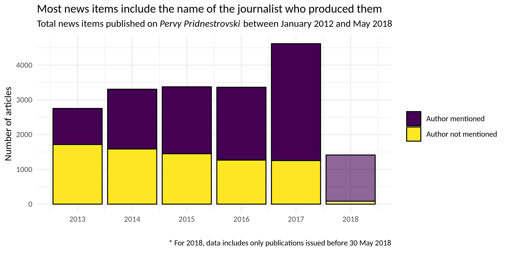
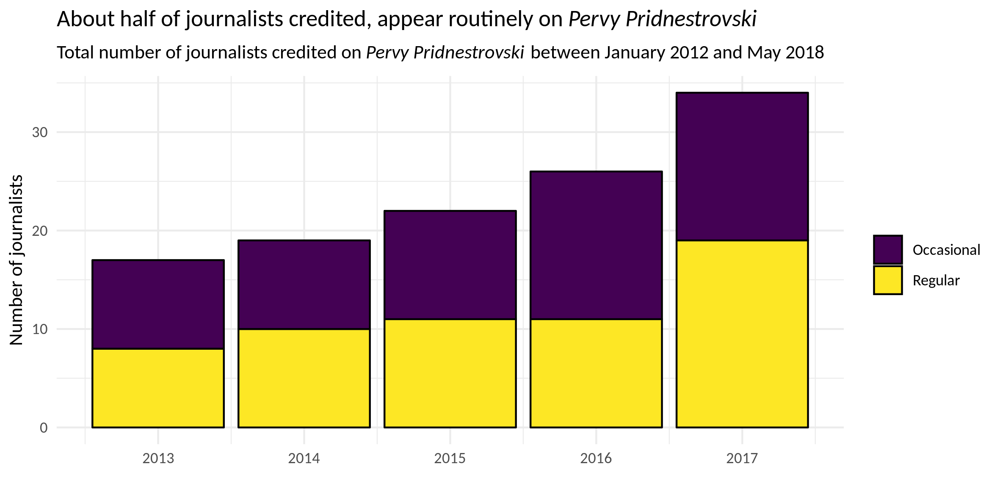
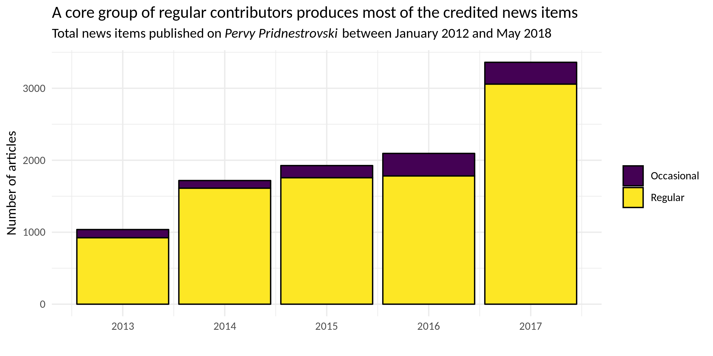
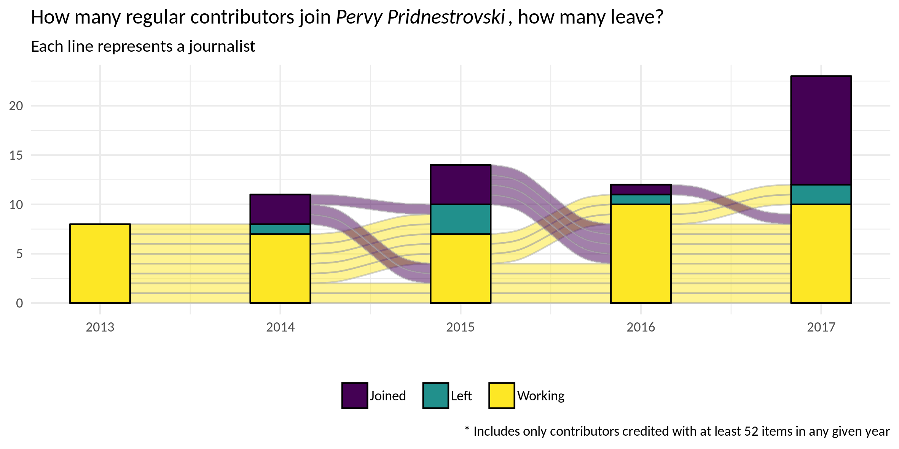
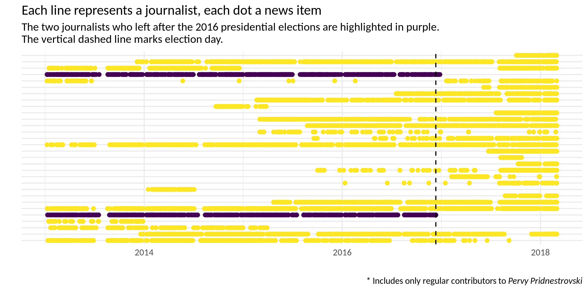

*I have analysed Transnistrian online media 18 months after Vadim Krasnoselski came to power. I found clear evidence of selective removal of “unpleasant” old news items, but no evidence of mass dismissal of journalists.*

In Transnistria – a de facto independent state located within the internationally recognised borders of Moldova – in the aftermath of the December 2016 presidential vote, the risk of increased tensions seemed to be particularly high, as Vadim Krasnoselski – who won the vote – had threatened to jail the incumbent Shevchuk [on live TV during a pre-electoral debate](https://youtu.be/V_HC6UOEzjk?t=10m16s), and people in top positions close to Shevchuk knew they had a lot to lose from an unfavourable electoral outcome. The transition, however, has been managed peacefully – at least in part, under the careful watch of Moscow – in order to avert a major crisis.

If in exchange for leaving their positions of power peacefully Shevchuk and other members of his close circle had been given some reassurance about their safety, the deal has not hold. Shevchuk himself had to flee to Chișinău fearing prosecution in Tiraspol, and a number of high-ranking officials under his tenure (including former interior minister, former head of the customs committee, and the former head of the republican bank) [have been jailed](https://tv.pgtrk.ru/ru/news/20170929/61775). Apparently, [many others left for Odessa](http://mk.kn.md/articles/2017/02/23/eksglava-kgb-pridnestrovya-pokhishhen-neizvestnymi.html). Lower ranking officials probably mostly kept their place. But what about journalists at the state-owned broadcaster *Pervy Pridnestrovski*? The TV channel has been a central element of the pre-electoral struggle, with news reporting explicitly promoting the line of then-president Shvechuk, blaming the opposition led by (as it turned out, soon-to-become president) Vadim Krasnoselski for the ongoing economic crisis, and casting doubts about the motivations and interests of the presidential contender Krasnoselski and his backers at the powerful *Sheriff* holding.

Soon after the vote, *Pervy Pridnestrovski* started characterising as criminal the very same policies that they presented in a positive light until recently, and duly reported about investigations against high-ranking officials of the previous government. In his first meeting with journalists as president elect, Krasnoselski stated [he would not take revenge](http://presidential-power.com/?cat=1046) on those working in the state media and security services who took sides with Shevchuk before the vote. Yet, the old management of the TV channel was removed [already before Krasnoselski’s inauguration](http://newsmaker.md/rus/novosti/smi-pod-kontrolem-novaya-vlast-v-pridnestrove-nachala-kadrovye-perestanovki-28874), and [allegedely](https://alfa24.online/2017/07/15/ne-teh-laikaes-uvolnaisa-zurnalisty) a number of journalists left Transnistria in the aftermath of the vote.

Eventually, what happened? Did journalists in state-owned media stay or did they go? And did the new leadership of state-owned media remove news items published during the harsh presidential campaign?

## Deleting old news

These questions can be approached by systematically parsing the websites of relevant news outlets before and after the vote. Unfortunately, I did not previously scrape the website of *Pervy Pridnestrovski*. However, just a few weeks before the elections, I did scrape the YouTube channel of the TV station [for a different article](http://presidential-power.com/?p=5667). The [table available at this link](https://github.com/giocomai/transnistria_media_post_election_2018/blob/master/PervyPridnestrovskiRemovedYT.csv) lists all YouTube videos that were on *Pervy Pridnestrovski*’s YouTube channel on 25 November 2016 (two weeks before the vote), but were not on-line as of this writing in late May 2018. It seems highly likely that the vast majority of the 27 clips thus identified have been removed for political reasons, as they mostly focus on activities by Krasnoselski and his backers from the business group *Sheriff* that were either allegedly criminal or otherwise characterised as highly damaging for Transnistria.

The pages corresponding to these video clips have also been removed from the official website of the TV channel, yet evidence of the existence of these materials persists on-line: a privately owned website that mirrors *Pervy Pridnestrovski*’s contents still has all the correspondent pages ([example link](http://novostipmr.ru/video/1tv/2016-06-majoneznaya-panika/)), while many of the video clips themselves are available on the Russia-based social network Odnoklassniki ([example link](https://m.ok.ru/video/11387667741)) or elsewhere on the Internet.

## Did the same happen with news agency Novosti Pridnestrov’ia?

Novosti Pridnestrov’ia – https://novostipmr.com/ – is a Tiraspol-based news agency owned by the local authorities. Did they also selectively remove news items that are in contrast with the narrative presented by the new authorities?

Comparing a version of the archive of Novosti Pridnestrov’ya dating early October 2016 (almost two months before the vote) that I used [for my own research](https://giorgiocomai.eu/2018/04/08/non-recognition-is-the-symptom-not-the-cause/), with a list of pages still available on the website as of late May 2018 (more than 70.000 news items in total), it again appears that a number of articles were selectively removed for political purposes.

Unfortunately, due to the timing of the scrapings, the list ([see full list](https://github.com/giocomai/transnistria_media_post_election_2018/blob/master/NovostiPmrRemovedYT.csv)) does not include any material published after 5 October and before the vote on 11 December 2016. Yet, it still shows a clear pattern of selective removal of contents. Some of the removed articles again include strong criticism to opponents of the then president Shevchuk. However in the case of Novosti Pridnestrov’ia most of the removed news items actually refer to economic aspects, in particular trade of currency operated by Transnistria’s republican bank, as well as news items accusing of wrongdoings companies that belong to Transnistria’s main business group, *Sheriff*. *Sheriff*’s backing of Krasnoselski, and more broadly open contrasts between then-president Shevchuk and the business interests of *Sheriff* have been a core part of the electoral campaign. It should also be mentioned that activities of the Transnistria’s republican bank in 2016 are currently at the centre of judicial inquiries in Transnistria, and that under the previous government debates on the monetary policy of Transnistria often pitched central authorities against the interests of the *Sheriff* holding and private banks related to them.

## If the news were removed, what happened to journalists who made them?

As is frequently the case for news agencies, *Novosti Pridnestrov’ia* does not make reference to the authors of the materials it publishes. On the contrary, the website of TV channel *Pervy Pridnestrovski* often publishes the name of the journalists along with the relevant news clip. Considering the high frequency of publications (*Pervy Pridnestrovski* published more than 4.500 news items on its website, and more than 6.000 videos on YouTube in 2017 alone), the removal of about two dozens items does not preclude the possibility of analysing the trajectory of individual journalists, in particular those that routinely appeared on TV.

In order to approach this question, I parsed the almost 20.000 pages currently available on website of the *Pervy Pridnestrovski* TV channel and extracted the name of the author of each news segment currently available on the website of the TV station. Before digging into the details, here are some descriptive statistics to provide some context.

An increasing share of news items published on the website of *Pervy Pridnestrovski* includes reference to the reporters authoring the feature.

How many journalists are credited with articles, and how many of them publish regularly? In the following graphs, “regular” contributors are identified as those who authored on average at least one item of news per week in any given year.

Regular contributors are behind the vast majority of news items for which the author is credited in each of the last five years. The question is, are they the same journalists? Did the December 2016 presidential election lead to an unexpected number of dismissals?

This does not seem to be the case for either occasional or regular contributors. Only two of the ten reporters regularly appearing on the screens of *Pervy Pridnestrovski* in 2016 left their job at the end of the year, which is in line with the correspondent figure for previous years.

Including also occasional contributors (anyone who has been credited with at least one news story) as well as incomplete data for the first five months of 2018, the number of journalists who left after the December 2016 presidential vote seems in line with figures for the previous years (also considering the fact that the total number of journalists has increased.)

## But still… why did they leave?

There is good reason to believe that those two who left at the end of 2016, did so because of the outcome of the election. Indeed, both of them left the TV station immediately after the vote.

One of them was senior editor of the information and political news section. Before the election, he wrote articles that questioned the independence of Krasnoselski (some are still available on-line). His last features were broadcast and posted on-line on 11 December, the very day of the election. The other left the company two weeks after the vote; he was also working on political and economic aspects and he also had contributed to materials questioning the motivations of the *Sheriff* holding.

They seem to be the authors of the most explicit news items that have later been removed from the website. Yet, other removed items were credited to journalists that have continued working for *Pervy Pridnestrovski*.

## Not so special?

These data present a story that is not particularly surprising, and can be summarised as follows. A new president comes to power through a competitive election in a non-democratic context. State-owned media staunchly but unsuccessfully supported the incumbent; after the election, the top management and a few journalists who focused on political reporting are dismissed or leave their job voluntarily. Most journalists keep their place and adapt to the new circumstances. The new management goes through the on-line archives, finds some materials that are in stark contrast with the narrative proposed by the new political leadership, and decides to remove them. These pieces do not include any particularly incriminating detail, they seem unlikely to attract meaningful attention (who reads old news anyway?), and all those interested would be familiar with the context in which they have been published. Yet somebody must have thought that simply because they are in contrast with the currently acceptable political narrative, they do not deserve the legitimacy of being hosted on the official website of a news media owned by the government.

Nothing in this story sounds particularly surprising, yet it is a story worth reporting as similar dynamics may often go undocumented: in the Internet age, how frequent is retrospective, selective censorship after changes of political regime or changes in media ownership?

[The data and the code used to generate the graphs included in this story is available on GitHub](https://github.com/giocomai/transnistria_media_post_election_2018).

[[Originally published on Osservatorio Balcani e Caucaso](https://www.balcanicaucaso.org/eng/Areas/Transnistria/After-a-new-president-came-to-power-what-happened-to-Transnistria-s-media-188493)]
