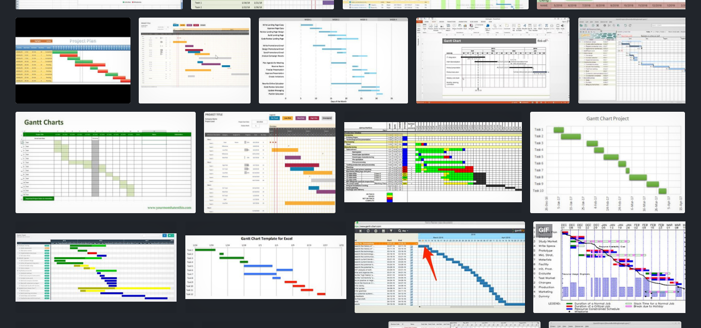
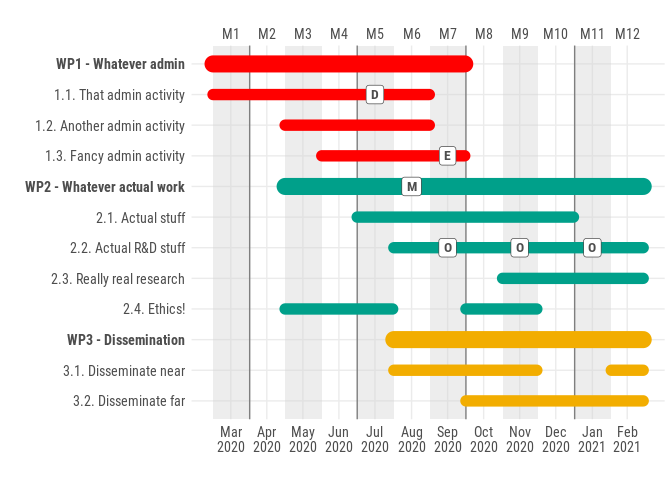
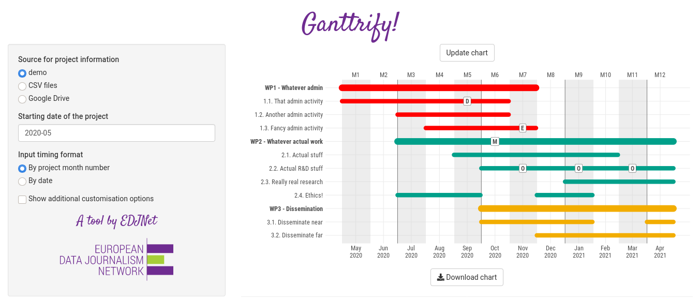

__[*Originally published by EDJNet*](https://medium.com/european-data-journalism-network/beautiful-gantt-charts-with-ggplot2-80ccd8c2c788)__

## The prequel

Among the many things that the Covid-19 brought to journalism, there is one that is both a boon and a bane: grants. As the pandemic brought new challenges to the sustainability of many media organisations, [a number of initiatives and donors](https://ipi.media/covid-19-funding-opportunities-for-journalism/) stepped up to provide financial assistance to media organisations and journalists. In many cases, the application process was mercifully straightforward, also due to the urgency of the matter: a brief form was all that was needed to apply to some of these funding lines. However, it is easy to predict that such mercy will not last. For better or worse, I am afraid that grant writing will become more and more a component part of the working routine of journalists and newsrooms, similarly to what has been happening through the last couple of decades in other creative professions, from academic research to the arts.

As donors are mostly unwilling to sponsor core activities, but rather aim at supporting specific initiatives (and preferably innovative ones), not all members of the newsroom will feel the same pressure to fund-raise. Data journalists - often relatively recent recruits to the newsroom and the first people management will think of when they read "innovative" in a call for proposals - are ideally positioned to be the first beneficiaries (and victims) of this new trend.

This is obviously an opportunity for data journalists, but is also - undeniably - a pain: writing grant applications is a time-consuming and often unrewarding process, as well as a significant distraction from one's actual job.

Having worked with no profits, in resarch, and in data journalism, I have found myself working on grant applications more than I care to admit over the last dozen years. Of all the parts of a grant application, there is one that I always found particularly unsatisfying: making a Gantt chart. 

[Wikipedia](https://en.wikipedia.org/wiki/Gantt_chart) will tell you more, but in the context of grant applications a Gantt chart is basically a timeline of activities, showing visually when a given "working package" or "activity" starts or ends, which activities happen at the same time, when a given milestone or event will take place, etc, and is a required component part of most grant applications.

There are many different ways to go about it, but there is a common denominator to all Gantt charts I have ever seen: they are ugly. You don't need to take my word for this: just keep scrolling through an [image search of "Gantt chart"](https://www.qwant.com/?q=gantt%20chart&t=images) on a search engine and you will be confronted with an endless sea of pure ugliness, dubious colour palettes, and clear evidence of interns (and probably senior scholars) torturing Microsoft Excel into making something that looks like a Gantt chart by using the background colours of cells.

I must confess, I am also guilty of this crime. But when last year a colleague asked to help them out with a Gantt chart for a new grant application, I felt the time had come to stand up and say loud and clear: "I will not make another ugly Gantt chart by colouring the cells of a spreadsheet." So I scourged the internet for alternative solutions, dedicated software... tutorials on YouTube, [questions on StackOverflow](https://stackoverflow.com/questions/3550341/gantt-charts-with-r), hidden repositories on GitHub, embroidery patterns on Pinterest... but I found nothing that wouldn't hurt my eyes.

Faced with what is evidently my posh taste for Gantt charts, I had no alternatives: I had to make a package for the R programming language to facilitate creating decent-looking Gantt charts. Please meet `ganttrify`.

## Nice-looking Gantt charts and how to make them

I am no artist or designer, so this could be much improved, but here's how a basic Gantt chart made with `ganttrify` would look for a stereotyped research project.

Projects in data journalism will look different, but may well still require a Gantt chart to represent a timeline of activities.

If you are familiar with the R programming language, you probably want to check out [the repository on GitHub](https://github.com/giocomai/ganttrify/) with more details on the customisations (you will be happy to hear that `ganttrify` outputs `ggplot2` objects that you can easily customise further... you will also notice I first drafted the "readme" as I was finalising a grant application).

If you are not familiar with R, or you are a data journalist who just wants to get back to their work and suggest an easy tool to whoever is writing the grant application with them, here is the solution you were looking for: [a straightforward online interface that makes it easy to create and customise decent-looking Gantt charts](https://apps.europeandatajournalism.eu/app/ganttrify). 

Check out the demo tables in the app to see how you should format the data input (start and end date can be either given as project-month numbers, or as dates: make sure you tell the app your preferred input formats to prevent bumping into errors). If you edit the inputs in Google Drive, make sure to paste your link and click on "Update chart" on top to load your updated data.

`ganttrify` even suggests using colour palettes inspired by Wes Anderson movies ([Tumblr](https://wesandersonpalettes.tumblr.com/)/[R package](https://github.com/karthik/wesanderson)) to make sure your Gantt chart will look fashionable: what's not to like?

Best of luck with your next grant application!