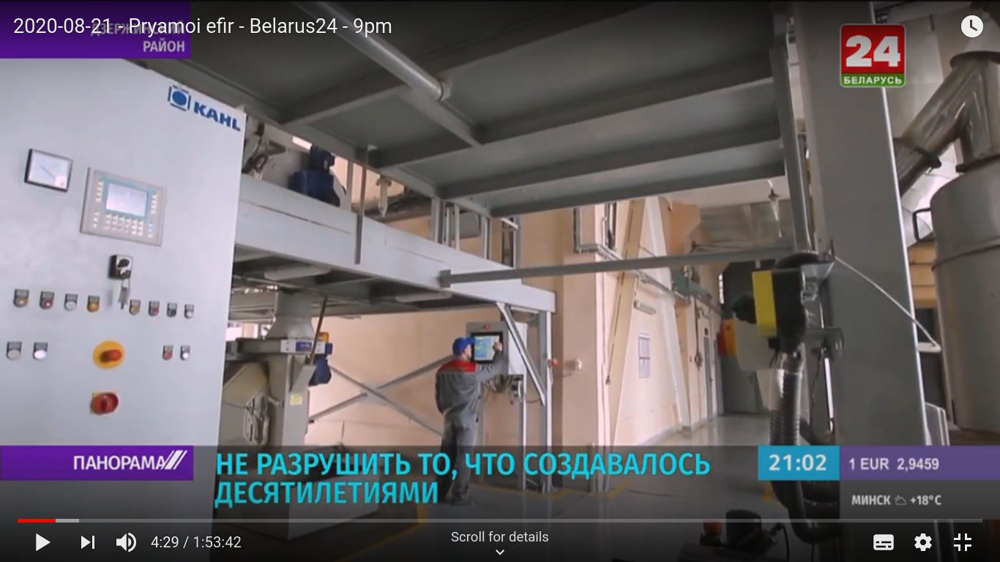
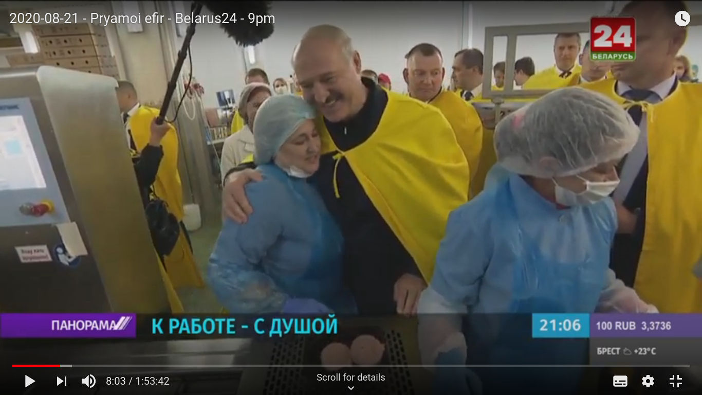
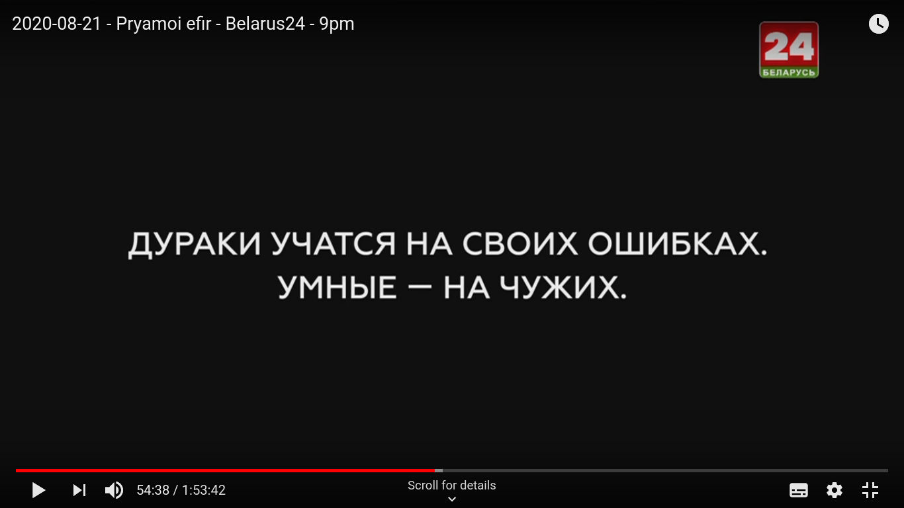

In the first days of post-electoral protests in Belarus, state news were largely in denial: no mention of the protests or tiny segments suggesting not much was going on, with routine coverage of Lukashenko doing routine visits and such.

After more than 10 days of protests, things have changed considerably. 

*Panorama*, an evening news programme supposed to last 50 minutes according to schedule, went on for two full hours. Most of it was dedicated to discussing in one way or the other the "complex political situation" in the country.

The news programme used all possible approaches to get through to the audience the understanding that incoming president Lukashenko is here to stay, that any other outcome is implausible, and would anyway be disastrous.

This post includes a brief description on the news segments of "Panorama" broadcast on Friday, 21 August 2020 on Belarus 24. As the full broadcast is (apparently) not available online, links are mostly to my own recordings of it (they are unfortunately sometimes intermittent). Links to the corresponding segments on the official YouTube channel are also included when available.

## News segments from Friday, 21 August

### Visit to Agrokombinat Dzerzhinsky

This news segment takes almost 30 minutes, and includes extensive coverage of Lukashenko talking to workers in a formal context after visiting the facilities. 

Parts of the segments looked like advertisement for the company and its products, but it still had a political undertone, also highlighted by the text in the lower thirds, e.g. "Let's not destroy what it took decades to build."

The director of the company tells Lukashenko that [not a single worker is striking](https://youtu.be/yq-Uz_pEzN0?t=279). 

The voice-over both acknowledges and dismisses the presence of different points of views among workers:

> "There were different emotions among workers about recent events, but, from a purely human perspective, common sense and kind words is exactly what we so much need in our society at this time" [[Link](https://youtu.be/yq-Uz_pEzN0?t=461)]

A "spontaneous" conversation between a worker and Lukashenko ensues, whereby the worker expresses support and concern about the situation. Lukashenko replies that she needs not worry, and points out that looking on the internet, one may feel that things are scary, but in real life, you come to work and things are completely different.

Political messages alternate with images of food products, sausages, chickens, etc., with Lukashenko's voice heard over images of chicken thighs and such. 

A more formal situation follows, which looks somewhat like a press-conference where workers ask questions and Lukashenko gives long speeches in reply. [Lukashenko says that](https://youtu.be/yq-Uz_pEzN0?t=666):

> "in Minsk and somewhere else somebody may not like [the fact that I won the election], and this is natural, but you do not need to worry about it... this is *my* problem that I need to deal with, we will solve it, and believe me, in the coming days it will be solved."

He reassures workers the everything will be fine, and that things will be back to normal. 

Another 20 minutes of Lukashenko replying to workers follows, insisting on foreign pressures and on the risks that the current situation entails. Some comments relate to specific issues. 

Lukashenko, for example, [confirms](https://youtu.be/yq-Uz_pEzN0?t=1166) that Russian staff (6-9 individuals) has come to take the place of people from state television who went on strike. He highlights that this has not cost him anything, as friends in Russia took care of all related costs. He insists that if people do not want to come to work, they may stay at home, as there will always be someone willing to take their place given the current situation with unemployment, including from Ukraine and Russia. 

In reference to the [performers of the state theatre going on strike](https://youtu.be/yq-Uz_pEzN0?t=1626), Lukashenko claims that he is happy to give them all the freedom they want: they want freedom and free market, this is what they will get... if they earn money, good for them. 

Such references are, in classic Lukashenko style, between the reassuring, the matter-of-factly, and the threatening, as he is basically saying in front of a group of workers that if they go on strike they may soon be without a job. Yet, in the context, those workers have little to do but nod approvingly.

[Links from official YouTube: [1](https://www.youtube.com/watch?v=VZwNAi5ZS5U), [2](https://www.youtube.com/watch?v=YzHrQfZTkA0), [3](https://www.youtube.com/watch?v=fvGNyGzFUJE)]

### Grodno Azot

A [segment from Grodno Azot](https://youtu.be/yq-Uz_pEzN0?t=1759) highlights how strike-related closures would be extremely costly, as well as risky in term of security, with catastrophes being a distinct possibility.

[[Official YouTube](https://www.youtube.com/watch?v=GRiiuuWspi8)]

### The economic programme of the opposition is a disaster

In [a separate segment](https://youtu.be/yq-Uz_pEzN0?t=2101), the deputy prime minister explains at length how the opposition has an unclear but disastrous economic plan that would lead to all sorts of terrible consequences, including massive debt, hyperinflation, default, followed by foreign private investors buying Belarusian companies for little money with the only goal of exploiting its workers without current protection.

[[Official YouTube](https://www.youtube.com/watch?v=k3vB1FOErxw)]

### Maria Kolesnikova is not welcomed by workers at BMZ

[Kolesnikova is met "by actual workers"](https://youtu.be/yq-Uz_pEzN0?t=2287) who shout at her "go away!" (the same "ukhadi!" that demonstrators dedicate to Lukashenko), and she has to flee in a black car.

__Update__: it appears that this segment was doctored by adding chants of "ukhadi, ukhadi" on the original video, while in reality everything worked out as expected for Kolesnikova and people were chanting against Lukashenko. See [video comparison on Twitter](https://twitter.com/felix_light/status/1297155990354370560). 

### Belarus and Maidan

Expert opinions comparing current events to Maidan follow, pointing at the fact that we should learn from the experience of our neihgbours. The political programme of the opposition was copied from the Maidan, and when people understand the contents of that programme, they don't like it.

### Compromat

Then there's [recordings of phone tappings](https://youtu.be/yq-Uz_pEzN0?t=2444) "which appeared on the internet" from a member Babariko's campaign pointing at how nobody believed in Tikhanovskaya, and that they were ready to get rid of her. Connecting the new opposition with the old opposition is part of the smear. [[Official Youtube](https://www.youtube.com/watch?v=MVHYwcmnWU8)]

What this phone call ultimately illustrates is how even second-tier activists are recorded while talking to acquaintances.

### Against fakes

A [segment illustrates](https://youtu.be/yq-Uz_pEzN0?t=2555) how a given story circulated on Telegram channels was a fake [[Official YouTube](https://www.youtube.com/watch?v=I6sABroB0hw)]. The frequent use of "фейк" (the English word "fake" used in Russian) in this and other segments, including in Lukashenko's talks, is still surprising to me. 

### Comparison with Maidan and Ukraine

There's a [long segment of an expert opinion](https://youtu.be/yq-Uz_pEzN0?t=2828) insisting on the comparison with events in Ukraine. This includes references to Bernard-Henri Lévy, to Soros, and everything you'd expect. [[Official YouTube](https://www.youtube.com/watch?v=vpVRl0zZIQQ)]

One of the [most puzzling and daring segements of the news programme](https://youtu.be/yq-Uz_pEzN0?t=3215) follows: a direct comparison of images without voice-over from Maidan protests (including from 2004) and Belarus 2020. The introduction unfortunately got lost in my recording (this part has unfortunately some interruptions), but the presenter suggested that the viewer looks at what follows and that they should draw their conclusions independently. In the process, it shows also the mass size of the protests in Minsk in the previous days, which was otherwise largely unreported on state tv. 

An on-screen text then reads: "The stupid learn from their own mistakes. The intelligent, from the mistakes of others."

Scenes of disorders and violence follow.

### External military aggression

[Long segments](https://youtu.be/yq-Uz_pEzN0?t=3298) detail how there are ongoing preparations for military aggression from the West, and how Belarus is getting ready to contrast it. Lukashenko is due to inspect these efforts on the following day (August 22).

### Illegal demonstrations in Minsk

A [representative of the Minsk administration](https://youtu.be/yq-Uz_pEzN0?t=3791) points out that no requests for demonstrations have been received, and that taking part to unauthorised demonstrations may be illegal and have consequences. The general procuror insists on this point ([Official YouTube](https://www.youtube.com/watch?v=t-FntWcJ7qE)). 

In a previous part of the broadcast, reference was also made about how it is illegal to pressure people into taking part in strikes, which I suppose will be used against workers who have been active in organising events. 

### People who "disappeared" are actually fine

Another segment shows how people that were included in a list of people disappeared during the protests are actually fine. It does so by [phoning them and just nicely asking them over the phone if they are fine](https://youtu.be/yq-Uz_pEzN0?t=4385).

### Pro-Lukashenko demonstrations

Images from [pro-Lukashenko demonstrations](https://youtu.be/yq-Uz_pEzN0?t=4547) follow, including interviews with participants. The presenter highlights how these are demonstrations for unity and peace in Belarus. 

### Historian highlights how white-red-white flag was used by collaborationists during WWII

An [historian discusses](https://youtu.be/yq-Uz_pEzN0?t=4934) the white-red-white flag used by demonstrators and points out how this might be a divisive symbol (unfortunately, my recording here is really intermittent, but the gist of the conversation is still understandable).

### Gromyko

A [lengthy interview with former Soviet foreign minister Andrei Gromyko](https://youtu.be/yq-Uz_pEzN0?t=5388) leads to the conclusion of the broadcast. 

## Conclusion

This is a brief overview of a single news programme broadcast on Friday 21 August on Belarus 24. It shows that authorities in Belarus have decided to actively shape the narrative about recent events and protests, rather than say nothing and let people read news from other sources. Interestingly, many segments assume that a large part of the audience gets their news from Telegram and other online sources, as some parts are clearly made to respond to narratives and news distributed elsewhere. The key arguments that emerge from all segments can be summarised as follows:

- let's not destroy the stability and relative welfare that was achieved in recent decades
- the alternative is Maidan and Ukraine, which is depicted as an intrinsically negative term of comparison
- there is lots of external pressure
- the opposition is divided and clueless, it is coordinated from abroad, has limited support, and the few ideas they have would have devastating consequences
- Lukashenko is going to take care of this all very soon, and you will have back your calm, stable, flourishing country that you all love

