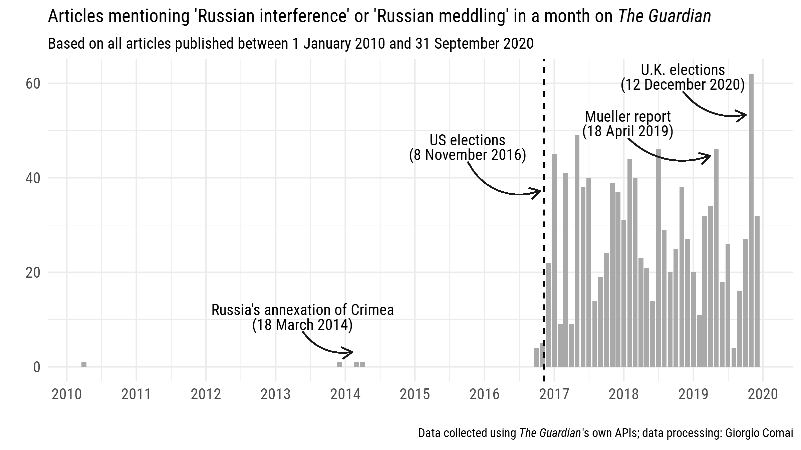

In recent years, a certain preoccupation with Russia has featured frequently in journalistic reporting and opinion pieces in Western media. This has partly been related to its aggressive foreign policy, its role in returning war to Europe, and its military involvement in the Middle East. But Russia's alleged involvement in domestic politics well outside its neighbourhood and well into the core of Western democracies has perhaps stirred even more debate. This trend has been particularly noticeable in the aftermath of the 2016 electoral contests that brought Donald Trump to the White House and Brexit to the UK, with references to Russian meddling - including disinformation campaigns waged through social media and hacking-and-dumping operations - becoming ever more common.

A certain preoccupation with Russia's influence and interference in domestic politics in Europe slightly pre-dates those momentous elections, and relates instead to the increasingly cosy relationship between Moscow and radical right-wing movements and political parties in Europe. The multi-layered dynamics that opened the way for the far-right's fascination with the Kremlin, and pushed the Kremlin and its associates to pro-actively engage with such forces, are described in detail in a 2017 book by Anton Shekhovtsov, *Russia and the Western Far Right: Tango Noir*.

Far-right politicians have not kept hidden their support for Russia's president Vladimir Putin, both by boasting about their direct contacts - as for example [Marine Le Pen did at the time of the 2017 presidential elections in France](https://www.reuters.com/article/us-russia-france-lepen-putin-idUSKBN16V1CP) - and simply by proclaiming it very explicitly, as [e.g. Matteo Salvini did in multiple occasions](https://www.vice.com/it/article/kzjz8m/salvini-lega-putin-russia), including by sporting Putin t-shirts.

## The temptation of conflating separate preoccupations

This combination of trends has contributed to heating up debates about Russia and sometimes turning them into hyper-partisan affairs. At least in part, this is due to the fact that expressions of concern about Russia often conflate quite different preoccupations that ultimately coincide with the perceived crisis of Western liberal-democratic institutions and political forces.

Blaming structural crises on foreign interference and on externally-generated disinformation is tempting (and Vladimir Putin makes for a good, headline-grabbing, archvillain), but may be a poor starting point both for analysis and for developing policy responses.

Yet, this understanding does not negate the importance of having an honest conversation about Russia. Or probably, more than one. If Russia should not be a central character in the story about disinformation and lack of trust in institutions and electoral processes across the West, what kind of conversation about Russia's impact on domestic politics in Italy and other European countries should we have?

## What Russia do we want to talk about?

There is a number of ways Russia matters to the domestic political conversation in a country such as Italy.

Let's start from a Russia that does not really exixst, but that nonetheless seems to be a powerful pole of attraction. Many, in particular on the far-right, seem to see in a stereotyped version of Russia's Vladimir Putin a role model: a strongman who puts national interests first, who makes fast and effective decisions without concerns about the burden of checks and balances, who does not need to care about political correctness and human rights, who does not bow to international pressures, and can protect so-called “traditional values”.

This is, of course, a fantasy, full of contraddictions and distant from reality. Nonetheless, there is no denying that this is a powerful fantasy with widespread appeal. Interestingly, this is a narrative carefully created by Russia's leadership for domestic purposes to higlight the stark contrasts with the dysfunctional 1990s - hard post-perestroika years when the internal frailty of the Russian state became most visible and living standards fell disastrously for the vast majority of residents. Originally, this narrative was not anti-Western nor particularly socially conservative, but it increasingly became so in recent years. Homophobic discourse (and legislation) appeared more distinctly in the last decade, and became an important talking point, for example, of the campaigns opposing the EU association agreements in Ukraine, Moldova, and Georgia. By leveraging this and other conservative tropes as well as an anti-liberal and anti-Western rhetoric, contemporary Russia with Putin at its helm became a symbol for the global right.

But is it still really Russia that we are talking about? Arguably, to the extent that this preoccupation revolves around the rise of the radical right, right-wing populism, and diminishing trust in the institutions at the core of liberal democracies, then Russia is itself marginal, if not as a token. Symbols of course do matter, but in both analytical and policy terms - to understand this trend, and to contrast it - focusing on Russia may not be not very useful.

## And the dark money? And disinformation? And…?

There is, however, a common counter-argument to this proposition: Russia, it is argued, is not only a symbol but also an active enabler of such political forces. It supports them not only financially, but also by favouring the spread of disinformation and by using influence operations to exacerbate social divisions and polarise the public debate around wedge issues: this is what Russian meddling is about.

I am convinced that [focusing on the vulnerabilities](https://twitter.com/giocomai/status/1285125633052487680) exposed by the preoccupation with Russian meddling - including online disinformation, the role of dark money in politics, and issues of cybersecurity - is the most fruitful way to protect democratic institutions and processes from both domestic and external spoilers.

However, with mounting evidence pointing at how actors associated with the Russian government do engage in such activities, a focus on the vulnerabilities does not imply complacency about the instances when Russia is part of the problem: quite on the contrary, identifying specific causes for concern contributes to define better what “Russia” we are talking about.

## Russia, foreign policy and soft power

Finally, a meaningful conversation about Russia and its role in domestic issues in Western democracies cannot ignore the actual country, the Russian Federation, with its long history of both cultural and economic relationships with European countries, its foreign policy, and its soft power.

In Italy, for example, governments of all colours and stripes have maintained relatively friendly relations with Moscow in recent years, even while remaining within the boundaries of the shared foreign policy agreed with its traditional allies, including for example by supporting EU sanctions after Russia's annexation of Crimea (journal articles by [Siddi](https://doi.org/10.1080/03932729.2018.1519765) and [Morini and Natalizia](https://italianpoliticalscience.com/index.php/ips/article/view/123) discuss this aspect at length).

The impact of these dynamics on domestic political dynamics may be limited, but quite possibly not negligible in some policy areas, such as for example energy and environmental policies. Does the close relationship between key players in the energy sectors in Italy and Russia hinder the development of a more ambitious energy policy, including a full commitment to abandon fossil fuels as soon as possible? Potentially, influence on a such an important policy area may be more consequential in the long term than other forms of “Russian meddling”.

## Are we still talking about Russia?

Concerns about the impact of Russia on domestic processes in Western democracies often lead to conversations in which Russia is ultimately not the protagonist. In some of them, Russia remains however an important actor. Focusing on Russia's role rather than conflating Russia with a large set of preoccupations is an important step in having a more meaningful public conversation about the multi-layered crisis that questions the very nature of liberal democracies.

*[Originally published on balcanicaucaso.org](https://www.balcanicaucaso.org/eng/Areas/Russia/Russia-as-a-source-of-concern-are-we-really-talking-about-Russia-205695)*
