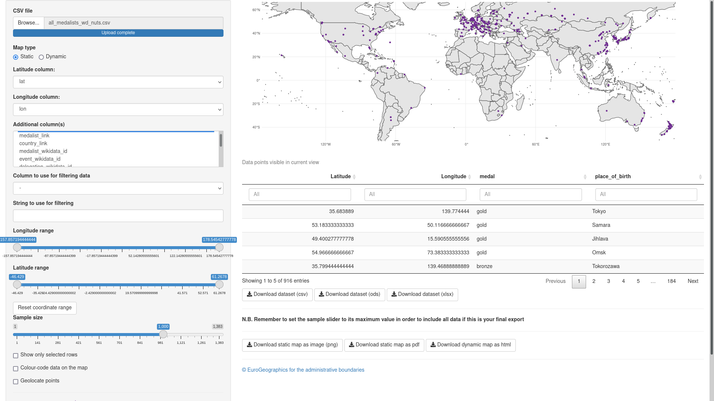

```{r setup, include=FALSE}
knitr::opts_chunk$set(echo = FALSE, fig.path = "static-")

```


When everybody's moved by contagious joy of two athletes making history by agreeing to share an Olympic golden medal, the data analyst thinks: "two golden medals for the same competition? is this going to break my dashboard?"

`r htmltools::HTML("")`

In my case, I was worried it would break my parsing script. Fortunately, it didn't, so after a quick check I could share their joy with relief. And then go back to my hobby. 

Armchair sports fans like to peddle with the [Olympic medal table](https://olympics.com/tokyo-2020/olympic-games/en/results/all-sports/medal-standings.htm), and I idly asked myself the customary questions... is it fair that the ranking is usually based on who gets the most gold? What if the ranking was instead based on some sort of weighted average of the medals? If - say - a gold medal is worth twice as much as a silver, and a silver twice as much as bronze, then would my favourite flag shine at the top of the ranking?

But just changing the value of medals brings you only so far... not fun enough to turn this into a hobby.

So I thought it was time to up my game. Being mildly annoyed by the excessive flag waving, I decided it would be nice to set up a medal table based on the number of medals won by regions, not by countries. 

So... there we go. Here's how you can join the fun.

## Going NUTS, and beyond

How do we attribute a medal to a region? There's no completely right approach, but place of birth should be meaningful enough in most cases. So all that is needed is find the place of birth of all medalists, geocode it, associate it with administrative entities of reasonable size, et... voilà!

So here's how I went it about it, considering that I wanted to have data unencumbered by copyright to share the fun. 

1. get all the Olympic medalist by country, sport, and event from the [List of 2020 Summer Olympics medal winners](https://en.wikipedia.org/wiki/List_of_2020_Summer_Olympics_medal_winners) available on Wikipedia
2. parse all the tables on that page to extract the relevant information, including links to the Wikipedia page of each medalist (ultimately, this proved to be the most painful part)
3. query the Wikipedia API to get the Wikidata ID of each medalist
4. proceed in the much more data-friendly Wikidata, and get the place of birth of each medalist
5. get from Wikidata the coordinates of the place of birth of each medalist
6. match the coordinates to the administrative units where they are located. In principle, this could be achieved remaining within Wikidata by retrieving the relevant property for the place of birth ([located in the administrative territorial entity](https://www.wikidata.org/wiki/Property:P131)), but, depending on the place of birth, this may lead to inconsistent results. I included the relevant data in the dataset, but I also did the geo-matching with NUTS regions - a standardised classification of administrative entities defined by the European Union (here's a list of [countries covered by NUTS](https://ec.europa.eu/eurostat/web/nuts/nuts-maps), and here's the [geographic dataset for download](https://ec.europa.eu/eurostat/web/gisco/geodata/reference-data/administrative-units-statistical-units/countries))
7. (optional) get from Wikidata all other sorts of data about the medalists or the place where they were born


## The dataset

How's the quality of the dataset? Not too bad for Europe, as the place of birth of only a handful of medalists is missing. Probably more work to do to turn this into something more meaningful at the global level. 

The good news is that you can join the fun! :-)

Of course, you can contribute add to Wikidata the missing information, which is often available online. 

And then... see who *you* can place at the top of the medal table by playing around with the data. 

You can find the code and all details about data parsing in this repository.

You can download the table with all the data as a csv file, and play with it as you like. 

If you want to have a quick look at the data based on place of birth, why not head on to our online tool, [`latlon2map`](https://latlon2map.europeandatajournalism.eu/), that makes it easy to explore quickly all tabular data that have a longitude and latitude column.



As for me, tired with all the data processing, I took a lazy if controversial approach. I decided that I will count each medal and each medalist the same. Bronze and gold look just as shiny to me. The official table counts just one medal for a team win, but I think that each piece of metal is a piece of joy for the person who brings it home: if eight people row together to get a medal and each takes a medal, then that's eight medals for me. And then... let's see how things go by focusing only on NUTS regions in Europe. 

So... here's my medal table for NUTS2:

```{r echo = FALSE, warning = FALSE, message = FALSE}
library("dplyr", warn.conflicts = FALSE)
all_medalists_wd_nuts_df <- readr::read_csv(file = "all_medalists_wd_nuts.csv", show_col_types = FALSE) 

all_medalists_wd_nuts_df %>% 
  dplyr::filter(is.na(nuts2_name)==FALSE) %>% 
  dplyr::group_by(nuts2_name) %>% 
  dplyr::count(name = "Total medals", sort = TRUE) %>% 
  head(20) %>% 
  knitr::kable(caption = "Total medals by place of birth of medalist at the 2020 Summer Olympics / NUTS2")
```


```{r}
all_medalists_wd_nuts_df %>% 
  dplyr::filter(is.na(nuts3_name)==FALSE) %>% 
  dplyr::group_by(nuts3_name) %>% 
  dplyr::count(name = "Total medals", sort = TRUE) %>% 
  head(20) %>% 
  knitr::kable(caption = "Total medals by place of birth of medalist at the 2020 Summer Olympics / NUTS3")
```


