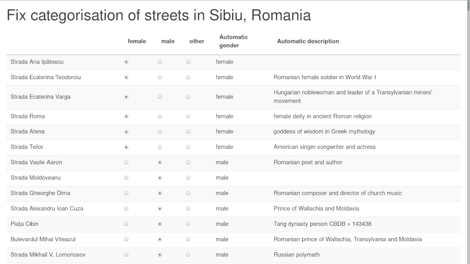

We have been toying with the idea of doing large-scale open-ended analysis of street names across Europe for quite some time. 

Back in 2019, I quickly built [an R package](https://giocomai.github.io/genderedstreetnames/) that facilitated retrieving the names of streets used in a municipality, tried to guess which were humans and the relative gender (simplistically operationalised as "sex at birth"), 
and provided a basic interface to check the data ([here's a walkthrough of the process](https://giocomai.github.io/genderedstreetnames/articles/genderedstreetnames.html)).



We never really pursued the idea in this format for a number of reasons. Among them, the fact that in the following years, a number of initiatives used slighlty different approaches to arrive at the same results.

We felt that to give more context, more than the gender dimension needed to be taken into account. For example, the extremely small number of streets dedicated to women in most cities is striking, but in the case of Italy, for example it is sometimes even more striking how many of those women were religious figures or Catholic saints. 

We decided to work in this direction, and eventually came out with the first version of [Mapping Diversity](https://mappingdiversity.eu/), covering more than 20 cities across Italy (the main city of reach region). 

In terms of data, its key features were:

- street names taken from OpenStreetMap
- tentative automatic matching of street names to the Wikidata identifier of the person a given street is dedicated to
- manual check limited to:
- claiming if a street was dedicated to a human or not
- if it was a woman,
- match it to the relative Wikidata identifier (which allows among other things, to show date of birth, profession, and a picture on the interactive visualisation)
- assign it to one of a small number of predefined category (e.g. religious figure, cultural figure, etc.)

This was time consuming (have you ever considered that Rome, for example, has more than 16 thousands named streets? consider manually checking all of them), but not devastatingly so. Automatic matching functioned reasonably well, and besides confirming if it was a human or not, one had to give some more thinking to the matching only if the subject was a woman (each woman had to be matched to a Wikidata identifier and a category). But since so few streets are dedicated to women... in terms of data cleaning, it was not too bad. Besides, we worked on the assumption that if a street was dedicated to a given person in one city, then the same match would be applied to all Italian cities: not a 100 per cent safe bet, but we felt it was acceptable to get wrong a few individuals out of tens of thousands of matches, as this incredibly reduced the number of streets to check (each city in Italy will have a street dedicated to "Giuseppe Garibaldi", but we manually checked it only once).

The resulting output got reasonable visibility and contributed to stir some much needed debate. But that was in Italy, and we like European-wide stories. Also, we felt the debate needed to go further than the gender dimension, and more explicitly consider also who were all these men that have a streets dedicated to them. 

We understood that this would have entailed more complexity and more work, but based on our first experience based on Italy, we moved forward. As we will see, things turned out to be much more complicated and time-consuming than we initially imagined, because many things change considerably from country to country, and sometimes from region to region. As a consequence, even in cases where in principle there would be a more efficient, more effective, or more comprehensive solutions for a given city or country, we mostly sticked to a standardised approach for all of Europe, as this allowed to have a more consistent data pipeline.

## Main data sources and data processing features

### Street names

The main point of reference for openly licensed geographic data is OpenStreetMap, indeed OpenStreetMap is the source we used for street names (thank you OpenStreetMap contributors!). OpenStreetMap has overall rather comprehensive and up to date data for the main European cities, and offers both the names of streets and their exact location on a map. Many cities around Europe distribute in some format a list of street names, but less often in a format that makes it possible to draw them on a map. 

However, even if OpenStreetMap is a global project, local peculiarities emerge again and again, both due to differences in language and common practices across countries, as well due to different standards self-defined by communities of mappers in different countries. 

Dealing with multilingual names can be a mess. In OpenStreetMap there is both a generic `name` tag, as well as the possibility to include specific language versions. There is [a set of rule on how to deal with all sorts of issues related to multinlingualism](https://wiki.openstreetmap.org/wiki/Multilingual_names), but these can be country-specific, or often left incomplete. 

We relied on the generic `name` tag, assuming it would be in the main language used in a given country, and dealing with exceptions either on a case by base basis (e.g. as we did with the relatively small Bozen/Bolzano in South Tyrol), or more systematically, as we did with the main Belgian cities (which include both a French and Dutch name of street separated by a hyphen, with the order of languages depending on the municipality).

There is no commonly agreed standard on how street names should *precisely* be written. The broad expectation is that street names are written in the same way as they are written in the real world, but then, there's a number of best practices, some of them countrys-specific. For example, if a full name of a person is known, then this should be used rather than only the first letter of the first name. But such things may be inconsistently applied within a given country, nevermind across countries. Such things not only complicate matching a given street to the person or entity it is dedicated to, but also matching it with other datasets relevant datasets that may exist at city, region, or country level. 

All things considerd, for better or worse, we sticked with the primary `name` tag for all street names.

Next, we wanted to retrieve all streets *in a given city or municipality*.

### Administrative boundaries

OpenStreetMap has records for administrative boundaries, but, as quite clearly stated in the [relevant documentation](https://wiki.openstreetmap.org/wiki/Key:admin_level), these are used incosistently across countries. "admin_level":

> "While admin_level=2 is almost always a de-facto independent country, and admin_level=4 is usually equivalent to a "province", higher values vary in meaning between countries. A data consumer looking for municipalities corresponding to "city", "town" or "village" boundaries will find these tagged anywhere from admin_level=4 to admin_level=10".

In principle, we could have checked what is the practice in each country, see if these are indeed applied consistently across a given country, see if these are matched to a consisent identifier, and take it from there. 

Instead, we opted to the more practical solution of relying on a dataset of Local Administrative Units (LAUs) distributed by Eurostat, that can be used, including the following copyright notice in the output: `© EuroGeographics for the administrative boundaries`.

This made it possible to use an already standardised dataset, with a consistent identifier that can be used to match it to other data sources. Even so, the output did not always make sense. For example, there are a few cities - including Bruxelles, Lisbon, and Dublin - that are composed of a number of municipalities. In such cases it may be relevant to keep the data at the municipality level, but for many readers having the full urban area would make more sense. In such cases, we fell back on the relevant NUTS region. 

Wtih standardised administrative boundaries, and with country files with all streets in a country taken from OpenStreetMap ([as distributed by Geofabrik](https://download.geofabrik.de/europe.html)), it straightforward to crop the national or regional data with the boundaries of the given municipality, drop all streets that have no name (often, service streets) and get a set of streets names that can easily be drawn on a map.

This is also how we derived a unique identifiers for each street. In OpenStreetMap, streets do not have a unique identifier (unless they are part of a relation). In our case, the identifier became a combination of the full street name itself with the gisco_id of the municipality: every streets with exactly the same name spelling within a given municipality is considered to be a single street. 

Some countries or cities have unique identifiers for streets (e.g. [Czechia](https://cuzk.cz/)). Some mostly larger cities have all of their streets as a separate Wikidata entity. Still, due to differences in spelling, word order, lack or presence of honorific titles, and such, achieving a full match between such datasets is not straightforward, and may need custom solutions for each relevant city. Again, rather than developing custom country or city-specific solutions, we went for a solution that could be consistently applied across our datasets. 

Now comes the difficult part. 

### Matching streets to the entity it is named after

Potentially, there are a number of sources available that include information about whom a street is named after. 

Some of them are high quality, but difficult or impossible to scale or generalise. These include:

- Open data distributed by a municipality with this information. Even when it exists, it is mostly not easily matchable to geographic data, it would be difficult to match a person with data about a person. Even in a best case scenario this would require manual work to transform the data into something that can be visualised and compared with other countries or cities. An example of an almost ideal format is the one used by the municipality of Bologna in Italy to report about [streets and public spaces dedicated to women in the Italian municipality of Bologna](https://opendata.comune.bologna.it/explore/dataset/le-aree-verdi-e-le-vie-di-bologna-dedicate-alle-donne/information/): open data in nice tabular format, with geographic coordinates included, time when the street was dedicatetd to the given person, basic biographic information included in a mostly parsable format (the ideal format, from our perspective, would also include a Wikidata identifier, would be comprehensive of all streets, and perhaps include information to whom the street was named before in case of name change). 
- in the case of major cities, there are books dedicated to the subject, that include information about the person a street is dedicated to (e.g., for Bucharest, [Străzi din București și numele lor](https://www.danagont.ro/strazi-din-bucuresti-si-numele-lor-aurel-ionescu/)). 
- in the case of major cities, sometimes there are local initiatives dedicated to highlighting particularly interesting biographies of people who have been dedicaded a street (e.g., again in the case of Bucharest, [Străzi cu Renume](https://strazicurenume.ro/))

Some initiatives exist that include information about streets names dedicated to women. The most comprehensive is probably a vast initiative established in Italy with information about streets dedicated to women across most municipalities of the country, [Toponomastica femminile](https://www.toponomasticafemminile.com/). This includes carefully researched data on thousands of municipalities.

There are some initiatives that present information in a structured format about a number of cities, in Europe or elsewhere, which similarly to our own initiative rely on OpenStreetMap and Wikidata:

- [EqualStreetNames](https://github.com/EqualStreetNames/equalstreetnames)
- [Las Calles de las Mujeres](https://geochicasosm.github.io/lascallesdelasmujeres/)

Some academic articles or studies have been dedicated to the matter, and some of them have included relevant datasets, e.g.:

- [stnameslab](https://en.stnameslab.com/)
- [Streetonomics: Quantifying culture using street names](https://doi.org/10.1371/journal.pone.0252869)
- [Political patterning of urban namescapes and post-socialist toponymic change: A quantitative analysis of three Romanian cities](https://doi.org/10.1016/j.cities.2020.102773)

Some journalistic investigations have dealt with these issues, and could be used as a terms of reference in some cases, see e.g.:

- [Streetnames: Streetscapes – Mozart, Marx and a Dictator](https://www.zeit.de/feature/streetdirectory-streetnames-origin-germany-infographic-english), by *Die Zeit*

Finally, these data can in principle be stored directly in the very sources we used:

- the data can be stored directly in OpenStreetMap through a set of dedicated tags such as `name:etymology:wikidata`, as discussed in details in [this post detailing the work done in a German town](https://www.openstreetmap.org/user/tffmh/diary/400600). Name change could also be recorded there, using the [https://wiki.openstreetmap.org/wiki/Proposed_features/Date_namespace](data namespace feature). Unfortunately, this information is only sparesely included in OpenStreetMap. There are however interactive maps available online that allow both to see available data and contribute this information directly on OpenStreetMap, see in particular:
- [mapcomplete.osm.be/etymology](https://mapcomplete.osm.be/etymology?z=18&lat=40.72012&lon=-73.9893&language=en#welcome)
- [https://etymology.dsantini.it/](https://etymology.dsantini.it/)
- the data can be stored directly in Wikidata, using the "named after" property in relation to entity. This is indeed quite widely used for the cities that have each of their street as a separate Wikidata entity. But how many municipalities have each of their street as a separate Wikidata entitiy? This varies hugely among countries:
- in some countries, e.g. Czechia and the Netherlands, the data are apparently rather comprehensive
- in some countries such as Germany or France a number of municipalities have been included, but apparently with no specific criteria, if not the availability of relevant open data and the presence of a local activist initiating their upload
- in most other countries, just just a small number of monumental streets have their own Wikidata entity.

By itself, none of these two sources offers an ideal format for storing such data. For example, Wikidata includes coordinates of the street as a single point, and in the overwhelming majority of cases does not include a direct pointer to the relevant street in OpenStreetMap. This is a consquence of the data model and prevailing practices in OpenStreetMap: streets are often effectively composed of many segments with potentially different properties, often formally not attached to each other. They mostly do not have a unique permanent identifier that can be linked from Wikidata. Such an identifier *can* exist in OpenStreetMap if all components of a street are united in a *relation* (see the [relevant proposal](https://wiki.openstreetmap.org/wiki/Relations/Proposed/Street)), which seems to be a sensible but not very common practice, partly because it could often be considered redundant or unnecessary.

*If* each street was united in a relation in OpenStreetMap and hence have a permanent identifier, and each street existed in Wikidata with its own permanenent Q identifier, then the two could be connected through Wikidata's [OpenStreetMap relation ID](https://www.wikidata.org/wiki/Property:P402) property, and we would have the best of all worlds. If more countries were like Czechia, with each street having [a unique identifier distributed as open data](https://www.wikidata.org/wiki/Property:P4533) and thus easily associated from Wikidata, we would be much closer to this world, as then this could be combined with all sorts of other open data.

But unfortunately, we are not very close to that world. 

So this is how we proceeded starting from the world we currently inhabit.

### Our approach for matching geo-located street names to the person or entity they are dedicated to

The previous paragraphs outlined how we got to have a list of street names for each municipality in Europe, and how we didn't find a pre-existent consistent and scalable approach to the get the relevant data from many cities across Europe, leaving the possibility to expand the effort to any municipality big or small.

The best approach would have probably been a mix and match, based on availability of data and country- or language-based specificities. This would have implied a per-country or per-city approach that we felt was not manageable. This choice - in hindsight, very much debatable - was partly driven by our experience with Italy as a pilot country. Indeed, in the case of Italy:

- no major city has all its streets as a Wikidata entity
- no major city has all of its streets matched to a Wikidata identifier
- streets are predictably named (e.g. it's always "via di *something*", "piazza *something*", "viale *name* *surname*", etc.)
- in the vast majority of cases, streets dedicated to people have both name and surname spelled out in full in the street name
- names have a single standard form (in other languages, name streets may change due declension or adjectivization of names)

We were obviously aware of the language differences, but we under-esitamted data availability in other countries.

Either way, we went with a mostly standard approach:

1. take a street name
1. for countries where it is common to have a Wikidata entity for each street, search the full street name string on Wikidata, and see if the "named after" field is available. If it is, keep it, and skip all the rest. If no match is found, or if a country is known for not having streets as entities on Wikidata, move on to the next steps.
1. remove the part of the name that describes the way, not the person or entity it is dedicated to, based on custom lists (e.g. for Italy remove all the "via", "viale", etc. at the beginning of the name string, for German all the "Straße" at the end of the word)
1. if the relevant language leads to changes in the way a name is written, tentatively try to change the name to have it in its nominative form (e.g. in Polish turn endings in "-szka", to endings "-szek"). This has been done completely based on word patterns (i.e. via *regex*), and not thoroughly optimised (as again, this implied a different solution for each country/language), so the quality of the results varied. 
1. search the remaining part of the street in Wikidata in the main language used in a given country
1. if a match is found, tentatively keep it

We bulk processed all the main cities across Europe in this way, but the same process happens on the fly on a dedicated custom interface for other municipalities.

### Manual checking data

Time for the most fascinating part of in the life of a data journalist: manual data cleaning. 

In principle this approach can be used to match all street to an entity, not only to persons. For example, if the matching is done thoroughly, one could see how many streets across Europe are dedicated to particular trees (e.g. "chestnut street") or to abstract concepts (e.g. "peace"). However, we decided to limit ourselves to streets named after people.

In some countries, in particular those where both name and surname are usually spelled out in full, the results were pretty good. In particular, there were very few false positives, mostly related to the fact that when a contemporary sportsperson or researcher has the same name as a 19th century burgermeister, then Wikidata gives precedence to the former. There were somewhat more false negatives, in particular in countries where it is quite common to name streets after military officials, partisans, or participants to revolutionary events that are remembered for their role, but that are not "famous", in the sense, that little is known about their life and they do not have an own presence in Wikidata or Wikipedia. Even in such cases, however, with e.g. about 10 per cent of streets dedicated to humans to fix, this means having to fix  hundreds of streets in major cities that have many thousands of different streets. 

In some countries, the quality of the data was more degraded, either because the parsing of the names was not very successful, or because it is common to include only a surname but no first name in the street name, or because some names are so common that is not obvious to whom a street has been dedicated to, without local knowledge/consulting local databases.

Next, we exported these data as spreadsheets and shared it with partners around the continent, with two files for each city. One file had supposedly only humans, and a data point had to be flagged only if it was not in fact, a human, while the other was supposedly of non-humans, and a street had to be flagged only if, indeed, it was a human. If it was obvious from the name of the person, gender assigned at birth could also be directly added, or Wikidata identifier fixed.

Additional checking or data fixing could be achieved through a dedicated web interface. The interface is less than ideal for batch-confirming hundreds of correct matches, but is more handy than working in a spreadsheet for adjusting human/non-human status, gender, or Wikidata id on a case by case basis.

We initially considered a "category" and a "tag" field, to enable matching assigning streets to particular issues (e.g. streets dedicated to people associated with colonialism), but this soon appeared to be unfeasible to scale, and best left to other approaches once the association with a Wikidata id has been confirmed.

### Clarifying concepts: what is a human?

Doing data cateogrisation at scale frequently leads to a number of edge cases that push one to reconsider even the most basic questions, such as what counts as a person. We eventually went for "a person is a distinct, identifiable, human being who has actually lived on this Earth". This definition leaves out a number of cases that could almost fit in there, including most commonly:

- streets dedicated to deities, legendary figures, or literary characters; when these had a distinct gender, this may have been included in some of the ensuing analyses
- streets dedicated to vast groups of people (e.g. "resistance fighters" were surely humans, but they are a category of people, not a distinct identifiable human)
- streets dedicated to a building or city, which in its turn is named after a human (e.g. "St. Michael's Church street")

If streets were dedicated to a small number of distinct individuals, e.g. "Pierre and Marie Curie", then both individuals would be assigned to a street. 

### The data model

To facilitate sharing of data across different teams, we preferred to stick to tabular data formats. 

At the most basic, this is how our internal data model looks like, showing first some streets dedicated to more than one person for reference:

```{r echo=FALSE, R.options = list(width = 1000)}
city_df <- readr::read_csv(file = fs::path("data", "RO_143450-municipiul sibiu (sibiu)-1677594527.csv"), show_col_types = FALSE)

city_df |>
  dplyr::select(!c("country", "category", "tag", "named_after_custom_label", "session", "time")) |> 
  dplyr::arrange(dplyr::desc(person), dplyr::desc(named_after_n),named_after_id)  |>
  dplyr::slice_head(n = 20) |>
  knitr::kable(format = "html", table.attr = "style='width:1000px;margin-left:-180px;'")
```


The `gisco_id` is a unique code for each local administrative unit (mostly, corresponding to municipalities). The expectation is that within each municipality there will only be one street with exactly the same name. In brief, the most basic unit of analysis is a combination of `gisco_id` and `street_name`, which can always be mapped back to OpenStreetMap. Here is a brief explanation for the other columns:

- `named_after_id` is a Wikidata identifier of the entity to which a street has been dedicated to
- `person` is a binary, either 1 or 0.
- `gender` can have the `male`, `female`, `other`, or `undetermined` value. This is a simplified version of the kind of data Wikidata offers, which can be have more options (and more than one value per entity)
- `checked` is a binary. 1 when the street has been confirmed in some form by a manual check. The expectation is that if a street has been checked, at least the field `person` is accurate; all others may be incomplete.
- `ignore` is a binary. If set to 1, it means that the corresponding `street_name` is not really the name of a street. Street names such as "entrance to Mc Drive" or "Airport ramp to departures" do appear in OpenStreetMap but they are irrelevant to the purpose of this analysis. 
- `named_after_n` defaults to 1. It corresponds to how many entities a street has been named after. If `named_after_n` is higher than 1, then it is expected that the row is repeated more than once in order to make it possible to have more data.

Based on the Wikidata identifier, it is easy to get a nice label and description of the entity a street is named after (possibly, in different languages), as well as a lot of other information, including date and place of birth and death, occupation, etc. 

Here's just a quick example with date of birth and death.

```{r echo=FALSE, R.options = list(width = 1000)}
city_details_df <- readr::read_csv(file = fs::path("data", "RO_143450-municipiul sibiu (sibiu)-with_details-1677594547.csv"), show_col_types = FALSE)

city_details_df |>
  dplyr::arrange(dplyr::desc(person), dplyr::desc(named_after_n),named_after_id)  |>
  dplyr::select(c("street_name", "named_after_id", "gender", "label", "description", "date_of_birth", "date_of_death")) |> 
  dplyr::mutate(date_of_birth = stringr::str_extract(string = date_of_birth, "[[:digit:]]{4}"),
                date_of_death = stringr::str_extract(string = date_of_death, "[[:digit:]]{4}")) |>
  dplyr::slice_head(n = 20) |>
  knitr::kable(format = "html", table.attr = "style='width:1000px;margin-left:-180px;'")
```

This data model is mostly functional, but is missing a couple of things that on more careful consideration would be necessary. 

- a `named_after_custom_label`, introduced late in the project and mostly not yet used, that allows to introduce a custom label when a given person does not have an own identifier in Wikidata. This is useful in particular for languages where the name of the person an entity is dedicated to does not keep its base form. If, for example, I was not able to match "Aleja Pawła Strzeleckiego" to the correct Wikidata identifier, I should at least be able to keep record of the fact that this street is named after someone called "Paweł Strzelecki".
- an additional column, or possibly, a separate table, for deduplication. It is infrequent, but by far not unseen, for a street to be present with multiple names in OpenStreetMap. For example, "Aleja Pawła Strzeleckiego" could also be recorded as " "Aleja P. Strzeleckiego", or "Al. Pawła Strzeleckiego", or "Aleja Pawła Edmunda Strzeleckiego". 
- an additional column to match the Wikidata identifier of the streets itself, when it exists as its own entity on Wikidata

Even with this additions, there is currently not a straightforward way to distinguish two streets that have the same name, are within the same municipality, but are effectively two separate streets. E.g. two "Müllerstraße" dedicated to two different people called "Mueller" in different parts of the same city. These are really residual issues, and ideally this could be addressed in OpenStreetMap itself by including the first name of the person if it is known. If not... these are really marginal cases, and not all data models can be perfect.

## Additional manual quality checks

When was done, an additional layer of checks has been added to reduce the number of mismataches, in particular checking for the consistency between manually introduced data and Wikidata-derived data

- does the Wikidata id of what has been manually tagged as a person really match a person?
- does the gender correspond?
- if the date of death of a person is missing, is this a really a correct match?

After this, we took a 5% sample of streets of a given city, and made sure errors in the sample were less than 5%. If there were more, a new round of thorough checks was initiated.


## The data


```{r echo=FALSE}
library("streetnamer")
library("tidywikidatar")

fs::dir_create("0-final_data")
all_checked_df_file <- "0-final_data/all_checked_df.csv.gz"

if (fs::file_exists(all_checked_df_file)) {
  all_checked_df <- readr::read_csv(file = all_checked_df_file, show_col_types = FALSE)
} else {
  
  tw_enable_cache(SQLite = FALSE)
  connection <- tidywikidatar::tw_set_cache_db(driver = "MySQL",
                                               database = "md_testing_db",
                                               user = "secret_username",
                                               pwd = "secret_password")
  
  db <- tw_connect_to_cache()
  
  tables_v <- DBI::dbListTables(db) %>% 
    tibble::enframe(value = "table_name", name = NULL) %>% 
    dplyr::filter(stringr::str_ends(string = table_name, pattern = "_street_named_after_id")) %>% dplyr::pull(table_name)
  
  
  all_checked_df <- purrr::map(
    .x = tables_v,
    .f = function(x) {
      DBI::dbReadTable(conn = db, name = x) %>% 
        dplyr::collect()
    }) %>% 
    purrr::list_rbind()
  
  readr::write_csv(x = all_checked_df, file = all_checked_df_file)
}

all_streets_df <- all_checked_df %>%
  dplyr::filter(as.logical(checked)) %>% 
      dplyr::arrange(dplyr::desc(time)) %>%
      dplyr::mutate(
        named_after_n =
          dplyr::if_else(condition = is.na(named_after_n),
            true = as.numeric(1),
            false = as.numeric(named_after_n)
          )
      ) %>%
      dplyr::ungroup() %>%
      dplyr::group_by(street_name) %>%
      dplyr::mutate(named_after_n_id = dplyr::row_number(),
                    named_after_n_to_keep = dplyr::first(named_after_n)) %>%
      dplyr::filter(named_after_n_id <= named_after_n_to_keep) %>%
      dplyr::ungroup() %>%
      dplyr::distinct(gisco_id, street_name, named_after_id, named_after_n_id, .keep_all = TRUE) %>%
      dplyr::select(-named_after_n_id, -named_after_n_to_keep)
```

So this is how the name of at least `r scales::number(nrow(all_streets_df))` streets across Europe has been checked by someone related to EDJNet. In many cases, it was just quick skimming to confirm that some street names were clearly not named after a person. In others, it was a slow process of confirming to whom a given person a street was dedicated to, or contributing some details to Wikidata. Indeed, I have personally added thousands of data points to Wikidata in the course of this project (more about giving back to Wikidata later). 

So here's a quick summary of the number of streets by country that we have processed:

```{r echo = FALSE}
all_streets_df %>% 
  dplyr::group_by(country) %>% 
  dplyr::count() %>% 
  dplyr::ungroup() %>% 
  dplyr::filter(n>100) %>% 
  knitr::kable()
```

```{r eval = FALSE, echo=FALSE, include=FALSE}
all_checked_df %>% dplyr::pull(named_after_id) %>% tw_get()
```

This is what is at the base of the journalistic outputs we have published so far. 

## What we have built in the process

We have built an interactive interface that makes it easier to check data across new cities. It can run either on a remote server - we have a hosted version online - as well as on a local computer. It is now available as a package for the R programming language, [`streetnamer`](https://github.com/EDJNet/streetnamer).

Besides we have built a package for the R programming language to streamline the processing of data from Wikidata. The package itself - [`tidywikidatar`](https://github.com/EDJNet/tidywikidatar/) - has received wider adoption and has been downloaded about 10.000 times from its main CRAN repostiory at the time of writing.

Both packages are available on GitHub, but they are not equally usable:

- `tidywikidatar` is a stable package which has been widely tested, is rather well documented, and while it still has some issues and many planned improvements, it can safely be used in production environments
- `streetnamer`, on the contrary, mostly works, but it has patchy documentation, and itself relies on another not fully mature package - [`latlon2map`](https://github.com/giocomai/latlon2map) - to retrieve geographic data. Some functions are nicely built, the interface is built with modules that can be adapted to other circumstances, but even beyond the documentation and the many improvements it should ideally receive, there are still some glitches that need fixing. Hopefully, the documentation will be improved, some tests will be added, and the main glitches smoothed out, but the truth is that this whole endeavour has already taken up much more time than we initially budgeted, so it's difficult to say how much we'll really be able to support this going forward.

It's also an open question if this should really be a priority, given the many other things that should be done to make the most of this effort. 

## What next?

So now we have this bunch of data, and all this infrastructure, and the question stands: what are we going to do do with it? 

In the coming months, as we finalise the outputs we planned, we will of course be releasing the full dataset. 

Still, a lot of work would be needed to make the most of it, even just to interact with all the potential interlocutors that may want to build up on this, and it's difficult to say at this stage how much we will be able to continue working on this in the coming months and years. 

Indeed, quite a lot of work would be needed just to keep this up to date: every month, dozens of new streets appear in big cities that have thousands of streets, some change name, some existed in the real world but were not included in OpenStreetMap. This means that by 2024, there could be a few thousand new streets to be checked for all the cities we have included in our initial publication.

So here's a few things that will happen, some that may happen, and some that it would be great to see happen:

- we'll be releasing the full datasets and a somewhat functional web interface to check the data, fix them, or process them for municipalities big and small across Europe. Other folks do interesting stuff with it, add new data, fix things that slipped through our checks, and open up a public conversation that, in its data-based format, has so far been mostly explored in a few big cities. 
- there is certainly scope to check data with other initiatives that have been working in these direction; some of them have likely better quality data than we do in some cities, and by checking for the differences it would surely be easier to spot issues and improve on the overall data quality.
- ideally, we would find good ways to give back, both to Wikidata and to OpenStreetMap; the data themselves can technically be stored in either, but it's really not straightfoward to to this systematically. There are surely ways, but they would need time and consideration. 
- use our datasets to show which data are missing, in particular which people are not on Wikidata, but perhaps should be there. What comes out from our dataset is a mostly clean list of people who are not on Wikidata, but since a street has been named after them, they would probably mostly cross the notability threshold. 
- finally, of course, the obvious: by having a clear, structured, data-based summary of who all the streets in our cities and towns are named after, we can more openly question how well this reflects the society we want to live in. 


