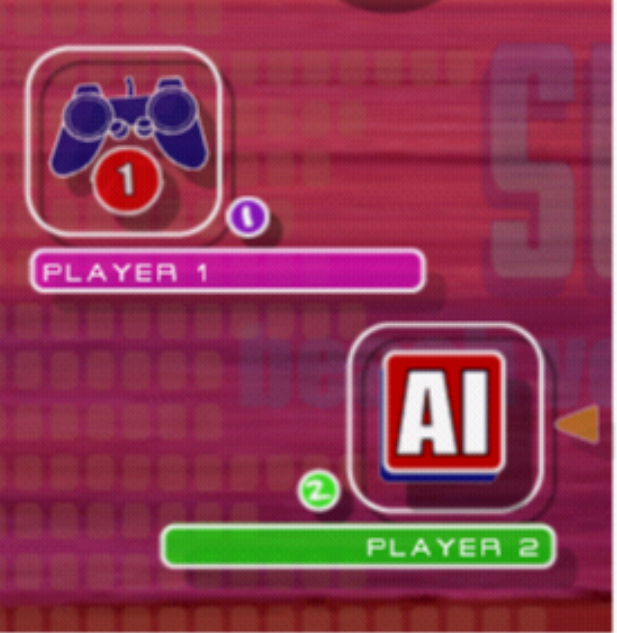
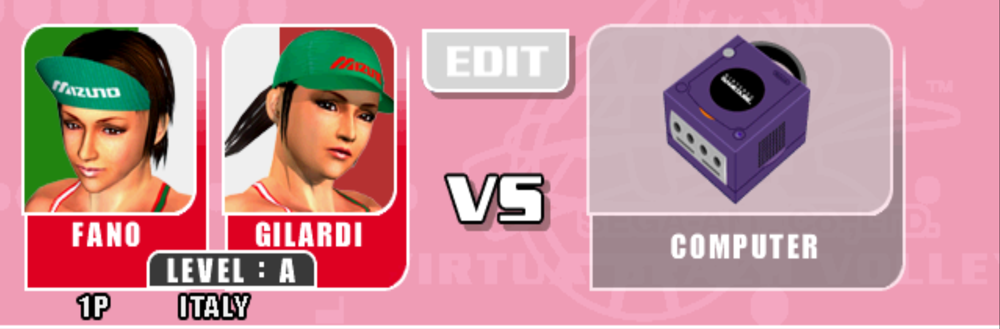

Anyone playing console games in the early 2000s clearly grasped something that is often lost in contemporary debates on "AI". 

Back in the early 2000s, you had two main options for playing beach volley on a console: "[Beach Spikers](https://en.wikipedia.org/wiki/Beach_Spikers)" for the Sega GameCube and "[Summer Heat Beach Volleyball](https://en.wikipedia.org/wiki/Summer_Heat_Beach_Volleyball)" for PlayStation 2.

You could play with multi-player or single-player modes in both of them. But when there's just one player and the adversary is controlled by the console, who are you really playing against?

In "Summer Heat Beach Volleyball" you'd be playing against "__AI__".

In "Beach Spikers", you'd be playing against "computer".

Of course, they meant exactly the same thing. There was no difference between the two concepts. Everybody understood perfectly well that "AI" did not really stand for some advanced human-like intelligence or some particularly advanced technology.

Anybody playing consoles back then wouldn't think much of playing against "AI" or against "computer".

But more than two decades later, perceptions have changed: in more and more domains, from opinion pieces in serious magazines to all sorts of grant applications, folks slap the label of “AI” to just about any computer-assisted technology, somehow implying that calling it “AI” will make it sound more sparkly and edgy.

It does not. If anything, it tends to imply lack of awareness about the specific technologies under debate.

Ageing gamers will remain unimpressed, well aware that "Beach spikers" was the better option anyway. 

