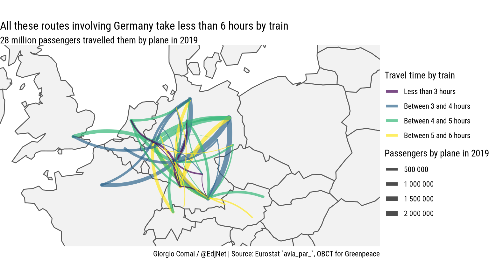
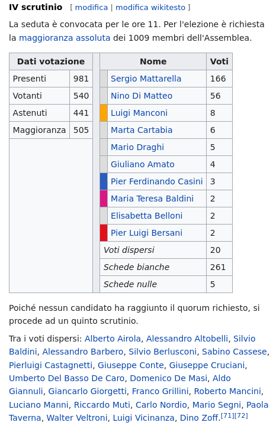

# Contents

- who am I?
- why I felt the need for a new package for interacting with Wikidata?
- `tidywikidatar` - a new(ish) R package
- how it solves these problems
- how `tidywikidatar` works
- actual use cases
- an interactive web interface for checking manually what automatic approaches may not get right
- what next?

```{r eval=TRUE, echo = FALSE, message=FALSE}
library("dplyr")
library("latlon2map")
invisible(ll_set_folder(fs::path(fs::path_home_r(),
                                 "R",
                                 "ll_data")))
options(timeout = 6000)
options(htmltools.dir.version = FALSE)
```


---

# Hi, I'm Giorgio Comai

- researcher and data analyst working for OBCT/CCI
- we coordinate the [European Data Journalism Network](https://www.europeandatajournalism.eu/)


```{r echo = FALSE, fig.align='center'}
knitr::include_graphics("img/EDJNet-logo.svg")
```

- one of our goals is to create tools for data journalists
- I am the author of the R package `tidywikidatar` - an R package that facilitates exploring 'Wikidata' through tidy data frames
- online mostly as *@giocomai* e.g. on [GitHub](https://github.com/giocomai/), [Twitter](https://twitter.com/giocomai), [Wikidata](https://www.wikidata.org/wiki/User:Giocomai)
- I have a website, [giorgiocomai.eu](https://giorgiocomai.eu/)

---
# Why a new package for R? 

- there are other Wikidata packages for R, in particular:
  - `WikidataQueryServiceR` - SPARQL queries!
  - `WikidataR` - all of Wikidata's complexity, which in R translates into nested lists that differ depending on the content
- R has quickly grown to prominence in data journalism largely thanks to the `tidyverse`, a suite of packages based on a consistent grammar that has data frames at its core. There was not an easy way to use Wikidata in a way that is consistent with this logic

---
# What's the matter?

- R users mostly hate nested lists
- some probably also hate SPARQL, but even more simply don't know much about SPARQL
- if you don't know what to expect, it's a pain to process data
- existing tools are not fit for the iterative data analysis process that is at the core of data journalism
- re-running an analysis with minor changes is a very common part of the workflow... without built-in caching, this can be painfully slow

---

# `tidywikidatar`

<div style ="float: right;" ></img></div>

Check out website with documentation and examples:
https://edjnet.github.io/tidywikidatar/

[](https://cran.r-project.org/package=tidywikidatar)
[](https://r-pkg.org/pkg/tidywikidatar)
[](https://r-pkg.org/pkg/tidywikidatar)

- everything in tabular format
- one row, one piece of information
- easy local caching
- easy integration with `dplyr` piped routines
- get image credits from WikiMedia commons
- include Wikipedia in the exploration, or use it as a starting point

---
class: middle, center
background-image: url(img/DRD_background_lower.png)
background-size: contain

# A couple of examples of practical use cases

---
### Olympics 2020 medalists by place of birth

https://github.com/EDJNet/olympics2020nuts

```{r echo = FALSE}
knitr::include_url("https://edjnet.github.io/olympics2020nuts/medalists_map.html")
```
---
### Main air routes that could be travelled by train

Wikidata used for: defining city hubs for airports, getting coordinates of airports (for excluding those on islands), use unique identifiers for merging with train dataset
[https://edjnet.github.io/european_routes/](https://edjnet.github.io/european_routes/)

```{r out.width="720px", echo = FALSE}
#{width=512px}

knitr::include_graphics(path = "img/air_train_routes_germany.png")
```


---
### Mapping diversity

https://medium.com/european-data-journalism-network/finding-gendered-street-names-a-step-by-step-walkthrough-with-r-7608c2d36a77

```{r echo = FALSE}
knitr::include_url("https://mappingdiversity.eu/italy/bologna/")
```


---
class: middle, center
background-image: url(img/DRD_background_lower.png)
background-size: contain

# `tidywikidatar`
# The basics

---
# Enable local caching

```{r}
library(dplyr, warn.conflicts = FALSE)
library("tidywikidatar")

tw_enable_cache()
tw_set_cache_folder(
  path = fs::path(fs::path_home_r(),
                  "R",
                  "tw_data"))
tw_set_language(language = "en")
tw_create_cache_folder(ask = FALSE)
```

---
# Or e.g. MySQL

```{r eval = FALSE}
library(dplyr, warn.conflicts = FALSE)
library("tidywikidatar")

tw_enable_cache(SQLite = FALSE)
tw_set_cache_db(driver = "MySQL",
                host = "localhost",
                port = 3306,
                database = "tidywikidatar",
                user = "secret_username",
                pwd = "secret_password")
```

---
# Search

```{r}
tw_search("European Union")
```

---
# Get an item

```{r}
tw_search("European Union") %>% 
  slice(1) %>% 
  tw_get() 
```

---
# Get a specific property

```{r}
tw_search("European Union") %>% 
  slice(1) %>% 
  tw_get_property(p = "P31") 
```

---
# Get a specific property

```{r}
tw_search("European Union") %>% 
  slice(1) %>% 
  tw_get_property(p = "P31") %>% 
  tw_label()
```

---
# What about qualifiers?

e.g. when did member states join the EU?


```{r}
tw_get_qualifiers(id = "Q458", # European Union
                  p = "P150") # contains administrative territorial entity
```


---
# What about qualifiers?

```{r}
tw_get_qualifiers(id = "Q458", # European Union
                  p = "P150") %>% # contains administrative territorial entity 
  filter(qualifier_property == "P580") %>% # keep only "start time"
  transmute(country = tw_get_label(qualifier_id),  #<< 
            start_time = qualifier_value) #<< 
```

- for more, check `tw_get_property_with_details()`

---
### Dealing with multiple results when only one is needed

Easy questions can be difficult: in which country is London?

```{r}
tibble::tibble(city_qid = c("Q84")) %>% 
  dplyr::mutate(city_label = tw_get_label(city_qid), 
                country_qid = tw_get_p(id = city_qid,
                                       p = "P17")) %>% 
  tidyr::unnest(country_qid) %>% 
  mutate(country = tw_get_label(country_qid))
```

---
### Dealing with multiple results when only one is needed

- keeping first result is tricky
- keeping only preferred may still give more than one result
- people who love tabular data often want just one result, that needs to be "good enough"


```{r}
tibble::tibble(city_qid = c("Q84", "Q220")) %>% 
  dplyr::mutate(city_label = tw_get_label(city_qid), 
                country_qid = tw_get_p(id = city_qid,
                                       p = "P17",
                                       preferred = TRUE,  #<< 
                                       latest_start_time = TRUE, #<< 
                                       only_first = TRUE)) %>%  #<< 
  dplyr::mutate(country_label = tw_get_label(country_qid))
```


---
class: middle, center
background-image: url(img/DRD_background_lower.png)
background-size: contain

# Different entry points

---
### Search

- `tw_search()` - search strings

### Query

- `tw_query()` - simple queries based on property/value couples
- `tw_get_all_with_p()` - get all items that have a given property, irrespective of their value

### Based on Wikipedia

- `tw_get_wikipedia_page_links()` - Get all Wikidata Q identifiers of all Wikipedia pages linked to input
- `tw_get_wikipedia_page_section_links()` - All identifiers found in a specific section of a Wikipedia page


---
class: middle, center
background-image: url(img/DRD_background_lower.png)
background-size: contain

# An example starting from Wikipedia

---
# Election of the President of the Republic in Italy

<div style ="float: right;" ></img></div>


- [Election of the President of the Republic in Italy](https://it.wikipedia.org/wiki/Elezione_del_Presidente_della_Repubblica_Italiana_del_2022)
- the electoral college can vote literally for whoever they like
- the list ends up including very different candidates, from respected intellectuals to football players and porn actors
- almost all of them with one thing in common: they are on Wikidata, but Wikidata does not know they have something in common.

---
## Wikidata identifiers

.pull-left[
Take a single section:

```{r include = TRUE, eval=FALSE}
df <- tw_get_wikipedia_page_section_links(
  title = "Elezione del Presidente della Repubblica Italiana del 2022",
  section_title = "IV scrutinio",
  language = "it")

df %>% select(wikipedia_title, qid)
```
]

.pull-right[

```{r eval = TRUE, echo = FALSE}
df <- tw_get_wikipedia_page_section_links(
  title = "Elezione del Presidente della Repubblica Italiana del 2022",
  section_title = "IV scrutinio",
  language = "it"
  ) %>% 
  select(wikipedia_title, qid)
df %>% 
  head(8) %>% 
  knitr::kable()
```
]

---
# Find out more

```{r}
pob_df <- df %>% 
  select(qid) %>% 
  mutate(name = tw_get_label(qid)) %>%
  mutate(place_of_birth_id = tw_get_p(id = qid, p = "P19",only_first = TRUE)) %>%
  mutate(place_of_birth = tw_get_label(place_of_birth_id)) %>%
  mutate(place_of_birth_coordinates = tw_get_p(id = place_of_birth_id,
                                               p = "P625",
                                               only_first = TRUE))
pob_df
```
---
### Here they are on a map
.pull-left[
```{r}
pob_sf <- pob_df  %>%
  tidyr::separate(
    col = place_of_birth_coordinates,
    into = c("pob_latitude","pob_longitude"),
    sep = ",",
    remove = TRUE,
    convert = TRUE) %>%
  filter(is.na(pob_latitude)==FALSE) %>% 
  sf::st_as_sf(coords = c("pob_longitude", "pob_latitude"), crs = 4326)

library("ggplot2")
pop_gg <- ggplot() +
  geom_sf(data = ll_get_nuts_it(level = 3, no_check_certificate = TRUE)) +
  geom_sf(data = pob_sf, colour = "deeppink4") +
  theme_minimal()


```
]

.pull-right[
```{r echo = FALSE}
pop_gg
```

]

---
### All the usual things we expect from Wikidata
.pull-left[
```{r}
occupation_df <- df %>% 
  pull(qid) %>% 
  tw_get_property(p = "P31") %>% # get "instance of"
  filter(value == "Q5") %>% # keep only humans
  tw_get_property(p = "P106") %>% # get occupation
 # filter(value!="Q82955") %>% # exclude politicians
  group_by(value) %>% 
  count(sort = TRUE) %>% 
  ungroup() %>% 
  transmute(occupation = tw_get_label(value), n)

```
]

.pull-right[
```{r echo = FALSE}
occupation_df %>% knitr::kable()
```

]
---
### And other things useful for data visualisation and interactive interfaces, e.g. quick access to images...

```{r}
president_df <- tw_search("Sergio Mattarella") %>% 
  tw_filter_first(p = "P31", q = "Q5") 

president_df %>% tw_get_image() 
  
```


```{r}
president_df %>%  tw_get_image(format = "embed", width = 300) %>% pull(image)
  
```
---
### ...with metadata and credits line

```{r}
president_df %>% tw_get_image_metadata() %>% 
  tidyr::pivot_longer(cols = -1, names_to = "property", values_transform = as.character)
```

---
### Back and forth between Wikidata and Wikipedia

This gets the Q identifier of all pages linked from a the Wikipedia page of a given Q identifier. Easy peasy :-)

```{r}
president_df %>% 
  tw_get_wikipedia(language = "it") %>% # gets url of Wikipedia page from QID
  tw_get_wikipedia_page_links(language = "it") %>% 
  select(wikipedia_title, qid) 
```

---
class: middle, center
background-image: url(img/DRD_background_lower.png)
background-size: contain

# Integration with interactive interfaces

---
class: middle, center
background-image: url(img/screenshot_mapping_diversity_01.png)
background-size: contain

---
class: middle, center
background-image: url(img/screenshot_mapping_diversity_02.png)
background-size: contain


---
class: middle, center
background-image: url(img/DRD_background_lower.png)
background-size: contain

# Issues and next steps

---
# General issues

- if you are processing many thousands of items, the current approach can be very slow when run for the first time (near instant thanks to caching later)
  - no obvious long term solution, but a future version will allow for an easier way to share the cache to make sure others can also run the script instantly
- no easy way to "give back" to Wikidata
  - I'm considering some sort of integration with [QuickStatements](quickstatements.toolforge.org/), and welcome recommendations on best practices (not so much on the technical implementation, but rather, what kind of instructions or warnings I should expose to users)


---
# Issues related to the web interface and mapping


- finalise the web interface, hopefully it will be out and public by the summer
- make it more generic, for easier checks of arbitrary sets of strings
- consider data issues, in particular the fact that many streets have an own item on Wikidata
- consider ways to "give back" newly gathered data to Wikidata (the data generated via the web interface will anyway be public)
- consider what to do with indirect outputs, e.g. lists of people who have street dedicated to them, but who apparently are not on Wikidata (also considering the inherent biases)

---

# `tidywikidatar`

<div style ="float: right;" ></img></div>

Check out website with documentation and examples:
https://edjnet.github.io/tidywikidatar/

[](https://cran.r-project.org/package=tidywikidatar)
[](https://r-pkg.org/pkg/tidywikidatar)
[](https://r-pkg.org/pkg/tidywikidatar)

- everything in tabular format
- one row, one piece of information
- easy local caching
- easy integration with `dplyr` piped routines
- get image credits from WikiMedia commons
- include Wikipedia in the exploration, or use it as a starting point
