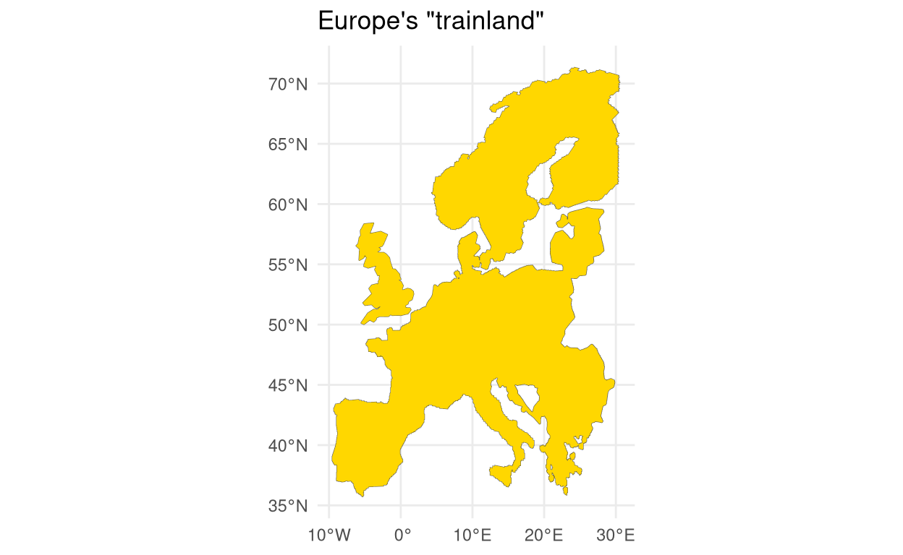

```{r setup, include=FALSE}
options(htmltools.dir.version = FALSE)
```

# Hi, I'm Giorgio Comai

- researcher and data analyst working for OBCT/CCI
- we coordinate the [European Data Journalism Network](https://www.europeandatajournalism.eu/)


```{r echo = FALSE, fig.align='center'}
knitr::include_graphics("img/EDJNet-logo.svg")
```

- I process data and create tools for data journalists
- I code in the R programming language
- I am the author of the R package `tidywikidatar` - an R package that facilitates exploring 'Wikidata' through tidy data frames


---
# A report: Train alternatives to short-haul flights in Europe

- my colleagues Lorenzo Ferrari and Gianluca De Feo produced a report for Greenpeace

```{r echo = FALSE, fig.align='center'}

```

https://www.balcanicaucaso.org/eng/Occasional-papers/Train-alternatives-to-short-haul-flights-in-Europe

- I pre-processed data, created datasets, and did some quality checks on the data
https://edjnet.github.io/european_routes/
---
# In this presentation:

- key steps of the data processing
- data issues
- solutions

```{r echo = FALSE, fig.align='center'}

```

---
# Main steps for finding main air routes that can be travelled by train

- take a dataset with the number of passengers across all main flight routes in Europe -> Eurostat's `avia_par_` datasets
  - deal with inconsistencies in the original datasets (missing data, non-standard codes, flights to “unknown airports”, to oil rigs, etc.)
- exclude routes with no land/plausible train connection between them
- exclude those routes that cannot be reasonably travelled by land or that would take huge amounts of time
- merge routes serving different airports associated to the same city
- find coordinates of airports and their relative city hubs for visualisation and getting data about distance
- match the result with the train datasets (generated separately)
- get labels of cities and airports in different languages (and alphabets)

---
# `avia_par_` datasets

In principle, standardised, but with considerable data issues, including:

- there are slightly different stats, not all of them available for all countries
  - We opted for "passengers carried (departures)" - `PAS_CRD`, which is mostly available
      - but e.g. not for Turkey, for which we had to rely on  “passengers on board” (`PAS_BRD`)
  - Czechia has only data for the country of destination, not specific airport 
      - we derived the data from other countries, using "passengers carried (arrivals)"  (and with the same approach, also data for Bosnia, Albania, Moldova)
  - airports in Serbia, Montenegro or Pristina airport occasionally have inconsistent ICAO codes (e.g. RS_ME instead of the two-letter country code); Basel airport is reported with different country codes
- missing data, non-standard airport codes, flights to “unknown airports”, to oil rigs, etc.
  - e.g. hundreds of thousands of passengers who, according to official data, flew into the unknown taking off from major European airports, mostly from either Brussels or Turkish airports
  - some airports that appear only as the destination, and some only as points of departure (mostly small airports)

---
## Finding coordinates of airports, and of the city hub they serve

- Eurostat's dataset does not include coordinates of airports (we need them to exclude excessively long routes, and find which of them is on islands)
- to compare with train routes, we need to merge data for multiple airports serving the same city
  - we care e.g. about the traffic volumes between London and Paris, not between each of the London airports and each of the Paris airports
- finding city hubs is not obvious, as mostly airports are located in local administrative units that are not very telling (airports often are located in very small towns, next to very big cities)

## We relied on Wikidata for most of these things. Why is Wikidata useful?

- all data are in the public domain, no licensing restrictions
- one single identifier - ideal for deduplication and consistent matching
- labels in many languages

---


```{r echo = FALSE, fig.align='center'}

```

---
# It includes coordinates for all airports

```{r echo = FALSE, fig.align='center'}
knitr::include_graphics("img/heathrow_coordinates.png")
```

# Has a field for "transport hub served"

```{r echo = FALSE, fig.align='center'}

```

---
# And again, coordinates and multilingual label for the hub cities

- data can be retrieved systematically, via API
- query for coordinates of the city
- get different labels e.g. London, Londyn, Londra, Лондон, ლონდონი (for big cities, very complete)
- cities can then have a single identifier, in our case useful for matching and deduplication with train dataset
- having name of the city in the local language has been useful for better matching with the train dataset
- we can also use the Wikidata identifier to retrieve a picture of the city or the airport systematically from Wikimedia commons, which can be useful in some interactive visualisations

---
# Back to the routes

- we now have cleaned the original `avia_par_` dataset
- we have associated airports to the main cities they serve
- we have merged passengers from different airport travelling between the same cities (e.g. all Paris-London passengers, no matter their airport of departure)
- we have unique and consistent identifiers for airports and cities
- we have coordinates for all aiports and cities


---
# Time to exclude overseas routes that cannot possibly be travelled by train

```{r echo= FALSE}
knitr::include_url(fs::path("maps", "routes_ll.html"), height = "400px")
```

---
# We do this, by adding a buffer to merge e.g. Sicily and Scandinavia, and then include Great Britain

.pull-left[
```{r echo = FALSE}

```
]

.pull-right[
```{r echo = FALSE}

```
]

---
# Airports to be excluded

```{r echo=FALSE}

knitr::include_url(fs::path("maps", "noneurotrainland_airports_ll.html"), height = "400px")

```

---
# Main routes that can be travelled by train

```{r echo=FALSE}
library("dplyr", warn.conflicts = FALSE)
library("reactable")
readr::read_csv(file = fs::path("data", "european_hub_land_routes.csv"), show_col_types = FALSE)  %>%
  mutate(distance_km = round(distance_km)) %>%
  select(ranking, route, passengers, distance_km) %>%
  reactable(
    defaultPageSize = 6,
    sortable = TRUE,
    resizable = TRUE,
    filterable = TRUE,
    columns = list(passengers = reactable::colDef(format = reactable::colFormat(
      separators = TRUE,
      digits = 0
    )))
  )
```


---

```{r echo = FALSE}
library("crosstalk")
library("reactable")

european_hub_land_routes_df <- readr::read_csv(file = fs::path("data", "european_hub_land_routes.csv"), show_col_types = FALSE)

data <- SharedData$new(european_hub_land_routes_df %>%
  transmute(ranking, route, passengers, distance_km = round(distance_km)))

bscols(
  widths = c(3, 9),
  list(
    #  filter_checkbox("type", "Type", data, ~type),
    filter_slider("passengers", "Passengers", data, ~passengers, width = "100%"),
    filter_slider("distance_km", "Distance", data, ~distance_km, width = "100%")
    # ,
    # filter_select("route", "Route", data, ~route)
    # ,
    # filter_select("origin_airport_country", "Country of departure", data, ~origin_airport_country)
  ),
  reactable(data, defaultPageSize = 8)
)


```

---
# Back to maps, for all...

```{r echo = FALSE, fig.align='center'}

```

---
# Or only specific countries, e.g. here France


```{r echo = FALSE, fig.align='center'}

```


---
# Summary of issues and solutions

- Eurostat's `avia_par_` datasets are a great starting point, but they still requires many hours of work to be actually useful
  - flights to "unknown airport", in particular from Czechia
  - inconsistent airport codes
  - no coordinates for airports included

- Other desirable data, include:
  - connecting flights
  - prices
  
- Wikidata is very useful
  - to get unique identifiers that be can used across datasets
  - get labels of airport and cities in many languages
  - get coordinates, hubs, pictures, potentially other information

---
# Links

- this presentation: https://giorgiocomai.eu/slides/2022-06-16-european_routes_un_slides/2022-06-16-european_routes_un_slides.html
  - in pdf: https://giorgiocomai.eu/slides/2022-06-16-european_routes_un_slides/2022-06-16-european_routes_un_slides.pdf
- extended version of the data analysis, including code and intermediate datasets available for download:
  - https://edjnet.github.io/european_routes/
  - https://github.com/EDJNet/european_routes
- Full report: __Train alternatives to short-haul flights in Europe__ https://www.balcanicaucaso.org/eng/Occasional-papers/Train-alternatives-to-short-haul-flights-in-Europe  
- brief article for the wider public: https://www.europeandatajournalism.eu/eng/News/Data-news/More-trains-fewer-emissions


```{r eval = FALSE, include = FALSE, echo=FALSE}
pagedown::chrome_print("2022-06-16-european_routes_un_slides.html")
```
